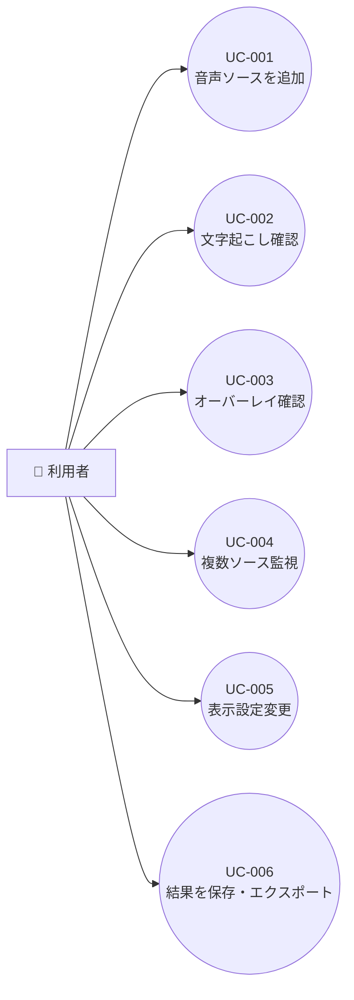

# 要件定義書

## 1. 目的

本プロジェクトは、Chrome 拡張機能として、任意の音声ソースを入力にリアルタイム文字起こしとリアルタイム翻訳を行い、その翻訳結果を Chrome 上の閲覧対象へオーバーレイ表示する仕組みを構築することを目的とする。

想定する主な音声ソースは、サイト上の動画や会議音声などのブラウザタブ音声、および PC に接続されたマイクやオーディオインターフェース入力である。利用者は複数の音声ソースを同時に扱い、それぞれについて独立した文字起こし結果と翻訳オーバーレイを確認できる必要がある。マイクなどブラウザ外起源の音声については、Chrome 内の指定タブまたは拡張専用表示面をオーバーレイ先とする。

従来の運用では、音声ソースごとに別ツールを開いたり、音声入力を手動で切り替えたり、文字起こしと翻訳を別々のサービスで実行する必要があり、以下の課題がある。

- 音声ソースごとの切り替え負荷が高い
- 複数音源を同時監視すると、どの字幕がどの音源に対応するか分かりにくい
- リアルタイム字幕とリアルタイム翻訳を視聴中コンテンツへ自然に重ねて表示しにくい
- マイク入力とブラウザ音声を同じ作業画面で一元管理しにくい

本拡張機能は、次の価値を提供する。

- 一元化: ブラウザ上で音声ソースの追加、監視、停止をまとめて行える
- 即時性: 発話中または発話直後に文字起こしと翻訳を順次表示できる
- 並列処理: 複数音声ソースを独立したストリームとして同時処理できる
- 重畳表示: 翻訳結果を対象コンテンツ上にオーバーレイとして重ねて表示できる
- 可視化: 音声ソース単位で原文字幕、翻訳字幕、状態を分けて表示できる

## 2. スコープ

### 2.1 対象範囲

- デスクトップ版 Chrome 向け拡張機能
- Chrome 拡張の UI としてのポップアップ、サイドパネル、対象タブ上の翻訳オーバーレイ表示
- ブラウザタブ音声の取得
- PC に接続されたマイク、USB マイク、オーディオインターフェース入力の取得
- Chrome および OS の許可範囲で取得可能な画面共有またはウィンドウ共有音声の取得
- 音声ソースごとのリアルタイム文字起こし
- 音声ソースごとのリアルタイム翻訳
- 音声ソースごとの翻訳オーバーレイ表示先の選択
- 音声ソースごとの言語設定、自動判定、翻訳先言語設定
- 複数音声ソースの同時処理
- 音声ソースごとの開始、一時停止、停止、再接続
- 原文字幕、翻訳字幕、タイムスタンプ、ソース名、状態表示
- オーバーレイの位置、サイズ、透明度、表示行数の調整
- セッション単位の結果保持、およびテキスト形式でのエクスポート
- 外部の音声認識サービスおよび翻訳サービスとの連携

### 2.2 対象外

- Chrome 以外のブラウザ向け拡張機能対応
- iOS / Android 版 Chrome への対応
- 音声の自動要約、感情分析、話者識別の高精度保証
- リアルタイム音声合成、吹き替え、同時通訳音声の再生
- 音声編集、波形編集、録音スタジオ用途の機能
- 利用者の明示操作なしに OS 全体の音声を常時監視する機能
- Chrome 管理外のネイティブアプリ上へ直接オーバーレイを描画する機能
- ブラウザや OS の制限、または配信元ポリシーにより取得が禁止される音声の保証取得
- 完全オフラインでの高精度文字起こし・翻訳

## 3. 用語定義

| 用語             | 説明                                                                                     |
| ---------------- | ---------------------------------------------------------------------------------------- |
| 音声ソース       | 文字起こし・翻訳の入力対象となる 1 つの音声入力。例: ブラウザタブ音声、接続マイク        |
| ソースセッション | 1 つの音声ソースに対して開始される処理単位。開始から停止までの文字起こし・翻訳状態を持つ |
| 部分字幕         | 発話途中の暫定的な文字起こし結果                                                         |
| 確定字幕         | 発話終了後または区切り判定後に確定した文字起こし結果                                     |
| 翻訳字幕         | 確定字幕または準確定字幕に対応して生成される翻訳結果                                     |
| 翻訳オーバーレイ | 翻訳字幕を Chrome の対象タブまたは拡張表示面へ重ねて表示する UI                          |
| サイドパネル     | Chrome 拡張が提供する常時表示可能な操作・監視 UI                                         |
| 字幕モニタ       | 複数ソースの原文字幕と翻訳字幕を一覧監視する表示領域                                     |
| 自動言語判定     | 音声ソースの言語をシステム側で推定して処理設定へ反映する機能                             |
| 同時処理枠       | 同時にアクティブな状態で文字起こし・翻訳処理を実行できる音声ソース数                     |

## 4. ステークホルダー

| ステークホルダー               | 役割                     | 関心事                                                               |
| ------------------------------ | ------------------------ | -------------------------------------------------------------------- |
| 利用者                         | 拡張機能の主利用者       | 字幕の即時性、翻訳品質、オーバーレイの見やすさ、複数音源の扱いやすさ |
| 組織管理者 / 導入担当          | 業務利用時の導入判断者   | セキュリティ、権限、ログ、コスト                                     |
| 開発・運用チーム               | システム設計、実装、保守 | 拡張性、障害切り分け、ブラウザ制約への追従                           |
| 音声認識 / 翻訳サービス提供者  | 外部 API の提供者        | API 制約、レイテンシ、利用料金、利用規約                             |
| ブラウザプラットフォーム提供者 | Chrome 拡張基盤の提供者  | 権限制御、ストア審査、API 利用ポリシー                               |

利用者の詳細像と期待体験は [ペルソナ設計書](../11-persona-design/persona-design.md) を参照する。主な利用文脈は、動画視聴時の単方向翻訳と、Web 会議時の双方向翻訳である。

## 5. ユースケース一覧

| ID     | ユースケース名                                   | アクター | 優先度 |
| ------ | ------------------------------------------------ | -------- | ------ |
| UC-001 | 音声ソースを追加して処理を開始する               | 利用者   | Must   |
| UC-002 | リアルタイム文字起こしを確認する                 | 利用者   | Must   |
| UC-003 | 翻訳オーバーレイを確認する                       | 利用者   | Must   |
| UC-004 | 複数音声ソースのオーバーレイを同時監視する       | 利用者   | Must   |
| UC-005 | ソースごとに言語とオーバーレイ表示設定を変更する | 利用者   | Must   |
| UC-006 | セッション結果を保存・エクスポートする           | 利用者   | Should |

### 5.1 ユースケース図

図: 利用者が行う主要ユースケース。

## 6. ユースケース詳細

### UC-001: 音声ソースを追加して処理を開始する {#uc-001}

| 項目         | 内容                                                                                           |
| ------------ | ---------------------------------------------------------------------------------------------- |
| **ID**       | UC-001                                                                                         |
| **アクター** | 利用者                                                                                         |
| **事前条件** | 拡張機能がインストール済みであり、必要な権限要求を実行できること                               |
| **事後条件** | 選択した音声ソースのソースセッションが開始され、翻訳オーバーレイまたは監視 UI に表示されること |
| **トリガー** | 利用者が「ソースを追加」または「開始」を実行する                                               |

**基本フロー:**

1. 利用者が音声ソース種別を選択する
2. システムが必要な権限取得フローを開始する
3. 利用者が対象タブ、入力デバイス、共有対象を選択する
4. システムが音声ストリーム接続を確立する
5. システムがソースセッションを作成し、監視 UI に追加する

**代替フロー:**

- 利用者が接続済みマイクを選択した場合、デバイス一覧から選んで開始できる
- 利用者がブラウザタブを選択した場合、対象タブ名をソース名として初期表示する

**例外フロー:**

- 権限が拒否された場合、開始せず再許可手順を案内する
- 音声入力が検出できない場合、ソース追加を中止して状態をエラー表示する

### UC-002: リアルタイム文字起こしを確認する {#uc-002}

| 項目         | 内容                                                       |
| ------------ | ---------------------------------------------------------- |
| **ID**       | UC-002                                                     |
| **アクター** | 利用者                                                     |
| **事前条件** | 音声ソースのソースセッションが開始されていること           |
| **事後条件** | 利用者がソースごとの部分字幕および確定字幕を確認できること |
| **トリガー** | 音声ソースから音声が継続入力される                         |

**基本フロー:**

1. システムが音声ストリームを受信する
2. システムが音声認識処理へ送信する
3. システムが部分字幕を表示する
4. システムが確定字幕を反映し、タイムスタンプ付きで保持する

**代替フロー:**

- 利用者が自動言語判定を有効にしている場合、推定結果に基づいて音声認識設定を切り替える

**例外フロー:**

- ネットワークまたは外部 API 障害が発生した場合、該当ソースのみ再接続状態に遷移する

### UC-003: 翻訳オーバーレイを確認する {#uc-003}

| 項目         | 内容                                                                 |
| ------------ | -------------------------------------------------------------------- |
| **ID**       | UC-003                                                               |
| **アクター** | 利用者                                                               |
| **事前条件** | 音声ソースの文字起こしが有効であり、翻訳先言語が設定されていること   |
| **事後条件** | 利用者が原文字幕に対応した翻訳字幕をオーバーレイとして確認できること |
| **トリガー** | 文字起こし結果が生成される                                           |

**基本フロー:**

1. システムが確定字幕または準確定字幕を翻訳処理へ送信する
2. システムが翻訳結果を受信する
3. システムが原文字幕に対応づけて翻訳字幕を対象タブまたは指定表示先へオーバーレイ表示する

**代替フロー:**

- 利用者がソースごとに異なる翻訳先言語を設定している場合、その設定を個別に適用する

**例外フロー:**

- 対応外の言語ペアである場合、翻訳を無効化し原文字幕のみ継続表示する

### UC-004: 複数音声ソースのオーバーレイを同時監視する {#uc-004}

| 項目         | 内容                                                                               |
| ------------ | ---------------------------------------------------------------------------------- |
| **ID**       | UC-004                                                                             |
| **アクター** | 利用者                                                                             |
| **事前条件** | 2 つ以上の音声ソースを開始可能であること                                           |
| **事後条件** | 利用者が音声ソースごとに分離された字幕・翻訳オーバーレイ・状態を同時確認できること |
| **トリガー** | 利用者が追加の音声ソースを開始する                                                 |

**基本フロー:**

1. 利用者が 2 つ目以降の音声ソースを追加する
2. システムが各ソースに独立した処理パイプラインを割り当てる
3. システムが対象タブまたは監視 UI 上でソースごとに結果を分離表示する
4. 利用者が各ソースを個別に停止、一時停止、再開する

**代替フロー:**

- 利用者が一部ソースのみ翻訳を有効化し、他ソースは文字起こしのみで利用できる

**例外フロー:**

- 同時処理枠を超える追加要求があった場合、追加を保留または拒否し、上限を表示する

### UC-005: ソースごとに言語とオーバーレイ表示設定を変更する {#uc-005}

| 項目         | 内容                                                           |
| ------------ | -------------------------------------------------------------- |
| **ID**       | UC-005                                                         |
| **アクター** | 利用者                                                         |
| **事前条件** | 1 つ以上のソースセッションが存在すること                       |
| **事後条件** | 対象ソースに対して新しい言語設定および表示設定が反映されること |
| **トリガー** | 利用者がソース設定を開いて変更を保存する                       |

**基本フロー:**

1. 利用者が対象ソースの設定を開く
2. 利用者が入力言語、自動判定、翻訳先言語、位置、サイズ、透明度、表示密度などを変更する
3. システムが設定を保存し、対象ソースに反映する

**代替フロー:**

- 利用者が全ソース共通設定を既定値として反映できる

**例外フロー:**

- 設定値が不整合な場合、保存せず修正を促す

### UC-006: セッション結果を保存・エクスポートする {#uc-006}

| 項目         | 内容                                                                         |
| ------------ | ---------------------------------------------------------------------------- |
| **ID**       | UC-006                                                                       |
| **アクター** | 利用者                                                                       |
| **事前条件** | 1 つ以上の字幕または翻訳結果が生成されていること                             |
| **事後条件** | 利用者がソース別またはセッション全体の結果を保存またはエクスポートできること |
| **トリガー** | 利用者がセッション停止またはエクスポート操作を行う                           |

**基本フロー:**

1. 利用者が対象ソースまたはセッション全体を選択する
2. 利用者がエクスポート形式を選択する
3. システムが字幕・翻訳・タイムスタンプを整形する
4. システムがファイル保存またはクリップボード出力を行う

**代替フロー:**

- 利用者が原文のみ、翻訳のみ、両方併記のいずれかを選択できる

**例外フロー:**

- 保存権限またはストレージが不足している場合、失敗理由を表示する

## 7. 機能要件

### REQ-001: 音声ソース登録・接続機能 {#req-001}

| 項目                 | 内容                                                                                                                                                                                                                                           |
| -------------------- | ---------------------------------------------------------------------------------------------------------------------------------------------------------------------------------------------------------------------------------------------- |
| **ID**               | REQ-001                                                                                                                                                                                                                                        |
| **カテゴリ**         | 機能要件                                                                                                                                                                                                                                       |
| **優先度**           | Must                                                                                                                                                                                                                                           |
| **関連ユースケース** | [UC-001](#uc-001), [UC-004](#uc-004)                                                                                                                                                                                                           |
| **説明**             | 利用者が文字起こし対象の音声ソースを追加し、接続を開始できること                                                                                                                                                                               |
| **受入基準**         | ブラウザタブ音声を追加できること。PC 接続マイクまたはオーディオインターフェース入力を追加できること。Chrome および OS が音声付きで共有可能な画面またはウィンドウを対象として追加できること。ソースごとに開始、一時停止、停止を実行できること。 |

### REQ-002: 権限取得・状態表示機能 {#req-002}

| 項目                 | 内容                                                                                                                                                             |
| -------------------- | ---------------------------------------------------------------------------------------------------------------------------------------------------------------- |
| **ID**               | REQ-002                                                                                                                                                          |
| **カテゴリ**         | 機能要件                                                                                                                                                         |
| **優先度**           | Must                                                                                                                                                             |
| **関連ユースケース** | [UC-001](#uc-001)                                                                                                                                                |
| **説明**             | 音声取得に必要な権限を安全に取得し、ソース状態を利用者に明示できること                                                                                           |
| **受入基準**         | 権限要求前に対象用途を表示できること。権限拒否時に再設定方法を案内できること。各ソースについて接続中、処理中、一時停止、再接続中、エラーの状態を表示できること。 |

### REQ-003: リアルタイム文字起こし機能 {#req-003}

| 項目                 | 内容                                                                                                                                                 |
| -------------------- | ---------------------------------------------------------------------------------------------------------------------------------------------------- |
| **ID**               | REQ-003                                                                                                                                              |
| **カテゴリ**         | 機能要件                                                                                                                                             |
| **優先度**           | Must                                                                                                                                                 |
| **関連ユースケース** | [UC-002](#uc-002)                                                                                                                                    |
| **説明**             | 音声ソースごとにリアルタイムで部分字幕と確定字幕を生成・表示できること                                                                               |
| **受入基準**         | 発話中または発話直後に部分字幕が表示されること。区切り確定後に確定字幕へ更新されること。字幕行ごとにソース識別情報とタイムスタンプを保持できること。 |

### REQ-004: 言語設定・自動判定機能 {#req-004}

| 項目                 | 内容                                                                                                                                                             |
| -------------------- | ---------------------------------------------------------------------------------------------------------------------------------------------------------------- |
| **ID**               | REQ-004                                                                                                                                                          |
| **カテゴリ**         | 機能要件                                                                                                                                                         |
| **優先度**           | Must                                                                                                                                                             |
| **関連ユースケース** | [UC-002](#uc-002), [UC-005](#uc-005)                                                                                                                             |
| **説明**             | 音声ソースごとに入力言語と翻訳先言語を設定し、必要に応じて自動言語判定を利用できること                                                                           |
| **受入基準**         | ソースごとに入力言語を明示設定できること。自動言語判定を ON/OFF 切替できること。翻訳先言語をソースごとに設定できること。設定変更後の新規字幕から反映されること。 |

### REQ-005: リアルタイム翻訳機能 {#req-005}

| 項目                 | 内容                                                                                                                                                                                                                       |
| -------------------- | -------------------------------------------------------------------------------------------------------------------------------------------------------------------------------------------------------------------------- |
| **ID**               | REQ-005                                                                                                                                                                                                                    |
| **カテゴリ**         | 機能要件                                                                                                                                                                                                                   |
| **優先度**           | Must                                                                                                                                                                                                                       |
| **関連ユースケース** | [UC-003](#uc-003)                                                                                                                                                                                                          |
| **説明**             | 文字起こし結果に対してリアルタイムで翻訳字幕を生成し、原文と対応づけてオーバーレイ表示できること                                                                                                                           |
| **受入基準**         | 原文字幕に対して翻訳字幕が表示されること。翻訳字幕は対象タブまたは指定表示先にオーバーレイ表示されること。翻訳字幕はソースごとに独立して表示されること。対応外の言語ペアでは原文表示を継続しつつ翻訳不可を明示できること。 |

### REQ-006: 複数ソース同時処理機能 {#req-006}

| 項目                 | 内容                                                                                                                                                                                      |
| -------------------- | ----------------------------------------------------------------------------------------------------------------------------------------------------------------------------------------- |
| **ID**               | REQ-006                                                                                                                                                                                   |
| **カテゴリ**         | 機能要件                                                                                                                                                                                  |
| **優先度**           | Must                                                                                                                                                                                      |
| **関連ユースケース** | [UC-004](#uc-004)                                                                                                                                                                         |
| **説明**             | 複数の音声ソースを同時に処理し、ソース単位で独立した結果を維持できること                                                                                                                  |
| **受入基準**         | 初回リリースで最大 3 ソースを同時にアクティブ処理できること。1 ソースの停止またはエラーが他ソースの処理継続を妨げないこと。ソースごとに原文字幕、翻訳字幕、状態が混在せず表示されること。 |

### REQ-007: 翻訳オーバーレイ表示機能 {#req-007}

| 項目                 | 内容                                                                                                                                                                                                                               |
| -------------------- | ---------------------------------------------------------------------------------------------------------------------------------------------------------------------------------------------------------------------------------- |
| **ID**               | REQ-007                                                                                                                                                                                                                            |
| **カテゴリ**         | 機能要件                                                                                                                                                                                                                           |
| **優先度**           | Must                                                                                                                                                                                                                               |
| **関連ユースケース** | [UC-002](#uc-002), [UC-003](#uc-003), [UC-004](#uc-004), [UC-005](#uc-005)                                                                                                                                                         |
| **説明**             | 利用者が翻訳結果を対象コンテンツへ重ねて閲覧できるオーバーレイ UI を提供すること                                                                                                                                                   |
| **受入基準**         | 対象タブ上または指定表示先タブ上に翻訳オーバーレイを表示できること。オーバーレイの位置、サイズ、透明度、表示行数を調整できること。原文のみ、翻訳のみ、両方表示を切り替えられること。ソース名、状態、最新更新時刻を確認できること。 |

### REQ-008: セッション保持・エクスポート機能 {#req-008}

| 項目                 | 内容                                                                                                                                                           |
| -------------------- | -------------------------------------------------------------------------------------------------------------------------------------------------------------- |
| **ID**               | REQ-008                                                                                                                                                        |
| **カテゴリ**         | 機能要件                                                                                                                                                       |
| **優先度**           | Should                                                                                                                                                         |
| **関連ユースケース** | [UC-006](#uc-006)                                                                                                                                              |
| **説明**             | セッション中に生成された字幕・翻訳結果をソース別に保持し、後から保存またはエクスポートできること                                                               |
| **受入基準**         | セッション停止後も当該ブラウザセッション中は結果を参照できること。TXT または JSON 形式でエクスポートできること。原文のみ、翻訳のみ、両方併記を選択できること。 |

### REQ-009: エラー復旧・劣化運転機能 {#req-009}

| 項目                 | 内容                                                                                                                                                   |
| -------------------- | ------------------------------------------------------------------------------------------------------------------------------------------------------ |
| **ID**               | REQ-009                                                                                                                                                |
| **カテゴリ**         | 機能要件                                                                                                                                               |
| **優先度**           | Must                                                                                                                                                   |
| **関連ユースケース** | [UC-001](#uc-001), [UC-002](#uc-002), [UC-003](#uc-003), [UC-004](#uc-004)                                                                             |
| **説明**             | ソース切断、ネットワーク障害、翻訳失敗などが発生しても、利用者が状況を把握し再開できること                                                             |
| **受入基準**         | ソース切断時に該当ソースを再接続待ち状態へ遷移できること。翻訳失敗時でも文字起こし表示を継続できること。復旧可能な障害では再試行操作を提供できること。 |

## 8. 非機能要件

### 8.1 性能要件

| ID         | 要件               | 目標値                                                      |
| ---------- | ------------------ | ----------------------------------------------------------- |
| REQ-NF-001 | 部分字幕の表示遅延 | 音声入力から p95 で 2.0 秒以内                              |
| REQ-NF-002 | 翻訳字幕の表示遅延 | 対応する原文字幕確定から p95 で 1.5 秒以内                  |
| REQ-NF-003 | ソース開始完了時間 | 利用者の選択完了後 5 秒以内に監視 UI へ追加                 |
| REQ-NF-004 | 同時処理性能       | 最大 3 ソース同時処理時も REQ-NF-001 と REQ-NF-002 を満たす |

### 8.2 可用性要件

| ID         | 要件       | 目標値                                     |
| ---------- | ---------- | ------------------------------------------ |
| REQ-NF-010 | 月間稼働率 | 99.5% 以上                                 |
| REQ-NF-011 | 障害分離   | 1 ソース障害時でも他ソース 100% 継続可能   |
| REQ-NF-012 | 再接続復旧 | 一時的ネットワーク断の 30 秒以内自動再試行 |

### 8.3 セキュリティ要件

| ID         | 要件             | 詳細                                                                           |
| ---------- | ---------------- | ------------------------------------------------------------------------------ |
| REQ-NF-020 | 明示的同意       | 音声取得前に利用者の明示的な操作と権限許可を必須とする                         |
| REQ-NF-021 | 通信の暗号化     | 外部 API との通信を TLS 1.2 以上で暗号化する                                   |
| REQ-NF-022 | 最小権限         | 拡張機能の権限は音声取得、表示、保存に必要な最小範囲に限定する                 |
| REQ-NF-023 | データ保持最小化 | 初期設定では生音声を永続保存せず、字幕・翻訳結果のみをセッション保持対象とする |
| REQ-NF-024 | 機密情報保護     | API キー、トークン、利用者設定を安全な保管領域で扱い、平文ログへ出力しない     |

### 8.4 ユーザビリティ要件

| ID         | 要件             | 詳細                                                                                           |
| ---------- | ---------------- | ---------------------------------------------------------------------------------------------- |
| REQ-NF-030 | 低操作負荷       | 新規ソース追加から開始までを 3 ステップ以内で完了できること                                    |
| REQ-NF-031 | 識別容易性       | 複数ソースを視覚的に識別できるラベルまたは色分けを提供すること                                 |
| REQ-NF-032 | 可読性           | 翻訳オーバーレイで原文と翻訳が判別しやすいフォントサイズ、行間、背景コントラストを提供すること |
| REQ-NF-033 | アクセシビリティ | キーボード操作とスクリーンリーダーを考慮し、WCAG 2.1 AA を目標とすること                       |

### 8.5 互換性要件

| ID         | 要件             | 詳細                                                                   |
| ---------- | ---------------- | ---------------------------------------------------------------------- |
| REQ-NF-040 | ブラウザ対応     | デスクトップ版 Chrome の最新安定版および直前安定版で主要機能を提供する |
| REQ-NF-041 | OS 対応          | Windows 11 および macOS 14 以上を初回リリース対象とする                |
| REQ-NF-042 | 入力デバイス対応 | OS が標準入力デバイスとして認識する有線 / 無線マイクを対象とする       |

### 8.6 運用保守性要件

| ID         | 要件           | 詳細                                                                     |
| ---------- | -------------- | ------------------------------------------------------------------------ |
| REQ-NF-050 | 構造化ログ     | ソース開始、停止、エラー、再試行、API 応答時間を追跡可能なログを記録する |
| REQ-NF-051 | 機能劣化運転   | 翻訳サービスが利用不能でも文字起こし単体は継続提供する                   |
| REQ-NF-052 | 設定差し替え性 | 音声認識サービスおよび翻訳サービスを将来差し替え可能な構成とする         |

## 9. 制約条件

- 実装形態は Chrome 拡張機能とし、Manifest V3 に準拠する
- 音声取得可否は Chrome API、OS 権限、共有対象の制約に従う
- オーバーレイ表示先は Chrome タブまたは拡張が管理する表示面に限定する
- リアルタイム文字起こしと翻訳は、初回リリースではネットワーク接続を前提とした外部サービス利用を許容する
- 初回リリースでの同時処理上限は 3 ソースとする
- Chrome Web Store 配布を想定し、拡張権限とデータ利用方針は審査要件を満たす必要がある
- 法令、契約、利用規約に反する形での音声取得や保存は行わない

## 10. 技術実現方針

本プロジェクトの初回リリースは、Chrome 拡張単体で完結する UI と、外部サービスを利用する音声認識・翻訳処理を組み合わせて実現する。採用予定の主要構成要素は以下とする。

### 10.1 MVP 技術構成

| 領域                 | 採用方針                                           | 目的                                                     |
| -------------------- | -------------------------------------------------- | -------------------------------------------------------- |
| 開発フレームワーク   | WXT                                                | エントリポイント管理、ビルド、開発体験、拡張構成の標準化 |
| 使用言語             | TypeScript                                         | 型安全性の確保、メッセージ契約と設定値の保守性向上       |
| UI フレームワーク    | React                                              | Popup、Side Panel、オーバーレイ UI のコンポーネント実装  |
| 拡張基盤             | Manifest V3、Service Worker                        | ソース管理、状態管理、メッセージ中継                     |
| バックグラウンド実行 | Offscreen Document                                 | DOM と MediaStream を用いた音声処理の常時実行            |
| ページ重畳表示       | Content Script、Shadow DOM、React                  | ページ CSS 競合を避けながら翻訳オーバーレイを描画        |
| 操作 UI              | Side Panel、Popup、React                           | ソース追加、設定変更、状態監視                           |
| 音声取得             | `chrome.tabCapture`、`getUserMedia()`              | タブ音声とマイク / オーディオインターフェース入力の取得  |
| 画面共有音声         | `chrome.desktopCapture` または `getDisplayMedia()` | 画面 / ウィンドウ共有時の音声取得                        |
| 音声前処理           | Web Audio API、AudioWorklet                        | モノラル化、リサンプリング、音量メータ、必要に応じた VAD |
| 文字起こし           | 外部ストリーミング STT API                         | リアルタイム字幕生成                                     |
| 翻訳                 | 外部翻訳 API                                       | 字幕に対応する翻訳生成                                   |
| 中継バックエンド     | 軽量 WebSocket / HTTP サービス                     | API キー秘匿、ベンダー抽象化、レート制御、監査ログ       |
| ローカル保存         | `chrome.storage.local`、IndexedDB                  | 設定保存、セッション字幕保持                             |

### 10.2 処理アーキテクチャ方針

- 音声ソースごとに独立した処理パイプラインを持つ
- パイプラインは `capture -> preprocess -> STT -> translation -> overlay` の順で構成する
- 1 ソースの障害や停止は他ソースの処理に影響させない
- 翻訳結果は既定で確定字幕を単位として生成し、必要に応じて部分字幕への拡張余地を残す
- タブ音声は対象タブへのオーバーレイ表示を第一候補とし、マイクなどブラウザ外起源の音声は指定タブまたは拡張管理画面へ表示する

### 10.3 初回リリースの優先実装範囲

- 最優先で対応する音声ソースは `ブラウザタブ音声` と `マイク / オーディオインターフェース入力` とする
- 画面共有 / ウィンドウ共有音声は同一パイプラインへ接続可能な拡張対象として扱う
- 初回リリースでは Chrome 外のネイティブアプリ上へ直接オーバーレイ表示する方式は採用しない
- 初回リリースでは API キーを拡張内に保持せず、中継バックエンド経由で外部 STT / 翻訳 API を利用する

### 10.4 技術選定上の補足

- WXT を拡張開発フレームワークとして採用し、Popup、Side Panel、Content Script、Unlisted Page をエントリポイント単位で管理する
- TypeScript を標準言語とし、ソース設定、メッセージ、字幕データ、翻訳データの型を明示する
- React を UI 実装の標準とし、Popup、Side Panel、翻訳オーバーレイの表示ロジックをコンポーネント単位で構成する
- バージョン選定は、LTS 提供のある技術は LTS を優先し、LTS がない技術は採用時点の最新安定版を利用する
- バックエンド実行環境の Node.js は 24.x LTS を採用する
- `chrome.tabCapture` はユーザー操作を契機として開始する
- タブ音声取得時は、必要に応じて AudioContext を用いてローカル再生を維持する
- Offscreen Document は拡張内で 1 つの音声処理ハブとして利用し、Service Worker とメッセージ連携する
- Content Script によるオーバーレイは固定配置だけでなく、ドラッグ移動や透明度変更を想定した構成とする
- 将来的なベンダー差し替えに備え、STT と翻訳は拡張内から直接固定実装せず、抽象化した API 境界越しに呼び出す

## 11. 前提条件

- 利用者はデスクトップ版 Chrome を利用できること
- 利用者は対象音声を取得・処理する権限または正当な利用目的を有すること
- 利用者端末は安定したインターネット接続を有すること
- マイク系入力は OS から利用可能な状態で認識されていること
- マイクなどブラウザ外起源の音声では、Chrome 内に少なくとも 1 つのオーバーレイ表示先を確保できること
- 1 ソースにつき主要な会話言語は 1 つであることを基本前提とする

### 11.1 未確定事項

- 初回リリースでオーバーレイ表示先を対象タブのみに限定するか、拡張専用の独立表示タブも提供するか
- セッション結果の保存先をローカルのみとするか、将来的にクラウド同期を行うか
- 音声認識サービスと翻訳サービスを単一ベンダーで統一するか、疎結合で分離するか

## 12. リスク

| ID       | リスク                                                       | 影響度 | 発生確率 | 対策                                                                   |
| -------- | ------------------------------------------------------------ | ------ | -------- | ---------------------------------------------------------------------- |
| RISK-001 | Chrome または OS の制約により一部音声ソースが取得できない    | 高     | 中       | 対象ソース種別ごとの対応条件を明文化し、代替入力手段を用意する         |
| RISK-002 | ノイズ、多人数会話、専門用語により文字起こし精度が低下する   | 高     | 高       | 用語辞書導入余地を残し、対象ユースケース別の評価データで継続改善する   |
| RISK-003 | 外部 API の遅延またはコスト増がリアルタイム性を損なう        | 高     | 中       | 部分字幕優先、翻訳非同期化、同時処理上限管理を行う                     |
| RISK-004 | 音声データや字幕データの取り扱いがプライバシー要件に抵触する | 高     | 中       | 保存最小化、明示同意、ログマスキング、利用規約整備を行う               |
| RISK-005 | 複数ソース同時処理により端末負荷が増大する                   | 中     | 中       | 上限 3 ソースを維持し、CPU / メモリ監視と品質劣化時の制御を入れる      |
| RISK-006 | ページ構造や CSS 競合によりオーバーレイの視認性が低下する    | 中     | 中       | 高 z-index、ドラッグ移動、透明度調整、専用表示先への切替を用意する     |
| RISK-007 | Offscreen Document と複数ソース音声処理の設計が複雑化する    | 中     | 中       | ソース単位の責務分離、メッセージ契約の固定、早期プロトタイプで検証する |

## 13. 要件トレーサビリティ

| 要件ID  | ユースケース                                                               | 設計書参照                                            | テストケース                                                      |
| ------- | -------------------------------------------------------------------------- | ----------------------------------------------------- | ----------------------------------------------------------------- |
| REQ-001 | [UC-001](#uc-001), [UC-004](#uc-004)                                       | [SD-001](../02-system-design/system-design.md#sd-001) | [TST-001](../07-test-specification/test-specification.md#tst-001) |
| REQ-002 | [UC-001](#uc-001)                                                          | [SD-002](../02-system-design/system-design.md#sd-002) | [TST-002](../07-test-specification/test-specification.md#tst-002) |
| REQ-003 | [UC-002](#uc-002)                                                          | [SD-003](../02-system-design/system-design.md#sd-003) | [TST-003](../07-test-specification/test-specification.md#tst-003) |
| REQ-004 | [UC-002](#uc-002), [UC-005](#uc-005)                                       | [SD-004](../02-system-design/system-design.md#sd-004) | [TST-004](../07-test-specification/test-specification.md#tst-004) |
| REQ-005 | [UC-003](#uc-003)                                                          | [SD-005](../02-system-design/system-design.md#sd-005) | [TST-005](../07-test-specification/test-specification.md#tst-005) |
| REQ-006 | [UC-004](#uc-004)                                                          | [SD-006](../02-system-design/system-design.md#sd-006) | [TST-006](../07-test-specification/test-specification.md#tst-006) |
| REQ-007 | [UC-002](#uc-002), [UC-003](#uc-003), [UC-004](#uc-004), [UC-005](#uc-005) | [SD-007](../02-system-design/system-design.md#sd-007) | [TST-007](../07-test-specification/test-specification.md#tst-007) |
| REQ-008 | [UC-006](#uc-006)                                                          | [SD-008](../02-system-design/system-design.md#sd-008) | [TST-008](../07-test-specification/test-specification.md#tst-008) |
| REQ-009 | [UC-001](#uc-001), [UC-002](#uc-002), [UC-003](#uc-003), [UC-004](#uc-004) | [SD-009](../02-system-design/system-design.md#sd-009) | [TST-009](../07-test-specification/test-specification.md#tst-009) |

## 変更履歴

| バージョン | 日付       | 変更者 | 変更内容                                  |
| ---------- | ---------- | ------ | ----------------------------------------- |
| 0.1.0      | 2026-04-20 | Codex  | 初版作成                                  |
| 0.2.0      | 2026-04-20 | Codex  | 翻訳オーバーレイ中心の要件に更新          |
| 0.3.0      | 2026-04-20 | Codex  | MVP 技術構成と実現方針を追加              |
| 0.4.0      | 2026-04-20 | Codex  | WXT、TypeScript、React の採用方針を反映   |
| 0.5.0      | 2026-04-20 | Codex  | Node.js 24 LTS と技術バージョン方針を反映 |
