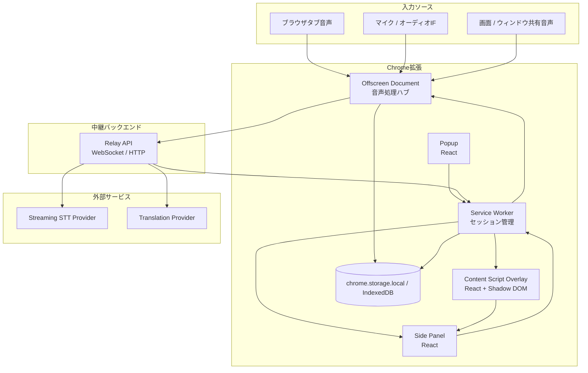
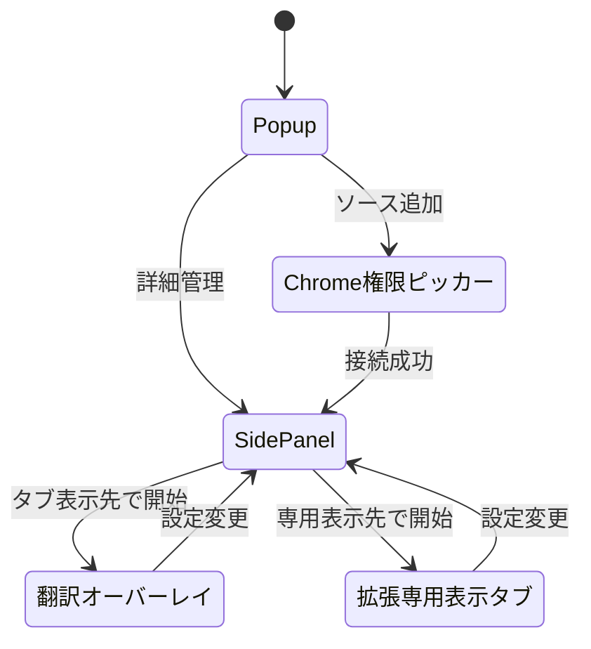
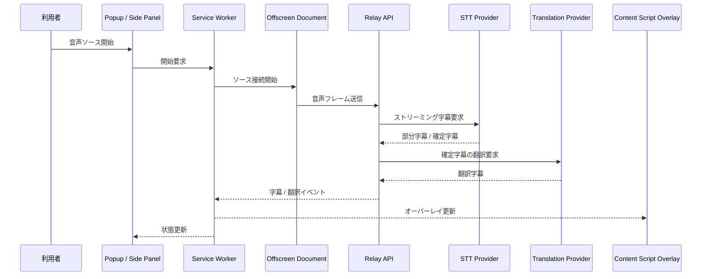
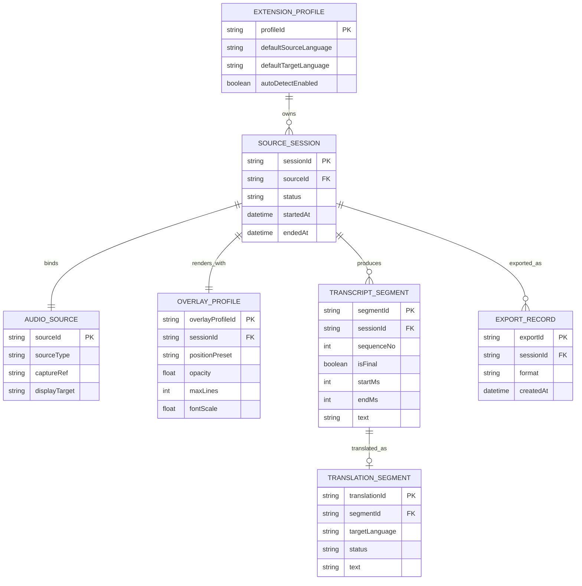

# 基本設計書

## 1. はじめに

### 1.1 目的

本文書は、リアルタイム文字起こし翻訳 Chrome 拡張の基本設計を定義する。Chrome 拡張内の各コンポーネント、音声取得から翻訳オーバーレイ表示までの処理経路、外部連携、概念データ構成、および共通処理方針を明確化することを目的とする。

### 1.2 対象読者

- 開発チームメンバー
- テックリード / アーキテクト
- 運用担当者

### 1.3 関連文書

- [要件定義書](../01-requirements/requirements-specification.md)
- [詳細設計書](../03-detailed-design/detailed-design.md)
- [API仕様書](../04-api-specification/api-specification.md)
- [セキュリティ設計書](../09-security-design/security-design.md)

## 2. システム概要

本システムは、Chrome 拡張を主たる実行基盤とし、音声取得と UI 表示をクライアント側で担い、文字起こしと翻訳は外部サービスを中継バックエンド経由で利用する構成を採用する。

利用者は Popup または Side Panel から音声ソースを追加する。音声ソースは Offscreen Document で収集・前処理され、ソース単位のストリームとして中継バックエンドへ送信される。バックエンドは STT および翻訳プロバイダと接続し、得られた字幕・翻訳結果を拡張へ返却する。Content Script は対象タブ上に React ベースの翻訳オーバーレイを描画し、Side Panel は複数ソースの管理と状態監視を行う。

初回リリースでは、ブラウザタブ音声およびマイク / オーディオインターフェース入力を優先対応とする。画面共有 / ウィンドウ共有音声は同一パイプラインへ接続できる設計とし、Chrome 外のネイティブアプリへの直接オーバーレイ表示は対象外とする。

また、将来拡張として翻訳結果の音声出力を追加できるよう、TTS プロバイダは Relay API 背後で差し替え可能な構成とする。現時点の候補は `Deepgram Aura-2` と `Google Chirp 3: HD` とし、MVP のホットパスには含めない。

## 3. システム構成図

図: Chrome 拡張内コンポーネント、中継バックエンド、外部プロバイダの全体構成。

## 4. 技術スタック

| レイヤー           | 技術                                | バージョン                      | 選定理由                                                                |
| ------------------ | ----------------------------------- | ------------------------------- | ----------------------------------------------------------------------- |
| 拡張フレームワーク | WXT                                 | 採用時点の最新安定版            | エントリポイント管理、MV3 対応、Chrome 拡張向け開発体験の標準化         |
| 言語               | TypeScript                          | 採用時点の最新安定版            | 型安全なメッセージ契約と設定管理を実現するため                          |
| UI                 | React                               | 採用時点の最新安定版            | Popup、Side Panel、オーバーレイ UI をコンポーネント指向で構築するため   |
| 拡張ランタイム     | Chrome Extensions API               | Chrome 安定版準拠               | `tabCapture`、`desktopCapture`、`sidePanel`、`offscreen` を利用するため |
| 音声前処理         | Web Audio API / AudioWorklet        | ブラウザ標準                    | 低遅延で音声整形、リサンプリング、メータリングを行うため                |
| バックエンド       | Node.js / Fastify                   | 24.x LTS / 採用時点の最新安定版 | WebSocket / HTTP 中継、ベンダー抽象化、API キー秘匿に適するため         |
| データ保存         | chrome.storage.local / IndexedDB    | ブラウザ標準                    | 軽量設定とセッション字幕を分離して保存するため                          |
| 外部連携           | Streaming STT API / Translation API | 各プロバイダの推奨安定版        | リアルタイム字幕と翻訳を実現するため                                    |
| 音声出力拡張       | TTS API                             | 各プロバイダの推奨安定版        | 将来の翻訳読み上げ機能へ備えるため                                      |

<!-- 技術選定の詳細な理由はADRとして記録すること -->

## 5. 機能一覧

| ID     | 機能名                                 | 概要                                                               | 関連要件                                                            |
| ------ | -------------------------------------- | ------------------------------------------------------------------ | ------------------------------------------------------------------- |
| SD-001 | 音声ソース接続管理                     | タブ音声、マイク、共有音声をソースとして接続しセッションを開始する | [REQ-001](../01-requirements/requirements-specification.md#req-001) |
| SD-002 | 権限・状態管理                         | 権限取得、ソース状態遷移、再接続状態を統一管理する                 | [REQ-002](../01-requirements/requirements-specification.md#req-002) |
| SD-003 | リアルタイム文字起こしパイプライン     | 音声ストリームを字幕へ変換し部分字幕と確定字幕を生成する           | [REQ-003](../01-requirements/requirements-specification.md#req-003) |
| SD-004 | 言語設定・判定管理                     | 入力言語、自動判定、翻訳先言語をソース単位で管理する               | [REQ-004](../01-requirements/requirements-specification.md#req-004) |
| SD-005 | リアルタイム翻訳パイプライン           | 確定字幕を翻訳し、対応する翻訳字幕を返却する                       | [REQ-005](../01-requirements/requirements-specification.md#req-005) |
| SD-006 | 複数ソース同時処理オーケストレーション | ソース単位の独立パイプラインを並列実行する                         | [REQ-006](../01-requirements/requirements-specification.md#req-006) |
| SD-007 | 翻訳オーバーレイ表示                   | Content Script 上で翻訳オーバーレイを描画・更新する                | [REQ-007](../01-requirements/requirements-specification.md#req-007) |
| SD-008 | セッション保存・エクスポート           | 字幕・翻訳結果を保持し、TXT / JSON へエクスポートする              | [REQ-008](../01-requirements/requirements-specification.md#req-008) |
| SD-009 | エラー復旧・劣化運転                   | ソース切断や翻訳障害時に再試行と部分継続を行う                     | [REQ-009](../01-requirements/requirements-specification.md#req-009) |

### 5.1 機能責務

#### SD-001: 音声ソース接続管理 {#sd-001}

- Popup / Side Panel から選択されたソース種別に応じて接続フローを開始する
- `tabCapture`、`getUserMedia()`、共有音声取得 API を統一的なソース情報へ変換する

#### SD-002: 権限・状態管理 {#sd-002}

- Chrome 権限要求とソース単位の状態遷移を Service Worker で管理する
- Side Panel と Overlay へ現在状態を配信し、再試行導線を提供する

#### SD-003: リアルタイム文字起こしパイプライン {#sd-003}

- Offscreen Document で音声フレームを生成し、中継バックエンド経由で STT を実行する
- 部分字幕と確定字幕を同一セグメント系列として保持する

#### SD-004: 言語設定・判定管理 {#sd-004}

- ソース単位の入力言語、翻訳先言語、自動判定フラグを保持する
- 自動判定結果は新規字幕処理へ反映し、既存確定字幕は不変とする

#### SD-005: リアルタイム翻訳パイプライン {#sd-005}

- 確定字幕を翻訳対象として中継バックエンドへ送信する
- 翻訳字幕は原文セグメントと 1 対 1 で関連付けて返却する

#### SD-006: 複数ソース同時処理オーケストレーション {#sd-006}

- `sourceId` ごとに独立した capture / STT / translation / overlay チャネルを持つ
- 1 ソース障害時も他ソースが継続できるよう、状態と再試行を分離する

#### SD-007: 翻訳オーバーレイ表示 {#sd-007}

- Content Script 上で React と Shadow DOM により表示レイヤを注入する
- 位置、透明度、最大行数などの表示設定をリアルタイム反映する

#### SD-008: セッション保存・エクスポート {#sd-008}

- 字幕、翻訳、メタデータを IndexedDB へ保存し、セッション単位で再参照可能にする
- TXT / JSON のエクスポート形式へ整形し、利用者操作で出力する

#### SD-009: エラー復旧・劣化運転 {#sd-009}

- 翻訳失敗時は文字起こしのみ継続する `degraded` 状態を提供する
- 接続断、タイムアウト、保存失敗をエラー分類し、復旧可能なものは自動再試行する

## 6. 画面設計

### 6.1 画面一覧

| ID     | 画面名           | 概要                                                     | URL パターン                                 |
| ------ | ---------------- | -------------------------------------------------------- | -------------------------------------------- |
| UI-001 | Popup            | 音声ソース追加、簡易開始 / 停止、直近状態確認            | `chrome-extension://<ext-id>/popup.html`     |
| UI-002 | Side Panel       | ソース一覧、言語設定、オーバーレイ設定、エクスポート操作 | `chrome-extension://<ext-id>/sidepanel.html` |
| UI-003 | 翻訳オーバーレイ | 対象タブ上に重ねて表示される翻訳字幕 UI                  | `match: <all_urls>`                          |
| UI-004 | 拡張専用表示タブ | マイクなどの表示先として使う専用モニタ画面               | `chrome-extension://<ext-id>/monitor.html`   |

### 6.2 画面遷移図

図: 利用者が音声ソース追加からオーバーレイ確認に至る主要遷移。

## 7. 外部インターフェース

### 7.1 外部システム連携一覧

| ID     | 連携先                 | プロトコル                   | 方向   | 概要                                         |
| ------ | ---------------------- | ---------------------------- | ------ | -------------------------------------------- |
| IF-001 | Relay API              | WSS / HTTPS                  | 双方向 | 音声フレーム送信、字幕 / 翻訳イベント受信    |
| IF-002 | Streaming STT Provider | WSS / HTTPS                  | 送受信 | 音声から部分字幕 / 確定字幕を取得            |
| IF-003 | Translation Provider   | HTTPS                        | 送受信 | 確定字幕を翻訳し翻訳結果を取得               |
| IF-004 | TTS Provider           | HTTPS / gRPC / Streaming API | 送受信 | 将来の翻訳読み上げ機能で翻訳文から音声を生成 |

### 7.2 連携シーケンス

図: タブ音声をリアルタイム翻訳オーバーレイへ反映する基本シーケンス。

### 7.3 TTS 拡張方針

- TTS は MVP の必須機能ではなく、翻訳オーバーレイを阻害しない後続拡張として扱う
- TTS 呼び出しは Relay API 背後で抽象化し、Chrome 拡張からベンダー固有 API を直接呼ばない
- 候補プロバイダは `Deepgram Aura-2` と `Google Chirp 3: HD` の 2 つを採用候補とする
- `Deepgram Aura-2` は低遅延・低コスト寄りの候補、`Google Chirp 3: HD` は高品質・表現力寄りの候補として評価する

## 8. 概念ER図

図: セッション、字幕、翻訳、オーバーレイ設定の概念データモデル。

## 9. 共通処理方針

### 9.1 認証・認可

- 初回リリースではエンドユーザーのログインは必須としない
- Chrome 権限許可を音声取得の前提とし、ソース接続ごとに明示操作を要求する
- 外部プロバイダの API キーは拡張へ保持せず、中継バックエンド側で管理する
- バックエンドとの通信は拡張配布単位の資格情報または署名付きトークンで保護する

### 9.2 エラーハンドリング

- ソース単位で状態機械を持ち、`idle`、`requesting_permission`、`capturing`、`transcribing`、`translating`、`degraded`、`error` を管理する
- 翻訳障害時は `degraded` 状態へ遷移し、文字起こしのみ継続する
- ネットワーク断やプロバイダ一時障害は自動再試行し、復旧不能時のみ `error` に遷移する
- エラーコードは `CAPTURE-*`、`STT-*`、`TRANSLATION-*`、`EXPORT-*` の系統で分類する

### 9.3 ログ

- 拡張側とバックエンド側の双方で構造化ログ（JSON）を採用する
- すべてのログに `sessionId`、`sourceId`、必要に応じて `segmentId`、`requestId` を含める
- ブラウザ側ではデバッグレベルを切り替え可能とし、本番では機微情報を含む詳細ログを抑制する

### 9.4 バリデーション

- 言語設定、オーバーレイ位置、透明度、表示行数などの入力値は UI 側で即時バリデーションする
- バックエンドは字幕セグメント、翻訳要求、エクスポート要求を再検証する
- 音声ソース追加時はソース種別と表示先の整合性を検証する

## 10. 非機能設計方針

### 10.1 性能

- 音声前処理は Offscreen Document 上の AudioWorklet で行い、短いフレーム単位で中継バックエンドへ送信する
- 部分字幕は STT ストリームから順次反映し、翻訳は既定で確定字幕単位として UI の揺れを抑える
- オーバーレイは差分更新を基本とし、ページ全体の再描画を避ける

### 10.2 スケーラビリティ

- 中継バックエンドはステートレスな API / WebSocket ノードとして設計し、水平方向にスケールできるようにする
- STT / 翻訳プロバイダはアダプタ層越しに利用し、将来的な差し替えや複数ベンダー併用を容易にする
- ソースごとのパイプラインを独立させ、同時処理数上限の範囲で並列度を制御する

### 10.3 可用性

- Service Worker 再起動時も、ローカル設定とセッションメタデータは再読込できるように保存する
- 一時的なネットワーク断では自動再試行し、翻訳サービスのみ障害時は字幕表示を継続する
- 拡張内の 1 コンポーネント障害が全ソース停止に直結しないよう、Offscreen Document、Service Worker、UI の責務を分離する

### 10.4 バージョン運用方針

- LTS 提供のある技術は LTS を優先採用する
- LTS 提供のない技術は採用時点の最新安定版を採用する
- バックエンド実行環境の Node.js は 24.x LTS を固定する
- バージョン更新時は互換性影響を確認し、必要に応じて ADR と関連設計書を更新する

## 変更履歴

| バージョン | 日付       | 変更者 | 変更内容                                  |
| ---------- | ---------- | ------ | ----------------------------------------- |
| 0.1.0      | 2026-04-20 | Codex  | 初版作成                                  |
| 0.2.0      | 2026-04-20 | Codex  | Node.js 24 LTS と技術バージョン方針を反映 |
