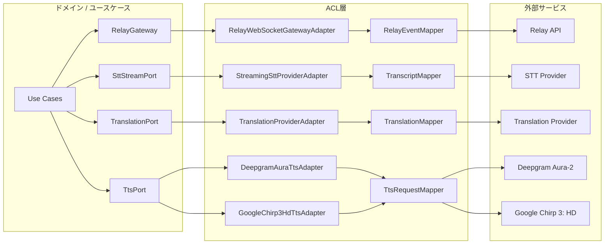
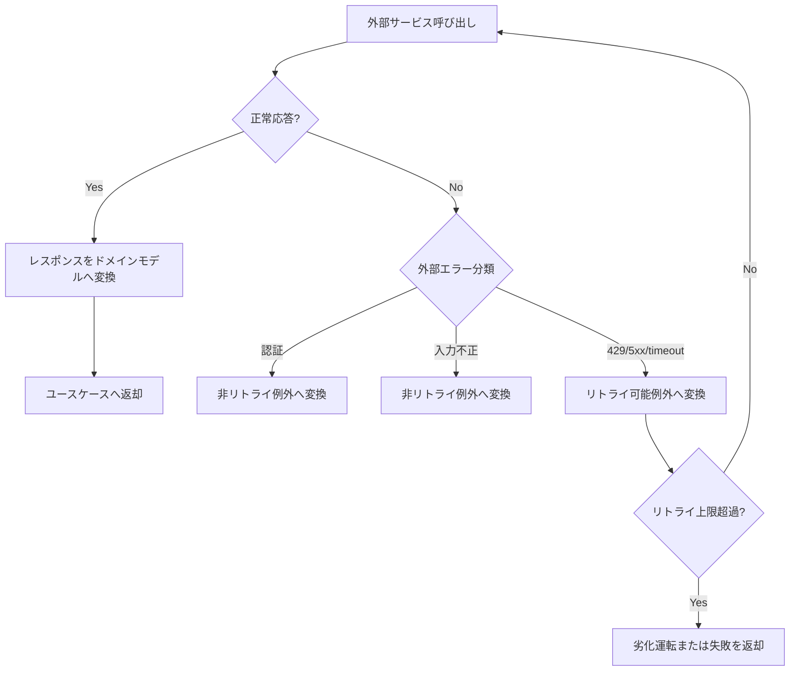

# ACL（腐敗防止層）設計書

## 1. はじめに

### 1.1 目的

本文書は、Chrome 拡張と Relay API、および Relay API と外部 STT / 翻訳 / 将来の TTS サービスの境界における ACL を定義する。外部イベント形式、エラー体系、認証方式をドメインモデルから隔離し、将来のベンダー差し替えを容易にすることを目的とする。

### 1.2 関連文書

| 関連 | 文書                         | 参照先                                                               |
| ---- | ---------------------------- | -------------------------------------------------------------------- |
| 上流 | 基本設計書                   | [system-design.md](../02-system-design/system-design.md)             |
| 上流 | ドメイン層設計書             | [domain.md](./domain.md)                                             |
| 同層 | ユースケース層設計書         | [use-case.md](./use-case.md)                                         |
| 同層 | 詳細設計書                   | [detailed-design.md](./detailed-design.md)                           |
| 関連 | インフラストラクチャ層設計書 | [infrastructure.md](./infrastructure.md)                             |
| 関連 | API仕様書                    | [api-specification.md](../04-api-specification/api-specification.md) |
| 関連 | セキュリティ設計書           | [security-design.md](../09-security-design/security-design.md)       |

### 1.3 ACL の設計原則

1. ドメイン層へ外部 API のイベント形式や例外型を漏らさない
2. 外部モデルとドメインモデルの変換はマッパーへ集約する
3. 外部障害は `retryable` / `non-retryable` に正規化して扱う
4. 監視・ログに必要なメタデータを必ず残す
5. ホットパス上の変換コストを最小化する

## 2. ポートとアダプタの全体像

### 2.1 アーキテクチャ概要



### 2.2 ポート一覧

| ID     | ポート名        | 定義場所           | 責務                                       | 実装アダプタ                                         |
| ------ | --------------- | ------------------ | ------------------------------------------ | ---------------------------------------------------- |
| DD-401 | RelayGateway    | 拡張アプリ層       | Relay API との接続、イベント送受信の抽象化 | `RelayWebSocketGatewayAdapter`                       |
| DD-402 | SttStreamPort   | Relay API アプリ層 | STT ストリームの抽象化                     | `StreamingSttProviderAdapter`                        |
| DD-403 | TranslationPort | Relay API アプリ層 | 翻訳 API の抽象化                          | `TranslationProviderAdapter`                         |
| DD-404 | TtsPort         | Relay API アプリ層 | 将来の TTS 生成の抽象化                    | `DeepgramAuraTtsAdapter`, `GoogleChirp3HdTtsAdapter` |

### 2.3 アダプタ一覧

| ID     | アダプタ名                   | 実装ポート      | 外部サービス           | 概要                                                 |
| ------ | ---------------------------- | --------------- | ---------------------- | ---------------------------------------------------- |
| DD-411 | RelayWebSocketGatewayAdapter | RelayGateway    | Relay API              | `session.start`、`audio.frame`、字幕イベントの送受信 |
| DD-412 | StreamingSttProviderAdapter  | SttStreamPort   | Streaming STT Provider | 音声フレームを外部 STT スキーマへ変換                |
| DD-413 | TranslationProviderAdapter   | TranslationPort | Translation Provider   | 確定字幕を翻訳 API 形式へ変換                        |
| DD-414 | DeepgramAuraTtsAdapter       | TtsPort         | Deepgram Aura-2        | 将来の低遅延 TTS 候補                                |
| DD-415 | GoogleChirp3HdTtsAdapter     | TtsPort         | Google Chirp 3: HD     | 将来の高品質 TTS 候補                                |

## 3. 外部 API 概要

### 3.1 外部サービス一覧

| ID      | サービス名             | ベースURL                          | 認証方式               | レートリミット                                                                     | APIバージョン      |
| ------- | ---------------------- | ---------------------------------- | ---------------------- | ---------------------------------------------------------------------------------- | ------------------ |
| EXT-401 | Relay API              | `https://relay.example.com/api/v1` | Bearer Token           | [API仕様書](../04-api-specification/api-specification.md#24-レートリミット) に従う | `1.0`              |
| EXT-402 | Streaming STT Provider | ベンダー依存                       | サーバーサイド資格情報 | 契約に従う                                                                         | ベンダー推奨安定版 |
| EXT-403 | Translation Provider   | ベンダー依存                       | サーバーサイド資格情報 | 契約に従う                                                                         | ベンダー推奨安定版 |
| EXT-404 | Deepgram Aura-2        | `https://api.deepgram.com`         | API Key                | 契約に従う                                                                         | 推奨安定版         |
| EXT-405 | Google Chirp 3: HD     | Google Cloud TTS Endpoint          | サービスアカウント     | 契約に従う                                                                         | 推奨安定版         |

### 3.2 エンドポイント一覧

#### EXT-401: Relay API

| エンドポイント          | メソッド / 種別 | 概要                             | 使用アダプタ                   |
| ----------------------- | --------------- | -------------------------------- | ------------------------------ |
| `/sessions`             | `POST`          | セッション初期化                 | `RelayWebSocketGatewayAdapter` |
| `/sessions/{sessionId}` | `GET`           | 状態取得                         | `RelayWebSocketGatewayAdapter` |
| `/relay`                | WebSocket       | 音声 / 字幕 / 翻訳イベント送受信 | `RelayWebSocketGatewayAdapter` |

#### EXT-404 / 405: 将来の TTS API

| サービス           | 操作     | 概要                           | 使用アダプタ               |
| ------------------ | -------- | ------------------------------ | -------------------------- |
| Deepgram Aura-2    | 音声合成 | 翻訳テキストから音声生成       | `DeepgramAuraTtsAdapter`   |
| Google Chirp 3: HD | 音声合成 | 翻訳テキストから高品質音声生成 | `GoogleChirp3HdTtsAdapter` |

## 4. リクエスト / レスポンスマッピング

### 4.1 マッピング方針

- Relay API のイベントエンベロープは `RelayEventMapper` でドメインイベントへ変換する
- STT / 翻訳 / TTS ベンダー固有フィールドは ACL 層で吸収する
- ベンダー固有ステータスは、`completed / failed / retryable` に正規化する
- ホットパスでは必要最小限のフィールドのみをドメインへ渡す

### 4.2 マッピング定義

#### DD-411: RelayWebSocketGatewayAdapter

**外部モデル → ドメインモデル**

| 外部フィールド          | 型       | ドメインフィールド | 型               | 変換ロジック               |
| ----------------------- | -------- | ------------------ | ---------------- | -------------------------- |
| `eventType`             | `string` | `eventKind`        | `RelayEventKind` | 定義済みイベント列挙へ変換 |
| `sessionId`             | `string` | `sessionId`        | `SessionId`      | 値オブジェクトとしてラップ |
| `payload.segmentId`     | `string` | `segmentId`        | `SegmentId`      | 値オブジェクトとしてラップ |
| `payload.text`          | `string` | `text`             | `string`         | プレーンテキストとして保持 |
| `payload.startOffsetMs` | `number` | `timeRange.start`  | `number`         | そのまま利用               |
| `payload.endOffsetMs`   | `number` | `timeRange.end`    | `number`         | そのまま利用               |

**ドメインモデル → 外部モデル**

| ドメインフィールド            | 型            | 外部フィールド           | 型       | 変換ロジック |
| ----------------------------- | ------------- | ------------------------ | -------- | ------------ |
| `sessionId`                   | `SessionId`   | `sessionId`              | `string` | 文字列へ変換 |
| `audioChunk`                  | `ArrayBuffer` | `payload.audioBase64`    | `string` | Base64 変換  |
| `languagePair.targetLanguage` | `string`      | `payload.targetLanguage` | `string` | そのまま利用 |

#### 疑似コード

```ts
class RelayEventMapper {
  toTranscriptPartial(event: RelayEnvelope): TranscriptPartialUpdated {
    return {
      sessionId: SessionId.from(event.sessionId),
      segmentId: SegmentId.from(event.payload.segmentId),
      revision: event.payload.revision,
      text: event.payload.text,
      timeRange: {
        start: event.payload.startOffsetMs,
        end: event.payload.endOffsetMs,
      },
    };
  }
}
```

## 5. エラー変換

### 5.1 エラー変換テーブル

| アダプタ        | 外部エラー / 状態            | ドメイン例外                    | リトライ対象 |
| --------------- | ---------------------------- | ------------------------------- | ------------ |
| DD-411          | `401/403`, 無効トークン      | `RelayAuthenticationException`  | No           |
| DD-411          | `429`, `RATE_LIMIT_EXCEEDED` | `RelayRateLimitException`       | Yes          |
| DD-411          | 接続タイムアウト             | `RelayTimeoutException`         | Yes          |
| DD-412          | STT ストリーム切断           | `SttStreamUnavailableException` | Yes          |
| DD-413          | `UNSUPPORTED_LANGUAGE_PAIR`  | `UnsupportedLanguagePairError`  | No           |
| DD-413          | 翻訳タイムアウト             | `TranslationTimeoutException`   | Yes          |
| DD-414 / DD-415 | TTS 生成失敗                 | `TtsSynthesisException`         | Yes          |

### 5.2 エラー変換フロー



## 6. レジリエンスパターン

### 6.1 サーキットブレーカー

| 設定項目              | Relay | STT   | Translation | TTS   |
| --------------------- | ----- | ----- | ----------- | ----- |
| 失敗回数閾値          | 5     | 5     | 5           | 5     |
| 監視ウィンドウ        | 30 秒 | 30 秒 | 30 秒       | 60 秒 |
| Open 状態タイムアウト | 15 秒 | 15 秒 | 15 秒       | 30 秒 |
| HalfOpen 試行回数     | 2     | 2     | 2           | 2     |

### 6.2 リトライ

| 設定項目         | Relay | STT   | Translation | TTS   |
| ---------------- | ----- | ----- | ----------- | ----- |
| 最大リトライ回数 | 3     | 3     | 1           | 1     |
| 初回待機時間     | 250ms | 250ms | 150ms       | 300ms |
| バックオフ倍率   | 2.0   | 2.0   | 2.0         | 2.0   |
| ジッター         | あり  | あり  | あり        | あり  |

### 6.3 タイムアウト

| 設定項目               | 値     | 根拠                                                                                |
| ---------------------- | ------ | ----------------------------------------------------------------------------------- |
| Relay 接続タイムアウト | 3000ms | [API仕様書](../04-api-specification/api-specification.md#26-レイテンシ優先ポリシー) |
| STT 初回応答           | 1000ms | 同上                                                                                |
| 翻訳リクエスト         | 800ms  | 同上                                                                                |
| TTS 合成開始           | 1500ms | MVP ホットパス外の将来拡張のため余裕を持たせる                                      |

### 6.4 フォールバック

| サービス             | フォールバック戦略           | デグレード内容                           |
| -------------------- | ---------------------------- | ---------------------------------------- |
| Relay API            | 再接続                       | 一時的な接続断では再接続待機表示         |
| STT Provider         | 再接続またはセッションエラー | 字幕生成を停止し利用者へ再試行導線を表示 |
| Translation Provider | `degraded` へ移行            | 文字起こしのみ継続                       |
| TTS Provider         | 呼び出しスキップ             | 字幕表示のみ継続                         |

## 7. テスト戦略

### 7.1 モック / スタブ方針

- 単体テストではポートのモックを使用する
- 結合テストでは Relay / STT / 翻訳のスタブサーバーを使用する
- TTS は将来拡張のため、契約テスト用スタブのみ先行整備する

### 7.2 テストダブル一覧

| ポート名        | 種別 | クラス名              | 用途                      |
| --------------- | ---- | --------------------- | ------------------------- |
| RelayGateway    | Mock | `MockRelayGateway`    | ユースケース単体テスト    |
| RelayGateway    | Stub | `StubRelayApiServer`  | WebSocket 契約テスト      |
| SttStreamPort   | Mock | `MockSttStreamPort`   | Relay API 内部テスト      |
| TranslationPort | Mock | `MockTranslationPort` | 翻訳失敗 / 劣化運転テスト |
| TtsPort         | Mock | `MockTtsPort`         | 将来の音声出力テスト      |

## 8. 監視と可観測性

### 8.1 ログ方針

| ログ項目                 | 出力タイミング | レベル | 出力内容                                          |
| ------------------------ | -------------- | ------ | ------------------------------------------------- |
| 外部リクエスト送信       | 呼び出し前     | INFO   | サービス名、`sessionId`、エンドポイント、要求種別 |
| 外部レスポンス受信       | 呼び出し後     | INFO   | サービス名、ステータス、応答時間                  |
| リトライ実行             | リトライ時     | WARN   | サービス名、回数、原因                            |
| サーキットブレーカー遷移 | 状態変更時     | WARN   | サービス名、遷移前後状態                          |
| フォールバック実行       | 劣化運転移行時 | WARN   | サービス名、戦略、影響範囲                        |

### 8.2 メトリクス

| メトリクス名              | 種別      | ラベル                               | 説明                     |
| ------------------------- | --------- | ------------------------------------ | ------------------------ |
| `acl_request_total`       | Counter   | `service`, `result`                  | 外部サービス呼び出し総数 |
| `acl_request_duration_ms` | Histogram | `service`, `operation`               | 呼び出し所要時間         |
| `acl_error_total`         | Counter   | `service`, `error_type`, `retryable` | エラー件数               |
| `acl_fallback_total`      | Counter   | `service`, `strategy`                | フォールバック実行件数   |

## 9. アダプタ詳細設計

### DD-411: RelayWebSocketGatewayAdapter

| 項目         | 内容                                                             |
| ------------ | ---------------------------------------------------------------- |
| 実装ポート   | `RelayGateway`                                                   |
| 外部サービス | Relay API                                                        |
| 責務         | セッション初期化、WebSocket 接続、音声フレーム送信、イベント受信 |

### DD-414: DeepgramAuraTtsAdapter

| 項目         | 内容                                        |
| ------------ | ------------------------------------------- |
| 実装ポート   | `TtsPort`                                   |
| 外部サービス | Deepgram Aura-2                             |
| 責務         | 低遅延寄り TTS 候補として翻訳文を音声化する |

### DD-415: GoogleChirp3HdTtsAdapter

| 項目         | 内容                                        |
| ------------ | ------------------------------------------- |
| 実装ポート   | `TtsPort`                                   |
| 外部サービス | Google Chirp 3: HD                          |
| 責務         | 高品質寄り TTS 候補として翻訳文を音声化する |

## 変更履歴

| バージョン | 日付       | 変更者 | 変更内容 |
| ---------- | ---------- | ------ | -------- |
| 0.1.0      | 2026-04-21 | Codex  | 初版作成 |
