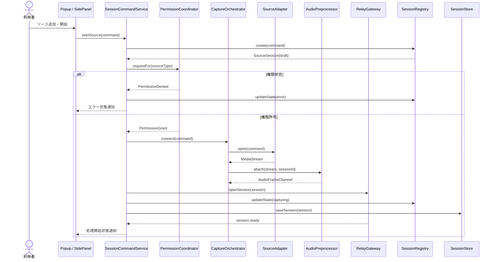
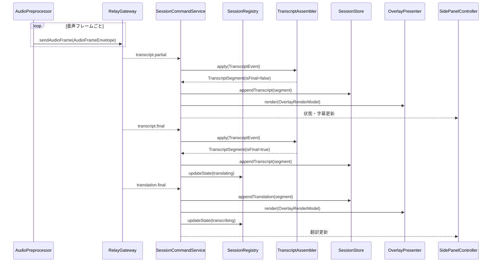
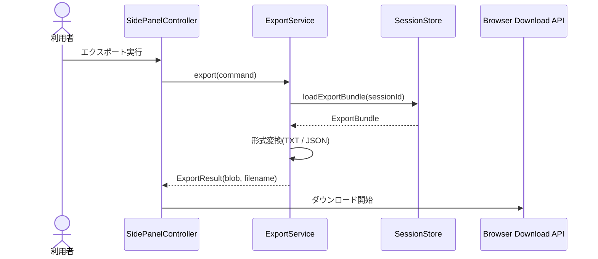
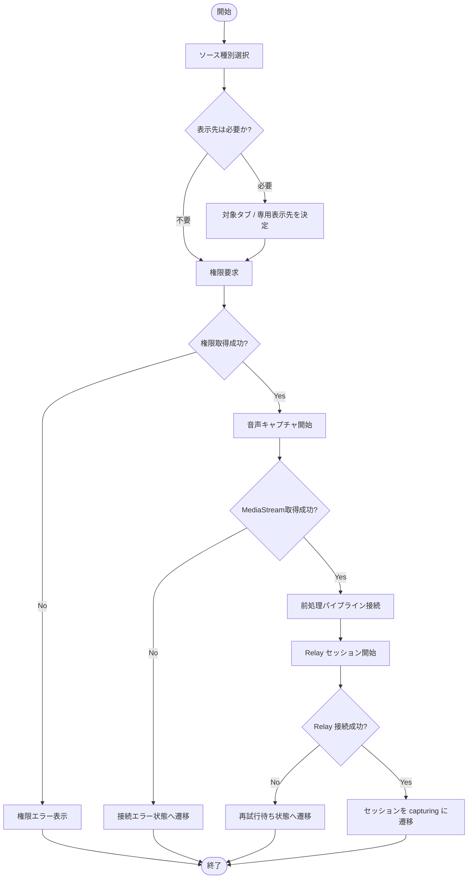
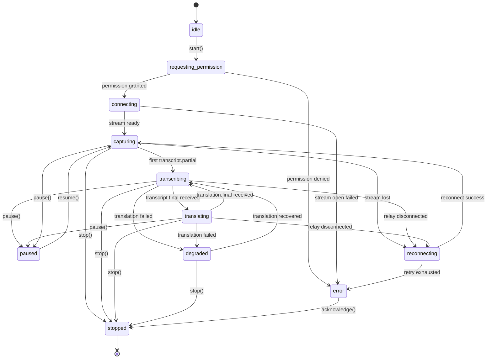

# 詳細設計書

## 1. はじめに

### 1.1 目的

本文書は、リアルタイム文字起こし翻訳 Chrome 拡張の主要処理について、実装に近い粒度の詳細設計を定義する。Chrome 拡張内モジュールの責務、音声取得から翻訳オーバーレイ表示までのシーケンス、メッセージ契約、エラー処理、状態遷移を明確化することを目的とする。

### 1.2 対応する基本設計項目

- [基本設計書 SD-001: 音声ソース接続管理](../02-system-design/system-design.md#sd-001)
- [基本設計書 SD-002: 権限・状態管理](../02-system-design/system-design.md#sd-002)
- [基本設計書 SD-003: リアルタイム文字起こしパイプライン](../02-system-design/system-design.md#sd-003)
- [基本設計書 SD-004: 言語設定・判定管理](../02-system-design/system-design.md#sd-004)
- [基本設計書 SD-005: リアルタイム翻訳パイプライン](../02-system-design/system-design.md#sd-005)
- [基本設計書 SD-006: 複数ソース同時処理オーケストレーション](../02-system-design/system-design.md#sd-006)
- [基本設計書 SD-007: 翻訳オーバーレイ表示](../02-system-design/system-design.md#sd-007)
- [基本設計書 SD-008: セッション保存・エクスポート](../02-system-design/system-design.md#sd-008)
- [基本設計書 SD-009: エラー復旧・劣化運転](../02-system-design/system-design.md#sd-009)

→ [基本設計書](../02-system-design/system-design.md)

## 2. クラス設計

### 2.1 クラス図

```mermaid
classDiagram
    class PopupController {
        +startSource(command: StartSourceCommand) void
        +stopSource(sessionId: string) void
        +openSidePanel() void
    }

    class SidePanelController {
        +updateSourceSettings(command: UpdateSourceSettingsCommand) void
        +pauseSource(sessionId: string) void
        +resumeSource(sessionId: string) void
        +exportSession(command: ExportSessionCommand) void
    }

    class SessionCommandService {
        -permissionCoordinator: PermissionCoordinator
        -captureOrchestrator: CaptureOrchestrator
        -sessionRegistry: SessionRegistry
        -relayGateway: RelayGateway
        -overlayPresenter: OverlayPresenter
        -sessionStore: SessionStore
        +startSource(command: StartSourceCommand) SourceSession
        +stopSource(sessionId: string) void
        +pauseSource(sessionId: string) void
        +resumeSource(sessionId: string) void
        +applySourceSettings(command: UpdateSourceSettingsCommand) void
        +handleRelayEvent(event: RelayEvent) void
    }

    class PermissionCoordinator {
        +requestFor(sourceType: SourceType) PermissionGrant
    }

    class CaptureOrchestrator {
        -sourceAdapterFactory: SourceAdapterFactory
        -audioPreprocessor: AudioPreprocessor
        +connect(command: StartSourceCommand) ActiveCapture
        +disconnect(sessionId: string) void
        +pause(sessionId: string) void
        +resume(sessionId: string) void
    }

    class SourceAdapterFactory {
        +create(sourceType: SourceType) SourceAdapter
    }

    class SourceAdapter {
        <<interface>>
        +open(command: StartSourceCommand) MediaStream
        +close(sessionId: string) void
    }

    class TabCaptureSourceAdapter {
        +open(command: StartSourceCommand) MediaStream
    }

    class UserMediaSourceAdapter {
        +open(command: StartSourceCommand) MediaStream
    }

    class DesktopCaptureSourceAdapter {
        +open(command: StartSourceCommand) MediaStream
    }

    class AudioPreprocessor {
        +attach(stream: MediaStream, sessionId: string) AudioFrameChannel
        +detach(sessionId: string) void
    }

    class RelayGateway {
        +openSession(session: SourceSession) void
        +sendAudioFrame(frame: AudioFrameEnvelope) void
        +closeSession(sessionId: string) void
    }

    class TranscriptAssembler {
        +apply(event: TranscriptEvent) TranscriptSegment
    }

    class OverlayPresenter {
        +mount(target: OverlayTarget) void
        +render(segment: OverlayRenderModel) void
        +updateSettings(sessionId: string, settings: OverlaySettings) void
        +unmount(sessionId: string) void
    }

    class SessionRegistry {
        +create(command: StartSourceCommand) SourceSession
        +updateState(sessionId: string, state: SourceSessionState) void
        +find(sessionId: string) SourceSession
    }

    class SessionStore {
        +saveSession(session: SourceSession) void
        +appendTranscript(segment: TranscriptSegment) void
        +appendTranslation(segment: TranslationSegment) void
        +loadExportBundle(sessionId: string) ExportBundle
    }

    class ExportService {
        -sessionStore: SessionStore
        +export(command: ExportSessionCommand) ExportResult
    }

    PopupController --> SessionCommandService
    SidePanelController --> SessionCommandService
    SidePanelController --> ExportService
    SessionCommandService --> PermissionCoordinator
    SessionCommandService --> CaptureOrchestrator
    SessionCommandService --> SessionRegistry
    SessionCommandService --> RelayGateway
    SessionCommandService --> TranscriptAssembler
    SessionCommandService --> OverlayPresenter
    SessionCommandService --> SessionStore
    CaptureOrchestrator --> SourceAdapterFactory
    SourceAdapterFactory --> SourceAdapter
    TabCaptureSourceAdapter ..|> SourceAdapter
    UserMediaSourceAdapter ..|> SourceAdapter
    DesktopCaptureSourceAdapter ..|> SourceAdapter
    CaptureOrchestrator --> AudioPreprocessor
    ExportService --> SessionStore
```



### 2.2 各クラスの責務

| クラス名                    | レイヤー             | 責務                                                                    |
| --------------------------- | -------------------- | ----------------------------------------------------------------------- |
| PopupController             | プレゼンテーション   | Popup からの開始 / 停止要求を受け付けて Service Worker へ委譲する       |
| SidePanelController         | プレゼンテーション   | ソース設定変更、状態表示、エクスポート要求を扱う                        |
| SessionCommandService       | アプリケーション     | ソースセッションの開始 / 停止 / 設定変更とイベント反映を統括する        |
| PermissionCoordinator       | アプリケーション     | ソース種別ごとの権限取得フローを統一管理する                            |
| CaptureOrchestrator         | アプリケーション     | SourceAdapter と AudioPreprocessor を束ね、アクティブ音声処理を管理する |
| SourceAdapterFactory        | アプリケーション     | ソース種別に応じたキャプチャ実装を生成する                              |
| SourceAdapter               | インフラストラクチャ | 音声ソース接続の抽象インターフェースを提供する                          |
| TabCaptureSourceAdapter     | インフラストラクチャ | `chrome.tabCapture` によるタブ音声取得を行う                            |
| UserMediaSourceAdapter      | インフラストラクチャ | `getUserMedia()` によるマイク / オーディオ入力取得を行う                |
| DesktopCaptureSourceAdapter | インフラストラクチャ | 共有音声取得 API による画面 / ウィンドウ音声取得を行う                  |
| AudioPreprocessor           | インフラストラクチャ | 音声のモノラル化、リサンプリング、フレーム化を行う                      |
| RelayGateway                | インフラストラクチャ | 中継バックエンドとの WebSocket 接続とイベント送受信を行う               |
| TranscriptAssembler         | アプリケーション     | 部分字幕と確定字幕をセグメントとして整形・更新する                      |
| OverlayPresenter            | プレゼンテーション   | Content Script 上の React オーバーレイ描画を更新する                    |
| SessionRegistry             | アプリケーション     | ソースセッションの状態、設定、接続情報をメモリ管理する                  |
| SessionStore                | インフラストラクチャ | IndexedDB / chrome.storage.local への保存と取得を行う                   |
| ExportService               | アプリケーション     | 保存済みセッションデータを TXT / JSON へ変換する                        |

## 3. シーケンス設計

### 3.1 DD-001: 音声ソース開始処理 {#dd-001}



### 3.2 DD-002: リアルタイム文字起こし・翻訳反映処理 {#dd-002}



### 3.3 DD-003: セッションエクスポート処理 {#dd-003}



## 4. 処理フロー

### 4.1 音声ソース開始フロー



## 5. データ構造

### 5.1 主要な型定義・インターフェース

```ts
type SourceType = 'tab' | 'microphone' | 'desktop';

type OverlayTarget = { kind: 'tab'; tabId: number } | { kind: 'extension-monitor'; pageId: string };

type SourceSessionState =
  | 'idle'
  | 'requesting_permission'
  | 'connecting'
  | 'capturing'
  | 'transcribing'
  | 'translating'
  | 'paused'
  | 'reconnecting'
  | 'degraded'
  | 'stopped'
  | 'error';

interface StartSourceCommand {
  sourceType: SourceType;
  sourceRef?: string;
  displayName: string;
  sourceLanguage?: string;
  targetLanguage: string;
  autoDetectLanguage: boolean;
  overlayTarget: OverlayTarget;
  overlaySettings: OverlaySettings;
}

interface UpdateSourceSettingsCommand {
  sessionId: string;
  sourceLanguage?: string;
  targetLanguage?: string;
  autoDetectLanguage?: boolean;
  overlaySettings?: Partial<OverlaySettings>;
}

interface OverlaySettings {
  positionPreset: 'top' | 'bottom' | 'floating';
  opacity: number;
  maxLines: number;
  fontScale: number;
  showOriginalText: boolean;
  showTranslatedText: boolean;
}

interface SourceSession {
  sessionId: string;
  sourceId: string;
  sourceType: SourceType;
  displayName: string;
  state: SourceSessionState;
  sourceLanguage?: string;
  targetLanguage: string;
  overlayTarget: OverlayTarget;
  overlaySettings: OverlaySettings;
  startedAt: string;
}

interface AudioFrameEnvelope {
  sessionId: string;
  sequenceNo: number;
  sampleRate: 16000;
  channels: 1;
  pcm16Base64: string;
}

interface TranscriptEvent {
  sessionId: string;
  eventType: 'transcript.partial' | 'transcript.final';
  segmentId: string;
  startMs: number;
  endMs: number;
  text: string;
  detectedLanguage?: string;
}

interface TranslationEvent {
  sessionId: string;
  eventType: 'translation.final';
  segmentId: string;
  targetLanguage: string;
  text: string;
}

interface OverlayRenderModel {
  sessionId: string;
  displayName: string;
  originalText?: string;
  translatedText?: string;
  overlaySettings: OverlaySettings;
  updatedAt: string;
}
```

## 6. エラー処理設計

### 6.1 エラー分類

| 分類               | 説明                                        | 返却境界       | ログレベル |
| ------------------ | ------------------------------------------- | -------------- | ---------- |
| 権限エラー         | Chrome / OS 権限が拒否された                | UI             | WARN       |
| キャプチャエラー   | 音声ソース接続や MediaStream 取得に失敗した | UI             | ERROR      |
| Relay 接続エラー   | 中継バックエンドとの接続に失敗した          | UI / WebSocket | ERROR      |
| STT エラー         | 文字起こし処理が失敗した                    | UI / WebSocket | ERROR      |
| 翻訳エラー         | 翻訳処理が失敗したが字幕は継続可能          | UI / WebSocket | WARN       |
| 保存エラー         | IndexedDB / storage 書き込みに失敗した      | UI             | WARN       |
| エクスポートエラー | データ整形またはダウンロード開始に失敗した  | UI             | WARN       |
| システムエラー     | 予期しない例外                              | UI / Relay API | ERROR      |

### 6.2 エラーハンドリング方針

- 権限エラーは即時に `error` 状態へ遷移し、再許可手順を UI に表示する
- 翻訳エラーは `degraded` 状態へ遷移し、文字起こしのみ継続する
- Relay 接続断、STT 一時障害、共有切断などの復旧可能エラーは指数バックオフで最大 3 回自動再試行する
- 保存エラーが発生してもライブ表示は継続し、Side Panel に保存失敗の警告を表示する
- 予期しない例外は `SYSTEM_UNEXPECTED` として集約し、詳細はログにのみ記録する

### 6.3 エラーコード一覧

| エラーコード                  | 説明                               | 対処方法                                     |
| ----------------------------- | ---------------------------------- | -------------------------------------------- |
| `CAPTURE_PERMISSION_DENIED`   | 音声取得権限が拒否された           | Chrome または OS の権限設定を確認する        |
| `CAPTURE_STREAM_OPEN_FAILED`  | 音声ソースの接続に失敗した         | ソースの再選択または再試行を行う             |
| `RELAY_CONNECT_FAILED`        | Relay API に接続できない           | ネットワーク状態を確認し再試行する           |
| `STT_STREAM_FAILED`           | 文字起こしストリームが中断した     | 自動再試行の完了を待つか再開始する           |
| `TRANSLATION_PROVIDER_FAILED` | 翻訳処理に失敗した                 | 一時的に原文字幕のみ利用する                 |
| `SESSION_STORE_WRITE_FAILED`  | セッション保存に失敗した           | ブラウザストレージ状態を確認する             |
| `EXPORT_BUILD_FAILED`         | エクスポート用データ生成に失敗した | セッション内容を確認して再実行する           |
| `SYSTEM_UNEXPECTED`           | 想定外エラーが発生した             | 拡張を再起動し、改善しなければ調査対象とする |

## 7. 状態管理

### 7.1 ソースセッション状態遷移図



### 7.2 状態遷移表

| 現在の状態                                   | イベント                | 次の状態                | 条件                                      |
| -------------------------------------------- | ----------------------- | ----------------------- | ----------------------------------------- |
| `idle`                                       | `start()`               | `requesting_permission` | 利用者が開始操作を実行                    |
| `requesting_permission`                      | `permission_granted`    | `connecting`            | 必要権限を取得済み                        |
| `requesting_permission`                      | `permission_denied`     | `error`                 | いずれかの必須権限が拒否された            |
| `connecting`                                 | `stream_ready`          | `capturing`             | MediaStream と Relay セッションが利用可能 |
| `capturing`                                  | `transcript.partial`    | `transcribing`          | 最初の部分字幕を受信                      |
| `transcribing`                               | `transcript.final`      | `translating`           | 確定字幕が発行された                      |
| `translating`                                | `translation.final`     | `transcribing`          | 翻訳字幕の反映が完了した                  |
| `capturing` / `transcribing` / `translating` | `pause()`               | `paused`                | 利用者が一時停止を実行                    |
| `paused`                                     | `resume()`              | `capturing`             | 利用者が再開を実行                        |
| `capturing` / `transcribing` / `translating` | `disconnect_detected`   | `reconnecting`          | 再試行可能エラー                          |
| `reconnecting`                               | `reconnect_success`     | `capturing`             | 再接続成功                                |
| `reconnecting`                               | `retry_exhausted`       | `error`                 | 規定回数まで再試行しても失敗              |
| `transcribing` / `translating`               | `translation_failed`    | `degraded`              | 文字起こし継続可能                        |
| `degraded`                                   | `translation_recovered` | `transcribing`          | 翻訳処理が回復                            |
| 任意の稼働状態                               | `stop()`                | `stopped`               | 利用者が停止を実行                        |

## 変更履歴

| バージョン | 日付       | 変更者 | 変更内容 |
| ---------- | ---------- | ------ | -------- |
| 0.1.0      | 2026-04-20 | Codex  | 初版作成 |
