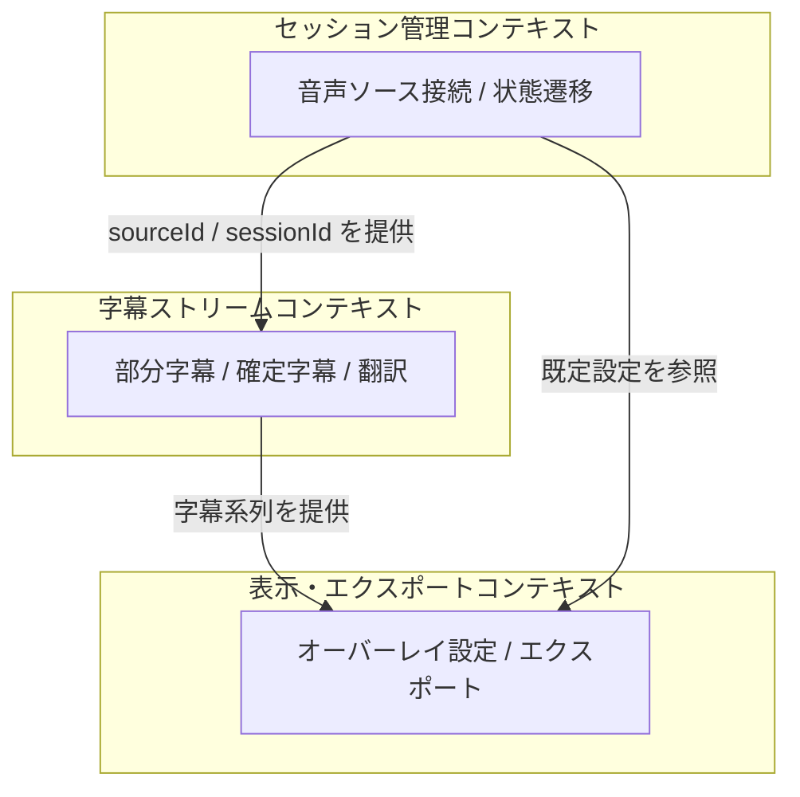
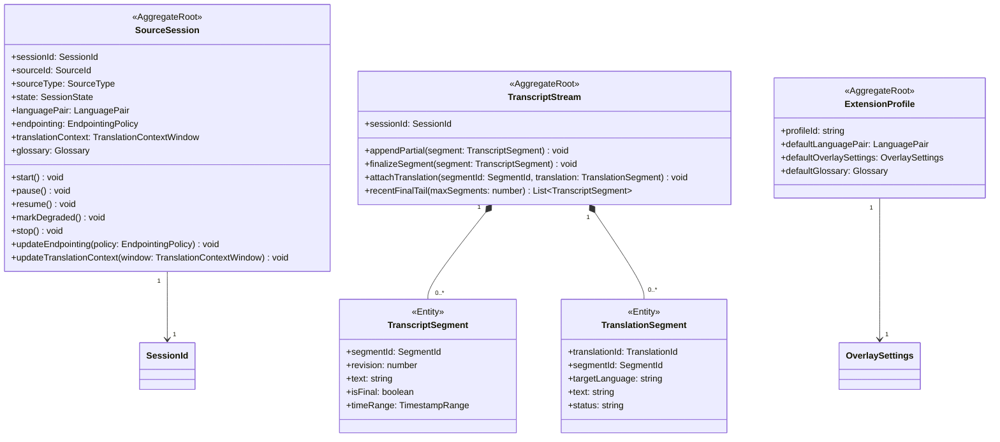
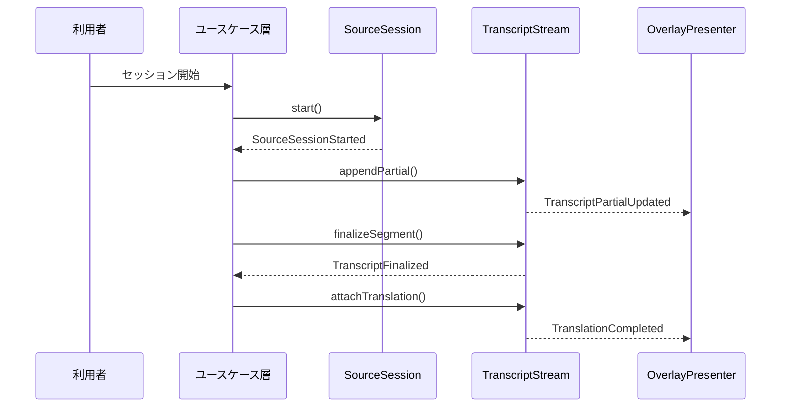
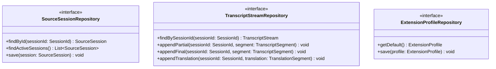

# ドメイン層設計書

## 1. はじめに

### 1.1 目的

本文書は、リアルタイム文字起こし翻訳 Chrome 拡張のドメイン層設計を定義する。音声ソース、セッション、字幕、翻訳、オーバーレイ設定、エクスポートに関する概念モデルを明確化し、ユースケース層とインフラ層が共有すべきビジネス上の不変条件を整理する。

### 1.2 関連文書

**上流文書:**

- [要件定義書](../01-requirements/requirements-specification.md)
- [基本設計書](../02-system-design/system-design.md)

**同層文書:**

- [詳細設計書](./detailed-design.md)
- [ユースケース層設計書](./use-case.md)
- [ACL設計書](./acl.md)

**下流文書:**

- [インフラストラクチャ層設計書](./infrastructure.md)
- [データベース設計書](../05-database-design/database-design.md)

> 注記: 本文書では `DD-2xx` 系を使用し、他の詳細設計文書と採番を分離する。

## 2. 境界づけられたコンテキスト

### 2.1 コンテキストマップ

### 2.2 コンテキスト定義

| ID     | コンテキスト名                 | 責務                                           | 上流下流関係                     |
| ------ | ------------------------------ | ---------------------------------------------- | -------------------------------- |
| DD-201 | セッション管理コンテキスト     | 音声ソース接続、セッション状態、同時処理制御   | 字幕ストリームの上流             |
| DD-202 | 字幕ストリームコンテキスト     | 部分字幕、確定字幕、翻訳字幕の系列管理         | セッション管理の下流、表示の上流 |
| DD-203 | 表示・エクスポートコンテキスト | オーバーレイ設定、表示モデル、エクスポート整形 | 字幕ストリームの下流             |

## 3. ユビキタス言語

| 用語                     | 英語名                     | 定義                                                             | コンテキスト       | 関連要件                                                                  |
| ------------------------ | -------------------------- | ---------------------------------------------------------------- | ------------------ | ------------------------------------------------------------------------- |
| 音声ソース               | AudioSource                | タブ音声、マイク、共有音声など、入力の起点                       | セッション管理     | [REQ-001](../01-requirements/requirements-specification.md#req-001)       |
| ソースセッション         | SourceSession              | 1 音声ソースに対する開始から停止までの処理単位                   | セッション管理     | [REQ-001](../01-requirements/requirements-specification.md#req-001)       |
| 部分字幕                 | Partial Transcript         | 発話途中の暫定字幕                                               | 字幕ストリーム     | [REQ-003](../01-requirements/requirements-specification.md#req-003)       |
| 確定字幕                 | Final Transcript           | 区切り確定後の原文字幕                                           | 字幕ストリーム     | [REQ-003](../01-requirements/requirements-specification.md#req-003)       |
| 翻訳字幕                 | Translation Segment        | 確定字幕に対応する翻訳結果                                       | 字幕ストリーム     | [REQ-005](../01-requirements/requirements-specification.md#req-005)       |
| オーバーレイ設定         | OverlaySettings            | 位置、透明度、表示行数などの表示設定                             | 表示・エクスポート | [REQ-007](../01-requirements/requirements-specification.md#req-007)       |
| 劣化運転                 | Degraded Mode              | 翻訳停止時に文字起こしのみ継続する状態                           | セッション管理     | [REQ-009](../01-requirements/requirements-specification.md#req-009)       |
| エンドポインティング方針 | Endpointing Policy         | STT プロバイダが文末と判定する無音長・句読点感度・最小発話長の束 | セッション管理     | [REQ-NF-018](../01-requirements/requirements-specification.md#req-nf-018) |
| 翻訳文脈窓               | Translation Context Window | 翻訳時に直前 N 個の確定字幕を文脈として渡すためのポリシー        | 字幕ストリーム     | [REQ-NF-019](../01-requirements/requirements-specification.md#req-nf-019) |

## 4. 集約設計

### 4.1 集約一覧

| ID     | 集約名               | 集約ルート         | 不変条件                                                                           | 関連要件                                                                                                                                 |
| ------ | -------------------- | ------------------ | ---------------------------------------------------------------------------------- | ---------------------------------------------------------------------------------------------------------------------------------------- |
| DD-210 | ソースセッション集約 | `SourceSession`    | 状態遷移が定義済み状態機械に従うこと。1 セッションは 1 `sourceId` にのみ属すること | [REQ-001](../01-requirements/requirements-specification.md#req-001), [REQ-009](../01-requirements/requirements-specification.md#req-009) |
| DD-211 | 字幕ストリーム集約   | `TranscriptStream` | 同一 `segmentId` の確定字幕は 1 回のみ。翻訳字幕は確定字幕にのみ紐づくこと         | [REQ-003](../01-requirements/requirements-specification.md#req-003), [REQ-005](../01-requirements/requirements-specification.md#req-005) |
| DD-212 | 拡張プロファイル集約 | `ExtensionProfile` | 既定言語・既定オーバーレイ値が定義済み範囲内であること                             | [REQ-004](../01-requirements/requirements-specification.md#req-004), [REQ-007](../01-requirements/requirements-specification.md#req-007) |

### 4.2 集約構造図

### 4.3 集約詳細

#### 4.3.1 ソースセッション集約（DD-210）

##### 不変条件リスト

| No. | 不変条件                                                                                                         | 検証タイミング                                          | 違反時の振る舞い                         |
| --- | ---------------------------------------------------------------------------------------------------------------- | ------------------------------------------------------- | ---------------------------------------- |
| 1   | `sessionId` と `sourceId` の組み合わせは不変であること                                                           | セッション生成後                                        | ドメイン例外を送出                       |
| 2   | `idle -> requesting_permission -> connecting -> capturing/transcribing/translating` の順序を崩さないこと         | 状態変更時                                              | ドメイン例外を送出                       |
| 3   | `degraded` は翻訳障害時のみ遷移可能であること                                                                    | 劣化運転移行時                                          | ドメイン例外を送出                       |
| 4   | `stopped` 後に再度 `resume` できないこと                                                                         | 再開要求時                                              | ドメイン例外を送出                       |
| 5   | `endpointing` / `translationContext` は `stopped` 前のみ変更可能であること (変更は次の utterance から反映される) | `updateEndpointing` / `updateTranslationContext` 実行時 | ドメイン例外を送出                       |
| 6   | `glossary` はセッション開始時にスナップショットされ、セッション寿命中は不変 (Issue #123)                         | セッション生成時のみ設定、以降変更不可                  | 変更は次回セッション開始まで反映されない |

##### トランザクション境界

- 1 セッションの状態変更は単一集約内で完結させる
- 他セッションとの同時処理上限判定はドメインサービスへ委譲する

#### 4.3.2 字幕ストリーム集約（DD-211）

##### 不変条件リスト

| No. | 不変条件                                                                                                 | 検証タイミング           | 違反時の振る舞い                  |
| --- | -------------------------------------------------------------------------------------------------------- | ------------------------ | --------------------------------- |
| 1   | 同一 `segmentId` の確定字幕は 1 回のみであること                                                         | `finalizeSegment` 実行時 | ドメイン例外を送出                |
| 2   | `translation.final` は確定済み字幕にのみ紐づくこと                                                       | 翻訳追加時               | ドメイン例外を送出                |
| 3   | 部分字幕の `revision` は単調増加すること                                                                 | 部分字幕更新時           | ドメイン例外を送出                |
| 4   | `recentFinalTail(n)` はメモリ内の確定済み系列を返し、`n` を超えない。永続層を参照しない (ホットパス遵守) | 翻訳発火前のクエリ時     | クエリ時に例外なし (空配列で安全) |

##### トランザクション境界

- 1 セグメント系列の更新を 1 単位として扱う
- 保存失敗時も表示側の結果整合を優先する

## 5. エンティティ

| ID     | 名前               | 所属集約                       | 識別子型        | ライフサイクル                         |
| ------ | ------------------ | ------------------------------ | --------------- | -------------------------------------- |
| DD-220 | SourceSession      | ソースセッション集約           | `SessionId`     | 作成 → 接続中 → 処理中 → 停止 / エラー |
| DD-221 | TranscriptSegment  | 字幕ストリーム集約             | `SegmentId`     | 部分字幕作成 → revision 更新 → 確定    |
| DD-222 | TranslationSegment | 字幕ストリーム集約             | `TranslationId` | 生成待ち → 完了 / 失敗                 |
| DD-223 | ExportRecord       | 表示・エクスポートコンテキスト | `ExportId`      | 作成 → 出力完了                        |

## 6. 値オブジェクト

| ID     | 名前                     | 所属集約                                    | 等価性基準                                                          | バリデーションルール                                                                                                                         |
| ------ | ------------------------ | ------------------------------------------- | ------------------------------------------------------------------- | -------------------------------------------------------------------------------------------------------------------------------------------- |
| DD-230 | SessionId                | ソースセッション集約                        | 文字列値の一致                                                      | 空文字不可                                                                                                                                   |
| DD-231 | SourceId                 | ソースセッション集約                        | 文字列値の一致                                                      | 空文字不可                                                                                                                                   |
| DD-232 | LanguagePair             | ソースセッション集約 / 拡張プロファイル集約 | 入力言語と翻訳先言語の一致                                          | BCP-47 または許可済みコードのみ                                                                                                              |
| DD-233 | SessionState             | ソースセッション集約                        | 状態値の一致                                                        | 定義済み状態のみ                                                                                                                             |
| DD-234 | OverlaySettings          | 拡張プロファイル集約                        | 位置・透明度・表示行数の一致                                        | 透明度 0〜1、行数 1 以上                                                                                                                     |
| DD-235 | TimestampRange           | 字幕ストリーム集約                          | 開始 / 終了オフセットの一致                                         | `start <= end`                                                                                                                               |
| DD-236 | EndpointingPolicy        | ソースセッション集約                        | `silenceThresholdMs` / `punctuationAware` / `minUtteranceMs` の一致 | `silenceThresholdMs` は 200〜1200ms（既定 600）、`minUtteranceMs` は 100〜3000ms（既定 500）、`punctuationAware` は boolean（既定 true）     |
| DD-237 | TranslationContextWindow | ソースセッション集約                        | `maxSegments` / `includeTranslatedText` の一致                      | `maxSegments` は 0〜5（既定 3）、`includeTranslatedText` は boolean（既定 true）                                                             |
| DD-238 | Glossary                 | ソースセッション集約 / 拡張プロファイル集約 | `entries` の原文・訳文・caseSensitive 完全一致                      | `entries` は最大 200 件、各 entry の `source` / `target` は 1〜64 文字、`source !== target`、`entries` 内の `source` は一意 (case-sensitive) |
| DD-239 | SessionRetentionPolicy   | 拡張プロファイル集約                        | `days` / `maxCount` の一致                                          | `days` は 1〜365 または null、`maxCount` は 1〜10000 または null、少なくとも一方は非 null (両方 null 不可、既定 30 日 / 100 件)              |
| DD-261 | TranscriptSearchQuery    | 字幕ストリーム集約 (検索 API 入力)          | `keyword` / `language` / `caseSensitive` の一致                     | `keyword` は 1〜256 文字、`language` は `source` / `target` / `both`、`caseSensitive` は boolean                                             |

## 7. ドメインサービス

| ID     | 名前                         | 責務                                                                                                               | 関連集約                                           |
| ------ | ---------------------------- | ------------------------------------------------------------------------------------------------------------------ | -------------------------------------------------- |
| DD-240 | SessionConcurrencyPolicy     | 同時アクティブセッション数が上限 3 を超えないことを保証する                                                        | ソースセッション集約                               |
| DD-241 | SessionStateTransitionPolicy | 状態遷移の妥当性を検証する                                                                                         | ソースセッション集約                               |
| DD-242 | ExportAssemblyService        | 字幕・翻訳系列を TXT / JSON 用に整形する                                                                           | 字幕ストリーム集約、表示・エクスポートコンテキスト |
| DD-243 | LanguageRoutingPolicy        | 自動判定有無と既定設定から有効な言語設定を決定する                                                                 | ソースセッション集約、拡張プロファイル集約         |
| DD-244 | EndpointingPolicyResolver    | 拡張プロファイル既定値とセッション個別設定から、有効な `EndpointingPolicy` / `TranslationContextWindow` を合成する | ソースセッション集約、拡張プロファイル集約         |

## 8. ドメインイベント

### 8.1 イベント一覧

| ID     | イベント名               | 発行元集約           | トリガー条件               | ペイロード                                         | 購読者                   |
| ------ | ------------------------ | -------------------- | -------------------------- | -------------------------------------------------- | ------------------------ |
| DD-250 | SourceSessionStarted     | ソースセッション集約 | セッション開始時           | `sessionId`, `sourceId`, `sourceType`, `startedAt` | ユースケース層、ログ基盤 |
| DD-251 | TranscriptPartialUpdated | 字幕ストリーム集約   | 部分字幕更新時             | `sessionId`, `segmentId`, `revision`, `text`       | 表示層                   |
| DD-252 | TranscriptFinalized      | 字幕ストリーム集約   | 確定字幕生成時             | `sessionId`, `segmentId`, `text`, `finalizedAt`    | 翻訳処理                 |
| DD-253 | TranslationCompleted     | 字幕ストリーム集約   | 翻訳完了時                 | `sessionId`, `segmentId`, `translationId`, `text`  | 表示層、保存層           |
| DD-254 | SourceSessionDegraded    | ソースセッション集約 | 翻訳障害で劣化運転へ移行時 | `sessionId`, `reason`, `occurredAt`                | 表示層、運用ログ         |
| DD-255 | SourceSessionStopped     | ソースセッション集約 | セッション停止時           | `sessionId`, `stoppedAt`, `reason`                 | 保存層、運用ログ         |

### 8.2 イベントフロー図

## 9. リポジトリインターフェース

### 9.1 リポジトリ一覧

| ID     | インターフェース名         | 対象集約                       | 主要操作                                                               |
| ------ | -------------------------- | ------------------------------ | ---------------------------------------------------------------------- |
| DD-260 | SourceSessionRepository    | ソースセッション集約           | `findById`, `save`, `findActiveSessions`                               |
| DD-261 | TranscriptStreamRepository | 字幕ストリーム集約             | `findBySessionId`, `appendPartial`, `appendFinal`, `appendTranslation` |
| DD-262 | ExtensionProfileRepository | 拡張プロファイル集約           | `getDefault`, `save`                                                   |
| DD-263 | ExportRecordRepository     | 表示・エクスポートコンテキスト | `save`, `findBySessionId`                                              |

### 9.2 インターフェース定義

## 10. 仕様 / ポリシー

| ID     | 仕様名                              | 対象                           | ビジネスルール                                   |
| ------ | ----------------------------------- | ------------------------------ | ------------------------------------------------ |
| DD-270 | ConcurrentSessionLimitSpecification | ソースセッション集約           | 同時にアクティブなソースは最大 3 まで            |
| DD-271 | TranslationAttachmentSpecification  | 字幕ストリーム集約             | 翻訳は確定字幕にのみ紐づけ可能                   |
| DD-272 | OverlaySettingsSpecification        | 拡張プロファイル集約           | オーバーレイ表示値は UI で扱える範囲内に制限する |
| DD-273 | ExportFormatSpecification           | 表示・エクスポートコンテキスト | エクスポート形式は TXT / JSON / CSV のみ許可する |

## 変更履歴

| バージョン | 日付       | 変更者 | 変更内容                                                                                                                                                                                                                                                                                        |
| ---------- | ---------- | ------ | ----------------------------------------------------------------------------------------------------------------------------------------------------------------------------------------------------------------------------------------------------------------------------------------------- |
| 0.1.0      | 2026-04-21 | Codex  | 初版作成                                                                                                                                                                                                                                                                                        |
| 0.2.0      | 2026-04-24 | Codex  | セグメント連続性 (Phase 4.1) 対応: DD-236 `EndpointingPolicy` / DD-237 `TranslationContextWindow` 追加、DD-244 `EndpointingPolicyResolver` 追加、`SourceSession` に endpointing / translationContext 属性と不変条件 5 を追加、`TranscriptStream` に `recentFinalTail` クエリと不変条件 4 を追加 |
