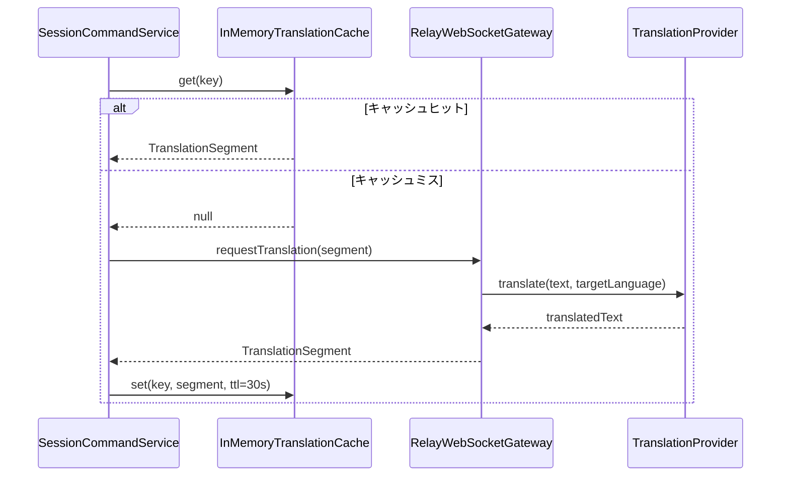
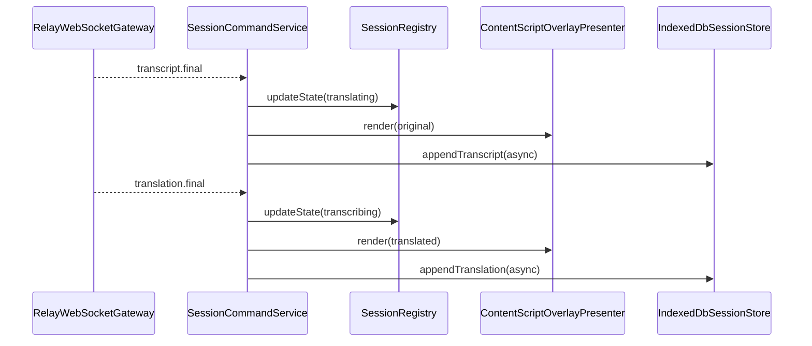

# インフラストラクチャ層設計書

> **ID体系について**: 本文書では `DD-1xx` 形式のIDを使用する。既存の [detailed-design.md](./detailed-design.md) の `DD-001` 以降とは重複しない採番とする。

## 1. はじめに

### 1.1 目的

本文書は、リアルタイム文字起こし翻訳 Chrome 拡張におけるインフラストラクチャ層の具体実装方針を定義する。特に本アプリで最重要となる **翻訳速度** を最優先設計原則とし、音声入力から翻訳オーバーレイ表示までのホットパス上で利用するアダプタ、外部サービスクライアント、保存処理、メッセージングの実装方針を明確化する。

### 1.2 関連文書

| 関係 | 文書                                                           | 参照内容                             |
| ---- | -------------------------------------------------------------- | ------------------------------------ |
| 上流 | [要件定義書](../01-requirements/requirements-specification.md) | 性能要件、技術実現方針               |
| 上流 | [基本設計書](../02-system-design/system-design.md)             | システム構成、技術スタック、機能責務 |
| 同層 | [詳細設計書](./detailed-design.md)                             | クラス設計、シーケンス設計、状態遷移 |
| 関連 | [API仕様書](../04-api-specification/api-specification.md)      | Relay API のイベント仕様             |
| 関連 | [セキュリティ設計書](../09-security-design/security-design.md) | API キー保護、データ保持方針         |

## 2. レイヤー構成における位置づけ

### 2.1 ヘキサゴナルアーキテクチャにおける位置

```mermaid
graph TD
    subgraph Driving["入力側"]
        Popup["Popup / Side Panel"]
        ContentUI["Overlay UI"]
    end

    subgraph Application["アプリケーション層"]
        SessionCommand["SessionCommandService"]
        ExportService["ExportService"]
    end

    subgraph Ports["ポート定義"]
        CapturePort["SourceAdapter"]
        RelayPort["RelayGateway"]
        StorePort["SessionStore"]
        OverlayPort["OverlayPresenter"]
    end

    subgraph Adapters["出力アダプタ（本文書の対象）"]
        TabAdapter["TabCaptureSourceAdapter"]
        MicAdapter["UserMediaSourceAdapter"]
        DesktopAdapter["DesktopCaptureSourceAdapter"]
        AudioPreprocessor["AudioPreprocessor"]
        RelayClient["RelayWebSocketGateway"]
        IndexedStore["IndexedDbSessionStore"]
        LocalStore["ChromeLocalSettingsStore"]
        OverlayAdapter["ContentScriptOverlayPresenter"]
        TranslationHttp["TranslationProviderClient"]
        SttStream["SttStreamClient"]
    end

    subgraph Externals["外部 / 実行基盤"]
        ChromeAPI["Chrome Extensions API"]
        BrowserAPI["Web Audio / IndexedDB"]
        RelayAPI["Relay API"]
        SttProvider["STT Provider"]
        TranslationProvider["Translation Provider"]
    end

    Popup --> SessionCommand
    ContentUI --> SessionCommand
    SessionCommand --> CapturePort
    SessionCommand --> RelayPort
    SessionCommand --> StorePort
    SessionCommand --> OverlayPort
    ExportService --> StorePort

    TabAdapter -.-> CapturePort
    MicAdapter -.-> CapturePort
    DesktopAdapter -.-> CapturePort
    RelayClient -.-> RelayPort
    IndexedStore -.-> StorePort
    OverlayAdapter -.-> OverlayPort

    TabAdapter --> ChromeAPI
    MicAdapter --> BrowserAPI
    DesktopAdapter --> ChromeAPI
    AudioPreprocessor --> BrowserAPI
    RelayClient --> RelayAPI
    RelayAPI --> SttProvider
    RelayAPI --> TranslationProvider
    IndexedStore --> BrowserAPI
    LocalStore --> ChromeAPI
```



### 2.2 コンポーネント一覧

| ID     | 名前                          | 種別                     | 実装ポート        | 概要                                               |
| ------ | ----------------------------- | ------------------------ | ----------------- | -------------------------------------------------- |
| DD-101 | TabCaptureSourceAdapter       | キャプチャアダプタ       | SourceAdapter     | `chrome.tabCapture` によるタブ音声取得             |
| DD-102 | UserMediaSourceAdapter        | キャプチャアダプタ       | SourceAdapter     | `getUserMedia()` によるマイク / オーディオ入力取得 |
| DD-103 | DesktopCaptureSourceAdapter   | キャプチャアダプタ       | SourceAdapter     | 共有音声取得 API による画面 / ウィンドウ音声取得   |
| DD-104 | AudioPreprocessor             | 音声前処理               | AudioFrameChannel | モノラル化、16kHz 変換、PCM16 フレーム生成         |
| DD-105 | RelayWebSocketGateway         | 外部サービスゲートウェイ | RelayGateway      | Relay API との永続 WebSocket 通信                  |
| DD-106 | IndexedDbSessionStore         | 永続化                   | SessionStore      | セッション字幕・翻訳結果の非同期保存               |
| DD-107 | ChromeLocalSettingsStore      | 設定ストア               | SettingsStore     | 言語設定、オーバーレイ設定の軽量保存               |
| DD-108 | ContentScriptOverlayPresenter | UI アダプタ              | OverlayPresenter  | Content Script 上の翻訳オーバーレイ描画            |
| DD-109 | SttProviderClient             | 外部サービスクライアント | SttStreamPort     | Relay API 内部で STT プロバイダと通信              |
| DD-110 | TranslationProviderClient     | 外部サービスクライアント | TranslationPort   | Relay API 内部で翻訳プロバイダと通信               |
| DD-121 | TtsProviderClient             | 外部サービスクライアント | TtsPort           | 将来の翻訳読み上げ機能で TTS プロバイダと通信      |

## 3. リポジトリ / ゲートウェイ実装

### 3.1 インフラ実装一覧

| ID     | 実装クラス                    | インターフェース | 接続先 / 永続化先    | 実装方式           |
| ------ | ----------------------------- | ---------------- | -------------------- | ------------------ |
| DD-111 | IndexedDbSessionStore         | SessionStore     | IndexedDB            | ブラウザ標準 API   |
| DD-112 | ChromeLocalSettingsStore      | SettingsStore    | chrome.storage.local | Chrome Storage API |
| DD-113 | RelayWebSocketGateway         | RelayGateway     | Relay API            | WebSocket          |
| DD-114 | ContentScriptOverlayPresenter | OverlayPresenter | 対象タブ DOM         | React + Shadow DOM |

### 3.2 ドメインモデル ⇔ 永続化モデル マッピング

| ドメインモデル     | 永続化モデル                        | マッピング方針                    |
| ------------------ | ----------------------------------- | --------------------------------- |
| SourceSession      | `sessions` object store             | 1 対 1 マッピング                 |
| TranscriptSegment  | `transcript_segments` object store  | セグメント単位で append-only 保存 |
| TranslationSegment | `translation_segments` object store | 原文 `segmentId` にひも付けて保存 |
| OverlaySettings    | `settings.overlay`                  | 単一 JSON オブジェクトとして保存  |

### 3.3 マッピング方針

#### Data Mapper パターン

インフラ層ではブラウザストレージおよび外部イベント形式を直接上位層へ漏らさず、Data Mapper 相当の変換関数を介してアプリケーションモデルへ変換する。

```ts
type PersistedSessionRecord = {
  sessionId: string;
  sourceType: 'tab' | 'microphone' | 'desktop';
  displayName: string;
  state: string;
  sourceLanguage?: string;
  targetLanguage: string;
  startedAt: string;
};

class SessionRecordMapper {
  toDomain(record: PersistedSessionRecord): SourceSession {
    return {
      sessionId: record.sessionId,
      sourceId: record.sessionId,
      sourceType: record.sourceType,
      displayName: record.displayName,
      state: record.state as SourceSessionState,
      sourceLanguage: record.sourceLanguage,
      targetLanguage: record.targetLanguage,
      overlayTarget: { kind: 'extension-monitor', pageId: 'default' },
      overlaySettings: getDefaultOverlaySettings(),
      startedAt: record.startedAt,
    };
  }

  toPersistence(session: SourceSession): PersistedSessionRecord {
    return {
      sessionId: session.sessionId,
      sourceType: session.sourceType,
      displayName: session.displayName,
      state: session.state,
      sourceLanguage: session.sourceLanguage,
      targetLanguage: session.targetLanguage,
      startedAt: session.startedAt,
    };
  }
}
```

#### ホットパスでの保存方針

- オーバーレイ表示を阻害しないため、字幕・翻訳の保存は **非同期 append-only** とする
- ホットパスでは保存失敗を UI 警告へ変換するが、描画更新自体は継続する
- 部分字幕は保存対象とするが、必要最小限のメタデータのみ保持し、過剰な構造化変換は行わない

## 4. 通信クライアント設定

### 4.1 ホットパス最適化方針

翻訳速度を最優先とするため、以下をホットパス設計原則とする。

- 拡張から Relay API までは **セッション単位の永続 WebSocket** を利用する
- 音声フレーム送信と字幕 / 翻訳イベント受信を同一接続上で行い、接続張り直しを避ける
- STT 確定字幕の翻訳要求は **キュー投入せず即時実行** する
- IndexedDB への保存は UI 更新後に非同期で行い、翻訳表示を待たせない
- Provider クライアントは Keep-Alive / 接続プールを有効化し、毎回の TLS ハンドシェイクを避ける

### 4.2 音声フレーム設定

| 設定項目         | 値                            | 説明                             |
| ---------------- | ----------------------------- | -------------------------------- |
| 入力チャネル数   | 1                             | モノラルへ正規化                 |
| サンプルレート   | 16kHz                         | STT ホットパス向けに標準化       |
| フレーム長       | 100ms                         | レイテンシと送信回数のバランス   |
| エンコーディング | PCM16                         | 変換コストを抑えつつ互換性を確保 |
| 転送形式         | Base64 またはバイナリフレーム | Relay API 仕様に従う             |

### 4.3 Relay WebSocket 設定

| 設定項目         | 値                        | 説明                       |
| ---------------- | ------------------------- | -------------------------- |
| 接続方式         | WebSocket                 | 双方向の低遅延通信         |
| 接続タイムアウト | 3000ms                    | セッション開始時の待機上限 |
| ハートビート間隔 | 15秒                      | 切断検知                   |
| 再接続回数       | 最大 3 回                 | 復旧可能障害時のみ         |
| 再接続方式       | 指数バックオフ + ジッター | 同時再接続集中を避ける     |

### 4.4 Provider クライアント共通設定

| 設定項目                           | デフォルト値           | 説明                   |
| ---------------------------------- | ---------------------- | ---------------------- |
| DNS / TCP 接続タイムアウト         | 300ms                  | 接続障害を早期検知     |
| STT ストリーム初回応答タイムアウト | 1000ms                 | 部分字幕の初回応答上限 |
| 翻訳リクエストタイムアウト         | 800ms                  | 翻訳速度優先の上限     |
| 最大同時接続数                     | プロセスごとの上限管理 | バックエンド負荷制御   |
| Keep-Alive                         | true                   | 接続再利用             |
| HTTP バージョン                    | Provider 推奨安定版    | 可能なら HTTP/2 を優先 |

### 4.5 将来拡張としての TTS 方針

TTS は MVP のホットパスには含めず、翻訳オーバーレイ表示を阻害しない後続拡張として扱う。したがって、`TranslationProviderClient` の応答完了を待って同期的に音声生成する構成は採用しない。

- TTS 呼び出しは `TtsProviderClient` を介して Relay API 背後で抽象化する
- 翻訳オーバーレイ更新と TTS 生成要求は分離し、TTS 失敗時も字幕表示は継続する
- TTS の生成開始は `translation.final` 受信後の非同期処理とし、翻訳速度 SLO の判定対象外とする
- 音声出力を追加する場合も、ソースごとの独立パイプライン原則を維持する

### 4.6 TTS 候補プロバイダ

| 候補                 | 位置づけ                 | 採用観点                                                      |
| -------------------- | ------------------------ | ------------------------------------------------------------- |
| `Deepgram Aura-2`    | 低遅延・低コスト寄り候補 | リアルタイム性とランニングコストを優先する場合に有力          |
| `Google Chirp 3: HD` | 高品質・表現力寄り候補   | 音声品質、感情表現、Google Cloud 運用整合を優先する場合に有力 |

採用判断時は次の観点で評価する。

- 日本語 / 英語での自然さ
- TTFB とストリーミング開始速度
- 100万文字あたりの実効コスト
- PCM / Opus など出力形式の扱いやすさ
- Relay API からの接続方式と運用監視のしやすさ

## 5. トランザクション管理

### 5.1 トランザクション管理方針

本アプリのホットパスでは、データベースの強いトランザクション整合性よりも **低遅延な表示反映** を優先する。そのため、音声処理からオーバーレイ表示までの経路では分散トランザクションを用いず、イベント単位の結果整合性を採用する。

| パターン                   | 説明                                    | 適用ケース             |
| -------------------------- | --------------------------------------- | ---------------------- |
| 即時反映 + 非同期保存      | UI 更新を先行し、保存は後段で実施       | 字幕 / 翻訳の表示      |
| セッション単位のメモリ整合 | メモリ上の `SessionRegistry` を正とする | ソース状態管理         |
| ストレージへの遅延永続化   | IndexedDB に追記保存する                | 履歴保持、エクスポート |

### 5.2 Unit of Work の扱い

- Relay イベント 1 件を 1 単位の処理として扱う
- `TranscriptAssembler -> OverlayPresenter -> SessionStore` の順で処理する
- `SessionStore` 失敗時も `OverlayPresenter` 成功結果はロールバックしない

### 5.3 トランザクション伝播設定

| 伝播レベル   | 説明                           | 適用ケース                     |
| ------------ | ------------------------------ | ------------------------------ |
| 即時処理     | 1 イベントを同期処理           | 部分字幕、翻訳字幕反映         |
| 非同期追記   | 後続タスクで保存               | IndexedDB 保存                 |
| 非同期再試行 | 失敗時に別リトライキューへ積む | ローカル保存失敗、Relay 再接続 |

## 6. ローカルストア設定

### 6.1 IndexedDB 構成

| ストア名               | 主キー          | 主用途               |
| ---------------------- | --------------- | -------------------- |
| `sessions`             | `sessionId`     | セッションメタデータ |
| `transcript_segments`  | `segmentId`     | 原文字幕の保存       |
| `translation_segments` | `translationId` | 翻訳字幕の保存       |
| `export_records`       | `exportId`      | エクスポート履歴     |

### 6.2 書き込み方針

| 設定項目     | 値                             | 説明                             |
| ------------ | ------------------------------ | -------------------------------- |
| 書き込み方式 | 非同期 append-only             | ホットパス阻害を避ける           |
| バッチサイズ | 1〜数件                        | 遅延蓄積を避けるため小さく保つ   |
| 失敗時再試行 | 1 回のみ                       | 繰り返しリトライで描画を妨げない |
| 保存優先度   | 確定字幕 > 翻訳字幕 > 部分字幕 | ストレージ圧迫時の優先順位       |

### 6.3 chrome.storage.local の使い分け

| 対象操作                 | 保存先                 | 理由                                 |
| ------------------------ | ---------------------- | ------------------------------------ |
| デフォルト言語設定       | `chrome.storage.local` | 小容量で即時読込したい               |
| オーバーレイ見た目設定   | `chrome.storage.local` | 起動時に同期的に近い感覚で復元したい |
| セッションごとの大量字幕 | IndexedDB              | 件数増加に耐えるため                 |

## 7. キャッシュ戦略

### 7.1 キャッシュ対象一覧

| ID     | 対象                   | キー                           | TTL                | 無効化トリガー                |
| ------ | ---------------------- | ------------------------------ | ------------------ | ----------------------------- |
| DD-131 | セッション設定         | `session:{sessionId}:settings` | セッション終了まで | 設定変更時                    |
| DD-132 | オーバーレイ描画モデル | `session:{sessionId}:overlay`  | 直近表示のみ       | 新字幕または設定変更時        |
| DD-133 | 翻訳結果短期キャッシュ | `translation:{lang}:{hash}`    | 30秒               | セッション終了または TTL 満了 |

### 7.2 キャッシュパターンの選定

| パターン                 | 説明                 | 適用ケース                       |
| ------------------------ | -------------------- | -------------------------------- |
| In-Memory Cache          | メモリ保持で最速参照 | 現在セッションの設定、描画モデル |
| Short-Lived Result Cache | 短命の結果再利用     | 同一短文の連続翻訳               |
| No Cache on Hot Path     | キャッシュ不採用     | 音声フレーム、部分字幕           |

### 7.3 キャッシュフロー



### 7.4 速度優先のキャッシュ原則

- キャッシュ参照や保存がオーバーヘッドになる場合は、キャッシュを使わず直接描画へ進む
- 高ヒット率が見込めない長文翻訳にはキャッシュを使わない
- 部分字幕翻訳は MVP では行わず、翻訳キャッシュの必要性自体を下げる

## 8. 内部イベント / メッセージング

### 8.1 イベント一覧

| ID     | イベント名              | 発行者                | 利用者                                 | 目的               |
| ------ | ----------------------- | --------------------- | -------------------------------------- | ------------------ |
| DD-141 | `session.started`       | SessionCommandService | Side Panel / Overlay                   | セッション開始通知 |
| DD-142 | `transcript.partial`    | RelayWebSocketGateway | TranscriptAssembler / Overlay          | 部分字幕反映       |
| DD-143 | `transcript.final`      | RelayWebSocketGateway | TranscriptAssembler / Translation 処理 | 確定字幕反映       |
| DD-144 | `translation.final`     | RelayWebSocketGateway | Overlay / SessionStore                 | 翻訳反映           |
| DD-145 | `session.state.changed` | SessionRegistry       | UI 全体                                | 状態同期           |

### 8.2 メッセージングフロー



### 8.3 メッセージ形式

```ts
type RelayEvent =
  | {
      eventType: 'transcript.partial';
      sessionId: string;
      segmentId: string;
      text: string;
      startMs: number;
      endMs: number;
    }
  | {
      eventType: 'transcript.final';
      sessionId: string;
      segmentId: string;
      text: string;
      startMs: number;
      endMs: number;
      detectedLanguage?: string;
    }
  | {
      eventType: 'translation.final';
      sessionId: string;
      segmentId: string;
      targetLanguage: string;
      text: string;
    }
  | {
      eventType: 'session.error';
      sessionId: string;
      code: string;
      retryable: boolean;
      message: string;
    };
```

## 9. 外部サービスクライアント基盤

### 9.1 HTTP / WebSocket クライアント共通設定

| 設定項目             | デフォルト値   | 説明                             |
| -------------------- | -------------- | -------------------------------- |
| 接続タイムアウト     | 300ms          | 新規接続の待機時間               |
| 読み取りタイムアウト | 800ms          | 翻訳応答の待機上限               |
| 最大リトライ回数     | 2              | ホットパスでの過剰再試行を避ける |
| リトライ間隔         | 指数バックオフ | 100ms, 250ms を上限に採用        |
| キープアライブ       | true           | 接続再利用                       |

### 9.2 リトライ方針

| 設定項目             | 値                              | 説明                       |
| -------------------- | ------------------------------- | -------------------------- |
| Relay 再接続         | 最大 3 回                       | セッション単位の再接続     |
| 翻訳プロバイダ再試行 | 最大 1 回                       | 翻訳速度優先のため最小限   |
| STT ストリーム再接続 | 最大 2 回                       | ソース切断でなければ再試行 |
| リトライ対象         | 接続断、408、429、502、503、504 | 一時障害のみ               |

### 9.3 サーキットブレーカー

| 設定項目                       | 値   | 説明                    |
| ------------------------------ | ---- | ----------------------- |
| 失敗率しきい値                 | 50%  | OPEN 状態へ遷移する基準 |
| 最小リクエスト数               | 20   | 判定に必要な最小件数    |
| OPEN 状態の持続時間            | 30秒 | 半開放までの待機時間    |
| HALF-OPEN 時の許可リクエスト数 | 5    | 回復確認用試行          |

### 9.4 外部サービスクライアント一覧

| ID     | 外部サービス名       | 用途                             | ベースURL              | 認証方式                          | タイムアウト   |
| ------ | -------------------- | -------------------------------- | ---------------------- | --------------------------------- | -------------- |
| DD-161 | Relay API            | 拡張とバックエンド間の双方向通信 | 環境ごとの Relay URL   | 署名付きトークン / セッション認証 | 3000ms 接続    |
| DD-162 | STT Provider         | 音声ストリーミング文字起こし     | ベンダーごとの推奨 URL | API キー（サーバー側保持）        | ストリーム継続 |
| DD-163 | Translation Provider | 確定字幕の翻訳                   | ベンダーごとの推奨 URL | API キー（サーバー側保持）        | 800ms          |

## 10. 速度最優先の設計原則

### 10.1 レイテンシ予算

| 区間                    | 目標値     | 設計方針                    |
| ----------------------- | ---------- | --------------------------- |
| 音声フレーム化          | 100ms 以内 | AudioWorklet で短フレーム化 |
| 拡張 → Relay 送信       | 50ms 以内  | 永続 WebSocket 利用         |
| 確定字幕 → 翻訳要求開始 | 50ms 以内  | キュー投入なし即時実行      |
| 翻訳プロバイダ応答      | 800ms 以内 | 低タイムアウト、接続再利用  |
| Overlay 描画更新        | 100ms 以内 | 差分描画、非同期保存        |

### 10.2 禁止事項

- 翻訳ホットパス上に永続キューを入れない
- 翻訳結果描画前に IndexedDB 書き込み完了を待たない
- 毎セグメントごとに新規 HTTP クライアントを生成しない
- 部分字幕翻訳を既定動作にしない

### 10.3 劣化時の優先順位

1. 原文字幕の継続
2. 翻訳字幕の継続
3. 保存処理
4. エクスポート補助情報

速度低下時は、保存や補助処理を先に劣化させ、翻訳オーバーレイの表示速度を最優先で守る。

## 変更履歴

| バージョン | 日付       | 変更者 | 変更内容 |
| ---------- | ---------- | ------ | -------- |
| 0.1.0      | 2026-04-20 | Codex  | 初版作成 |
