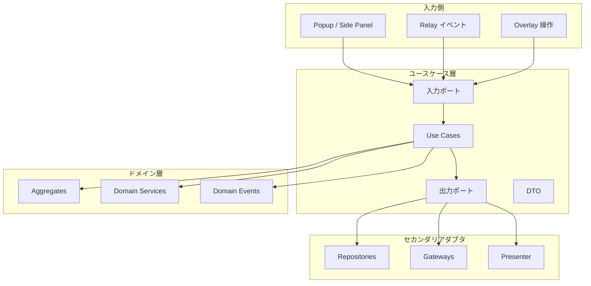
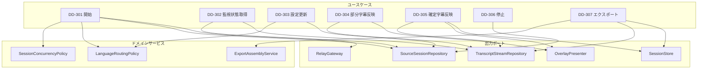
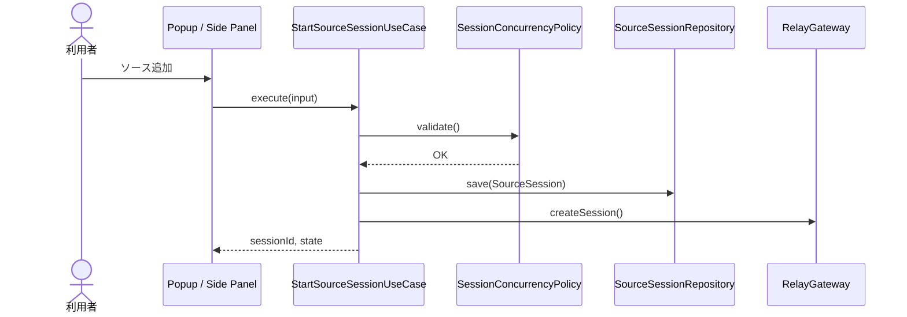

# ユースケース層設計書

## 1. はじめに

### 1.1 目的

本文書は、アプリケーション層のユースケース設計を定義する。Chrome 拡張 UI、Relay API イベント、ローカル保存、オーバーレイ表示を仲介するユースケースの責務と入出力 DTO を明確化する。

### 1.2 関連文書

#### 上流文書

- [要件定義書](../01-requirements/requirements-specification.md)
- [基本設計書](../02-system-design/system-design.md)

#### 同層文書

- [ドメイン層設計書](./domain.md)
- [詳細設計書](./detailed-design.md)

#### 下流文書

- [インフラ設計書](../08-infrastructure-design/infrastructure-design.md)
- [ACL設計書](./acl.md)
- [API仕様書](../04-api-specification/api-specification.md)

> 注記: 本文書では `DD-3xx` 系を使用する。

## 2. 設計方針

### 2.1 レイヤー位置づけ



### 2.2 ユースケースの粒度方針

- 1 ユースケースは 1 操作責務に限定する
- Command は状態変更、Query は表示用取得に限定する
- 外部 API 応答モデルは DTO として受け取り、ドメインモデルへ直接持ち込まない

### 2.3 Command / Query 分離方針

| 項目       | 方針                                                           |
| ---------- | -------------------------------------------------------------- |
| 分離レベル | 論理分離                                                       |
| Command    | セッション開始 / 停止、設定変更、字幕確定反映、エクスポート    |
| Query      | Side Panel 表示状態取得、Overlay 表示モデル取得                |
| 整合性     | 表示系は結果整合性、状態変更系はユースケース単位で整合性を担保 |

## 3. ユースケースカタログ

### 3.1 ユースケース一覧

| ID     | 名前                           | アクター | 種別    | 入力DTO                        | 出力DTO                         | 関連要件                                                                                                                                                                                                            | 関連ドメインサービス                                                             |
| ------ | ------------------------------ | -------- | ------- | ------------------------------ | ------------------------------- | ------------------------------------------------------------------------------------------------------------------------------------------------------------------------------------------------------------------- | -------------------------------------------------------------------------------- |
| DD-301 | StartSourceSessionUseCase      | 利用者   | Command | `StartSourceSessionInput`      | `StartSourceSessionOutput`      | [REQ-001](../01-requirements/requirements-specification.md#req-001), [REQ-002](../01-requirements/requirements-specification.md#req-002)                                                                            | `SessionConcurrencyPolicy`, `LanguageRoutingPolicy`, `EndpointingPolicyResolver` |
| DD-302 | GetSessionMonitorStateQuery    | 利用者   | Query   | `GetSessionMonitorStateInput`  | `SessionMonitorStateOutput`     | [REQ-006](../01-requirements/requirements-specification.md#req-006), [REQ-007](../01-requirements/requirements-specification.md#req-007)                                                                            | —                                                                                |
| DD-303 | UpdateSourceSettingsUseCase    | 利用者   | Command | `UpdateSourceSettingsInput`    | `UpdateSourceSettingsOutput`    | [REQ-004](../01-requirements/requirements-specification.md#req-004), [REQ-007](../01-requirements/requirements-specification.md#req-007), [REQ-NF-018](../01-requirements/requirements-specification.md#req-nf-018) | `LanguageRoutingPolicy`, `EndpointingPolicyResolver`                             |
| DD-304 | HandleTranscriptPartialUseCase | システム | Command | `HandleTranscriptPartialInput` | `HandleTranscriptPartialOutput` | [REQ-003](../01-requirements/requirements-specification.md#req-003)                                                                                                                                                 | `SessionStateTransitionPolicy`                                                   |
| DD-305 | HandleTranscriptFinalUseCase   | システム | Command | `HandleTranscriptFinalInput`   | `HandleTranscriptFinalOutput`   | [REQ-003](../01-requirements/requirements-specification.md#req-003), [REQ-005](../01-requirements/requirements-specification.md#req-005), [REQ-NF-019](../01-requirements/requirements-specification.md#req-nf-019) | `ExportAssemblyService`                                                          |
| DD-306 | StopSourceSessionUseCase       | 利用者   | Command | `StopSourceSessionInput`       | `StopSourceSessionOutput`       | [REQ-001](../01-requirements/requirements-specification.md#req-001), [REQ-009](../01-requirements/requirements-specification.md#req-009)                                                                            | `SessionStateTransitionPolicy`                                                   |
| DD-307 | ExportSessionResultUseCase     | 利用者   | Command | `ExportSessionResultInput`     | `ExportSessionResultOutput`     | [REQ-008](../01-requirements/requirements-specification.md#req-008)                                                                                                                                                 | `ExportAssemblyService`                                                          |

### 3.2 ユースケース依存関係図



## 4. Command / Query 設計

### 4.1 Command ユースケース一覧

| ID     | 名前                           | 対応UC                                                                                                                               | 副作用                         | トランザクション要否 |
| ------ | ------------------------------ | ------------------------------------------------------------------------------------------------------------------------------------ | ------------------------------ | -------------------- |
| DD-301 | StartSourceSessionUseCase      | [UC-001](../01-requirements/requirements-specification.md#uc-001)                                                                    | セッション作成、Relay 接続開始 | 要                   |
| DD-303 | UpdateSourceSettingsUseCase    | [UC-005](../01-requirements/requirements-specification.md#uc-005)                                                                    | 設定保存、表示更新             | 要                   |
| DD-304 | HandleTranscriptPartialUseCase | [UC-002](../01-requirements/requirements-specification.md#uc-002)                                                                    | 部分字幕更新、オーバーレイ反映 | 要                   |
| DD-305 | HandleTranscriptFinalUseCase   | [UC-002](../01-requirements/requirements-specification.md#uc-002), [UC-003](../01-requirements/requirements-specification.md#uc-003) | 確定字幕保存、翻訳反映         | 要                   |
| DD-306 | StopSourceSessionUseCase       | [UC-001](../01-requirements/requirements-specification.md#uc-001)                                                                    | セッション停止、接続解放       | 要                   |
| DD-307 | ExportSessionResultUseCase     | [UC-006](../01-requirements/requirements-specification.md#uc-006)                                                                    | エクスポートファイル生成       | 要                   |

### 4.2 Query ユースケース一覧

| ID     | 名前                        | 対応UC                                                            | キャッシュ可否 | ページネーション |
| ------ | --------------------------- | ----------------------------------------------------------------- | -------------- | ---------------- |
| DD-302 | GetSessionMonitorStateQuery | [UC-004](../01-requirements/requirements-specification.md#uc-004) | 可             | 無               |

## 5. 入出力DTO

### 5.1 入力DTO一覧

| ID        | 名前                           | 対応UC | フィールド                                                                                                              | バリデーション                                                         |
| --------- | ------------------------------ | ------ | ----------------------------------------------------------------------------------------------------------------------- | ---------------------------------------------------------------------- |
| DTO-I-301 | `StartSourceSessionInput`      | DD-301 | `sourceType`, `displayName`, `sourceLanguage`, `targetLanguage`, `overlayTarget`, `endpointing?`, `translationContext?` | ソース種別、言語コード、表示先整合、endpointing / context の範囲を検証 |
| DTO-I-302 | `GetSessionMonitorStateInput`  | DD-302 | `sessionIds?`, `includeOverlayState`                                                                                    | 空配列不可、真偽値検証                                                 |
| DTO-I-303 | `UpdateSourceSettingsInput`    | DD-303 | `sessionId`, `sourceLanguage`, `targetLanguage`, `overlaySettings`, `endpointing?`, `translationContext?`               | `sessionId` 必須、表示値範囲、endpointing / context の範囲を検証       |
| DTO-I-304 | `HandleTranscriptPartialInput` | DD-304 | `sessionId`, `segmentId`, `revision`, `text`, `timeRange`                                                               | `revision >= 1`、文字列長上限                                          |
| DTO-I-305 | `HandleTranscriptFinalInput`   | DD-305 | `sessionId`, `segmentId`, `text`, `translation?`, `timeRange`, `endpointingTrigger?`, `precedingSegmentId?`             | `segmentId` 必須、確定字幕空不可、`endpointingTrigger` は許可値のみ    |
| DTO-I-306 | `StopSourceSessionInput`       | DD-306 | `sessionId`, `reason?`                                                                                                  | `sessionId` 必須                                                       |
| DTO-I-307 | `ExportSessionResultInput`     | DD-307 | `sessionId`, `format`, `includeOriginal`, `includeTranslation`                                                          | 形式は `txt` / `json` / `csv`                                          |

### 5.2 出力DTO一覧

| ID        | 名前                            | 対応UC | フィールド                                                   | マッピング元                              |
| --------- | ------------------------------- | ------ | ------------------------------------------------------------ | ----------------------------------------- |
| DTO-O-301 | `StartSourceSessionOutput`      | DD-301 | `sessionId`, `state`, `startedAt`                            | `SourceSession`                           |
| DTO-O-302 | `SessionMonitorStateOutput`     | DD-302 | `sessions[]`, `latestSegments[]`, `overlayState`             | `SourceSession`, `TranscriptStream`       |
| DTO-O-303 | `UpdateSourceSettingsOutput`    | DD-303 | `sessionId`, `appliedAt`                                     | `SourceSession`, `ExtensionProfile`       |
| DTO-O-304 | `HandleTranscriptPartialOutput` | DD-304 | `sessionId`, `segmentId`, `revision`, `renderModel`          | `TranscriptSegment`                       |
| DTO-O-305 | `HandleTranscriptFinalOutput`   | DD-305 | `sessionId`, `segmentId`, `translationStatus`, `renderModel` | `TranscriptSegment`, `TranslationSegment` |
| DTO-O-306 | `StopSourceSessionOutput`       | DD-306 | `sessionId`, `state`, `stoppedAt`                            | `SourceSession`                           |
| DTO-O-307 | `ExportSessionResultOutput`     | DD-307 | `exportId`, `format`, `bytes`                                | `ExportRecord`                            |

### 5.3 DTO型定義（擬似コード）

```ts
type EndpointingPolicyInput = {
  silenceThresholdMs?: number; // 200..1200, 既定 600
  punctuationAware?: boolean; // 既定 true
  minUtteranceMs?: number; // 100..3000, 既定 500
};

type TranslationContextWindowInput = {
  maxSegments?: number; // 0..5, 既定 3
  includeTranslatedText?: boolean; // 既定 true
};

type StartSourceSessionInput = {
  sourceType: 'tab' | 'microphone' | 'desktop';
  displayName: string;
  sourceLanguage?: string | null;
  autoDetectLanguage: boolean;
  targetLanguage: string;
  overlayTarget: { kind: 'tab' | 'extension-monitor'; tabId?: number; pageId?: string };
  endpointing?: EndpointingPolicyInput;
  translationContext?: TranslationContextWindowInput;
};

type HandleTranscriptFinalInput = {
  sessionId: string;
  segmentId: string;
  text: string;
  timeRange: { startOffsetMs: number; endOffsetMs: number };
  translation?: {
    targetLanguage: string;
    text: string;
    status: 'completed' | 'failed';
    contextSegmentIds?: string[];
  };
  endpointingTrigger?: 'silence' | 'punctuation' | 'max_duration' | 'provider_default';
  precedingSegmentId?: string | null;
};

type SessionMonitorStateOutput = {
  sessions: Array<{
    sessionId: string;
    displayName: string;
    state: string;
    sourceType: string;
  }>;
  latestSegments: Array<{
    sessionId: string;
    segmentId: string;
    originalText?: string;
    translatedText?: string;
  }>;
};
```

## 6. トランザクション境界管理

### 6.1 トランザクション方針

- トランザクション境界はユースケース単位で扱う
- ブラウザ内保存と UI 更新は分散トランザクションにしない
- `HandleTranscriptFinalUseCase` では `OverlayPresenter` の成功を優先し、`SessionStore` 失敗で表示をロールバックしない

### 6.2 トランザクション境界一覧

| UC ID  | 範囲                                      | 分離レベル | ロールバック条件             |
| ------ | ----------------------------------------- | ---------- | ---------------------------- |
| DD-301 | セッション作成から Relay 接続要求送信まで | 論理一貫性 | 権限取得失敗、接続初期化失敗 |
| DD-303 | 設定更新と保存                            | 論理一貫性 | バリデーション失敗           |
| DD-305 | 確定字幕反映から翻訳表示モデル生成まで    | 結果整合性 | 確定字幕不整合               |
| DD-307 | エクスポート整形から出力データ生成まで    | 論理一貫性 | 対象データ不足、形式不正     |

## 7. 認可制御

### 7.1 認可マトリクス

| UC ID  | 名前                        | 必要ロール / 権限 | 追加条件                                        |
| ------ | --------------------------- | ----------------- | ----------------------------------------------- |
| DD-301 | StartSourceSessionUseCase   | `extension-user`  | Chrome 権限付与済みまたは権限要求可能であること |
| DD-302 | GetSessionMonitorStateQuery | `extension-user`  | 自端末セッションのみ参照可能                    |
| DD-303 | UpdateSourceSettingsUseCase | `extension-user`  | 対象 `sessionId` が自端末に属すること           |
| DD-307 | ExportSessionResultUseCase  | `extension-user`  | エクスポート対象セッションが存在すること        |

## 8. イベントディスパッチ

### 8.1 イベント発行パターン

- ドメインイベントは集約内で記録する
- ユースケース層は状態更新完了後に `OverlayPresenter`、`SessionStore`、ログ出力へイベントを配信する
- 失敗時はイベント種別ごとに劣化運転へ移行できるよう設計する

### 8.2 イベント発行一覧

| UC ID  | イベント                | タイミング       | 関連ドメインイベント                          |
| ------ | ----------------------- | ---------------- | --------------------------------------------- |
| DD-301 | セッション開始通知      | 状態更新後       | `SourceSessionStarted`                        |
| DD-304 | 部分字幕更新通知        | 表示モデル生成後 | `TranscriptPartialUpdated`                    |
| DD-305 | 確定字幕 / 翻訳完了通知 | 表示モデル生成後 | `TranscriptFinalized`, `TranslationCompleted` |
| DD-306 | セッション停止通知      | 停止後           | `SourceSessionStopped`                        |

## 9. エラーハンドリング戦略

### 9.1 例外変換ルール

- ドメイン例外はユースケース層でアプリケーション例外へ変換する
- 外部通信失敗は `retryable` 属性を持つアプリ例外へ変換する
- UI 向けにはメッセージと状態遷移情報のみを返し、内部実装詳細は漏らさない

### 9.2 例外変換テーブル

| ドメイン例外                   | アプリ例外                   | 対応ステータス / 表示 | エラーコード                |
| ------------------------------ | ---------------------------- | --------------------- | --------------------------- |
| `PermissionDeniedError`        | `PermissionRequiredAppError` | 権限案内表示          | `CAPTURE-PERMISSION-DENIED` |
| `SessionNotFoundError`         | `SessionNotFoundAppError`    | 404 相当              | `SESSION_NOT_FOUND`         |
| `UnsupportedLanguagePairError` | `ValidationAppError`         | 翻訳不可表示          | `UNSUPPORTED_LANGUAGE_PAIR` |
| `InvalidStateTransitionError`  | `ConflictAppError`           | 再試行 / 停止案内     | `INVALID_STATE_TRANSITION`  |
| 予期しない例外                 | `InternalAppError`           | 汎用エラー表示        | `INTERNAL_ERROR`            |

## 10. ユースケース詳細

### 10.1 DD-301: StartSourceSessionUseCase

| 項目     | 内容                                                                                                                                     |
| -------- | ---------------------------------------------------------------------------------------------------------------------------------------- |
| ID       | DD-301                                                                                                                                   |
| 名前     | StartSourceSessionUseCase                                                                                                                |
| アクター | 利用者                                                                                                                                   |
| 種別     | Command                                                                                                                                  |
| 関連要件 | [REQ-001](../01-requirements/requirements-specification.md#req-001), [REQ-002](../01-requirements/requirements-specification.md#req-002) |

#### 事前条件

- 利用者がソース追加操作を明示的に実行していること
- 同時アクティブセッション数が上限未満であること

#### 事後条件

- `SourceSession` が作成されること
- Relay API への初期接続要求が開始されること

#### シーケンス図



### 10.2 DD-305: HandleTranscriptFinalUseCase

| 項目     | 内容                                                                                                                                                                                                                |
| -------- | ------------------------------------------------------------------------------------------------------------------------------------------------------------------------------------------------------------------- |
| ID       | DD-305                                                                                                                                                                                                              |
| 名前     | HandleTranscriptFinalUseCase                                                                                                                                                                                        |
| アクター | システム                                                                                                                                                                                                            |
| 種別     | Command                                                                                                                                                                                                             |
| 関連要件 | [REQ-003](../01-requirements/requirements-specification.md#req-003), [REQ-005](../01-requirements/requirements-specification.md#req-005), [REQ-NF-019](../01-requirements/requirements-specification.md#req-nf-019) |

#### 事前条件

- 対象 `sessionId` がアクティブであること
- 確定字幕イベントが有効な `segmentId` を持つこと

#### 事後条件

- 確定字幕が `TranscriptStream` に記録されること
- 翻訳があれば表示モデルへ反映されること
- `precedingSegmentId` が提供されていれば overlay 連結表示のメタ情報として保持されること

#### 処理順序 (v0.2.0)

ホットパス最優先原則 (永続キュー禁止、IndexedDB 書き込み前待ちなし、部分字幕翻訳
非既定) を遵守する。旧順序 (「保存 → 翻訳 → overlay」) から変更。

1. `transcript.final` イベント受信 → `TranscriptStream` 集約を取得
2. `TranscriptStream.recentFinalTail(maxSegments)` でメモリ内から直前 N 個の確定
   字幕を取得 (O(1)、IndexedDB 非アクセス)
3. `TranslationPort.translate({ ..., precedingContext })` を即時発火 (Relay 経由)
4. 翻訳応答到着後、`OverlayPresenter.render(translation)` を即時実行
5. `SessionStore.appendTranscript` / `appendTranslation` を fire-and-forget で
   非同期実行 (結果整合、失敗しても overlay をロールバックしない)

### 10.3 DD-307: ExportSessionResultUseCase

| 項目     | 内容                                                                |
| -------- | ------------------------------------------------------------------- |
| ID       | DD-307                                                              |
| 名前     | ExportSessionResultUseCase                                          |
| アクター | 利用者                                                              |
| 種別     | Command                                                             |
| 関連要件 | [REQ-008](../01-requirements/requirements-specification.md#req-008) |

#### 事前条件

- セッションに少なくとも 1 つの確定字幕または翻訳が存在すること

#### 事後条件

- 選択形式に応じた出力データが生成されること
- `ExportRecord` が記録されること

#### 受理形式

- `txt`: 人が読みやすいプレーンテキスト (`[時刻] 原文` / `→ [言語] 翻訳`)
- `json`: 構造化形式 (`sessionIdentifier`, `segments[]` を含む 1 行 JSON)
- `csv`: スプレッドシート互換 (UTF-8 BOM + RFC 4180 quoting + CRLF 行末)。
  Excel / Numbers / pandas 等で直接読み込み可能

## 11. Relay 側ユースケース追補

拡張側 UseCase は DD-3xx 系で定義する。Relay 側は `packages/relay-api/src/application/use-cases/` 配下で実装され、IMPL 番号のみで識別する (roadmap / Task.md 参照)。

### 11.1 `ComposeTranslationContextUseCase` (IMPL-404)

| 項目         | 内容                                                                                               |
| ------------ | -------------------------------------------------------------------------------------------------- |
| 種別         | Query (副作用なし)                                                                                 |
| 入力         | `sessionId`, `currentSegmentId`, `maxSegments` (0〜5)                                              |
| 出力         | `PrecedingContext[]` (直近確定字幕の配列、空配列可)                                                |
| 呼出元       | `RouteTranscriptToTranslationUseCase` (IMPL-403) の内部                                            |
| データソース | Relay インメモリ session state (`SessionRegistry`)。永続 DB は参照しない (ホットパス遵守)          |
| 失敗時挙動   | session state 取得失敗や `maxSegments=0` の場合は空配列を返す (`translate()` は本文のみ送信になる) |

## 変更履歴

| バージョン | 日付       | 変更者 | 変更内容                                                                                                                                                                                                                                                                                                                      |
| ---------- | ---------- | ------ | ----------------------------------------------------------------------------------------------------------------------------------------------------------------------------------------------------------------------------------------------------------------------------------------------------------------------------- |
| 0.1.0      | 2026-04-21 | Codex  | 初版作成                                                                                                                                                                                                                                                                                                                      |
| 0.2.0      | 2026-04-24 | Codex  | セグメント連続性 (Phase 4.1) 対応: `StartSourceSessionInput` / `UpdateSourceSettingsInput` / `HandleTranscriptFinalInput` に endpointing / translationContext / endpointingTrigger / precedingSegmentId を追加、DD-305 の処理順序をメモリ先取り型に変更、§11 に Relay 側 `ComposeTranslationContextUseCase` (IMPL-404) を追補 |
