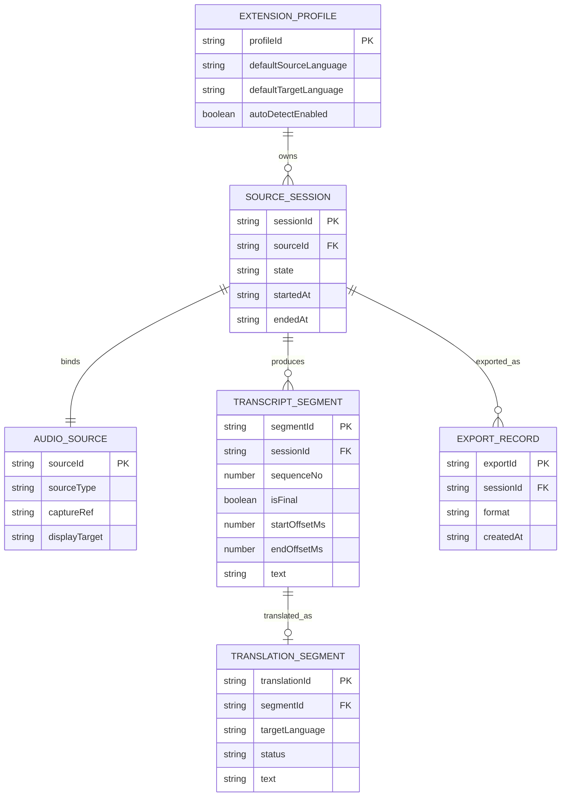

# データベース設計書

## 1. はじめに

### 1.1 目的

本文書は、リアルタイム文字起こし翻訳 Chrome 拡張のデータストア設計を定義する。MVP では中央の業務 RDBMS を持たず、ブラウザ内の `IndexedDB` と `chrome.storage.local` を中心に、字幕・翻訳・設定の保存方針を整理する。

### 1.2 関連文書

- [要件定義書](../01-requirements/requirements-specification.md)
- [基本設計書](../02-system-design/system-design.md)
- [インフラストラクチャ層設計書](../03-detailed-design/infrastructure.md)
- [セキュリティ設計書](../09-security-design/security-design.md)

## 2. データベース方針

### 2.1 DBMS

| 項目           | 内容                                                                      |
| -------------- | ------------------------------------------------------------------------- |
| メイン保存基盤 | IndexedDB                                                                 |
| 補助保存基盤   | `chrome.storage.local`                                                    |
| バージョン     | ブラウザ標準 API に従う                                                   |
| 文字コード     | UTF-8                                                                     |
| 用途           | `IndexedDB` はセッション字幕・翻訳、`chrome.storage.local` は軽量設定保存 |

### 2.2 命名規則

| 対象            | 規則                   | 例                                             |
| --------------- | ---------------------- | ---------------------------------------------- |
| Object Store 名 | スネークケース・複数形 | `sessions`, `transcript_segments`              |
| フィールド名    | キャメルケース         | `sessionId`, `createdAt`                       |
| インデックス名  | `idx_<store>_<field>`  | `idx_transcript_segments_sessionId_sequenceNo` |
| 設定キー        | ドット区切り           | `settings.overlay.defaultOpacity`              |

### 2.3 共通フィールド

`IndexedDB` の主要オブジェクトストアでは、次の共通フィールドを持つ。

| フィールド名 | 型     | 説明                  |
| ------------ | ------ | --------------------- |
| `id`         | string | レコード識別子        |
| `createdAt`  | string | ISO 8601 UTC 作成日時 |
| `updatedAt`  | string | ISO 8601 UTC 更新日時 |

## 3. 論理 ER 図

## 4. 物理 ER 図

MVP の物理設計では、リレーショナル DB のテーブルではなく、ブラウザ内 object store と key-value 設定で構成する。

| 物理ストア             | 種別                   | 主キー          | 用途                 |
| ---------------------- | ---------------------- | --------------- | -------------------- |
| `sessions`             | IndexedDB object store | `sessionId`     | セッションメタデータ |
| `transcript_segments`  | IndexedDB object store | `segmentId`     | 原文字幕             |
| `translation_segments` | IndexedDB object store | `translationId` | 翻訳字幕             |
| `export_records`       | IndexedDB object store | `exportId`      | エクスポート履歴     |
| `settings.*`           | `chrome.storage.local` | キー名          | 既定設定、UI 設定    |

## 5. ストア定義

### DB-001: sessions {#db-001}

セッションメタデータを保持する object store。

| フィールド名                  | データ型        | NULL | デフォルト | 説明                                                                       |
| ----------------------------- | --------------- | ---- | ---------- | -------------------------------------------------------------------------- |
| `sessionId`                   | string          | NO   | -          | 主キー                                                                     |
| `sourceId`                    | string          | NO   | -          | 音声ソース識別子                                                           |
| `sourceType`                  | string          | NO   | -          | `tab` / `microphone` / `desktop`                                           |
| `displayName`                 | string          | NO   | -          | UI 表示名                                                                  |
| `state`                       | string          | NO   | `idle`     | セッション状態                                                             |
| `sourceLanguage`              | string \| null  | YES  | `null`     | 入力言語                                                                   |
| `targetLanguage`              | string          | NO   | -          | 翻訳先言語                                                                 |
| `startedAt`                   | string          | NO   | -          | 開始日時                                                                   |
| `endedAt`                     | string \| null  | YES  | `null`     | 停止日時                                                                   |
| `endpointingSilenceMs`        | number \| null  | YES  | `null`     | セッション個別の endpointing 無音長。`null` の場合はプロファイル既定を使用 |
| `endpointingPunctuationAware` | boolean \| null | YES  | `null`     | セッション個別の句読点感度。`null` の場合はプロファイル既定を使用          |
| `translationContextSegments`  | number \| null  | YES  | `null`     | セッション個別の翻訳 context 段数。`null` の場合はプロファイル既定を使用   |
| `createdAt`                   | string          | NO   | -          | 作成日時                                                                   |
| `updatedAt`                   | string          | NO   | -          | 更新日時                                                                   |

**インデックス:**

| インデックス名           | フィールド  | 種別       | 用途                     |
| ------------------------ | ----------- | ---------- | ------------------------ |
| `idx_sessions_sourceId`  | `sourceId`  | 非ユニーク | ソース単位検索           |
| `idx_sessions_state`     | `state`     | 非ユニーク | アクティブセッション検索 |
| `idx_sessions_startedAt` | `startedAt` | 非ユニーク | 新しい順取得             |

### DB-002: transcript_segments {#db-002}

| フィールド名    | データ型       | NULL | デフォルト | 説明             |
| --------------- | -------------- | ---- | ---------- | ---------------- |
| `segmentId`     | string         | NO   | -          | 主キー           |
| `sessionId`     | string         | NO   | -          | セッション識別子 |
| `sequenceNo`    | number         | NO   | -          | セグメント順序   |
| `revision`      | number         | NO   | `1`        | 部分字幕改訂回数 |
| `isFinal`       | boolean        | NO   | `false`    | 確定字幕かどうか |
| `startOffsetMs` | number         | NO   | -          | 開始オフセット   |
| `endOffsetMs`   | number         | NO   | -          | 終了オフセット   |
| `text`          | string         | NO   | -          | 字幕本文         |
| `language`      | string \| null | YES  | `null`     | 入力言語         |
| `createdAt`     | string         | NO   | -          | 作成日時         |
| `updatedAt`     | string         | NO   | -          | 更新日時         |

**インデックス:**

| インデックス名                                 | フィールド                | 種別 | 用途                 |
| ---------------------------------------------- | ------------------------- | ---- | -------------------- |
| `idx_transcript_segments_sessionId_sequenceNo` | `sessionId`, `sequenceNo` | 複合 | セッション時系列取得 |
| `idx_transcript_segments_sessionId_isFinal`    | `sessionId`, `isFinal`    | 複合 | 確定字幕抽出         |

### DB-003: translation_segments {#db-003}

| フィールド名     | データ型 | NULL | デフォルト  | 説明                   |
| ---------------- | -------- | ---- | ----------- | ---------------------- |
| `translationId`  | string   | NO   | -           | 主キー                 |
| `segmentId`      | string   | NO   | -           | 対応原文セグメント     |
| `sessionId`      | string   | NO   | -           | セッション識別子       |
| `targetLanguage` | string   | NO   | -           | 翻訳先言語             |
| `status`         | string   | NO   | `completed` | `completed` / `failed` |
| `text`           | string   | NO   | -           | 翻訳本文               |
| `createdAt`      | string   | NO   | -           | 作成日時               |
| `updatedAt`      | string   | NO   | -           | 更新日時               |

**インデックス:**

| インデックス名                                 | フィールド               | 種別       | 用途                   |
| ---------------------------------------------- | ------------------------ | ---------- | ---------------------- |
| `idx_translation_segments_segmentId`           | `segmentId`              | 非ユニーク | 原文との対応付け       |
| `idx_translation_segments_sessionId_createdAt` | `sessionId`, `createdAt` | 複合       | セッション内時系列取得 |

### DB-004: export_records {#db-004}

| フィールド名         | データ型 | NULL | デフォルト | 説明           |
| -------------------- | -------- | ---- | ---------- | -------------- |
| `exportId`           | string   | NO   | -          | 主キー         |
| `sessionId`          | string   | NO   | -          | 対象セッション |
| `format`             | string   | NO   | -          | `txt` / `json` |
| `includeOriginal`    | boolean  | NO   | `true`     | 原文含有フラグ |
| `includeTranslation` | boolean  | NO   | `true`     | 翻訳含有フラグ |
| `createdAt`          | string   | NO   | -          | 実行日時       |

### DB-005: chrome.storage.local keys {#db-005}

| キー                                                | 型             | 用途                                                                                                     |
| --------------------------------------------------- | -------------- | -------------------------------------------------------------------------------------------------------- |
| `settings.language.defaultSourceLanguage`           | string \| null | 既定入力言語                                                                                             |
| `settings.language.defaultTargetLanguage`           | string         | 既定翻訳先言語                                                                                           |
| `settings.language.autoDetectEnabled`               | boolean        | 自動判定既定値                                                                                           |
| `settings.overlay.defaultOpacity`                   | number         | 既定透明度                                                                                               |
| `settings.overlay.defaultMaxLines`                  | number         | 既定表示行数                                                                                             |
| `settings.overlay.defaultMode`                      | string         | 原文 / 翻訳 / 両方表示                                                                                   |
| `settings.stt.defaultSilenceThresholdMs`            | number         | 200〜1200、既定 600。無音での文末判定時間                                                                |
| `settings.stt.defaultPunctuationAware`              | boolean        | 既定 true。句読点を文末判定に利用するか                                                                  |
| `settings.stt.defaultMinUtteranceMs`                | number         | 100〜3000、既定 500。最小発話長                                                                          |
| `settings.translation.defaultContextSegments`       | number         | 0〜5、既定 3。翻訳時の直前確定字幕参照段数                                                               |
| `settings.translation.defaultIncludeTranslatedText` | boolean        | 既定 true。context に訳済みテキストも含めるか                                                            |
| `settings.glossary.defaultGlossary`                 | object         | Issue #123: `{entries: Array<{source, target, caseSensitive}>}`。最大 200 件、各 1〜64 文字              |
| `settings.retention.sessionRetentionPolicy`         | object         | Issue #124: `{days: 1-365 \| null, maxCount: 1-10000 \| null}`。少なくとも一方は非 null (両方 null 不可) |

## 6. インデックス設計

### 6.1 インデックス方針

- セッション単位の時系列取得を最優先とする
- `sessionId` と `sequenceNo` を中心に複合インデックスを設計する
- 部分字幕 / 確定字幕の分離取得のため `isFinal` を索引に含める

### 6.2 インデックス一覧

| ストア                 | インデックス名                                 | フィールド                | 種別 | 用途                     |
| ---------------------- | ---------------------------------------------- | ------------------------- | ---- | ------------------------ |
| `sessions`             | `idx_sessions_state`                           | `state`                   | 単一 | アクティブセッション監視 |
| `transcript_segments`  | `idx_transcript_segments_sessionId_sequenceNo` | `sessionId`, `sequenceNo` | 複合 | モニタ表示               |
| `translation_segments` | `idx_translation_segments_segmentId`           | `segmentId`               | 単一 | 原文字幕との紐付け       |

## 7. マイグレーション方針

### 7.1 マイグレーションツール

- `IndexedDB` の `onupgradeneeded`
- アプリ側スキーマバージョン定数

### 7.2 マイグレーション規則

- スキーマ変更は後方互換な追加を優先する
- object store 名の破壊的変更は避ける
- 初期化時に旧バージョンからの移行処理を実行する
- 破壊的変更が必要な場合は、旧データをエクスポート可能な状態を維持する

### 7.3 v0.1 → v0.2 マイグレーション (セグメント連続性)

- `sessions` store に追加されたカラム (`endpointingSilenceMs` / `endpointingPunctuationAware` / `translationContextSegments`) は `null` で default 埋めし、既存レコードは挙動不変
- `chrome.storage.local` の新規キー (`settings.stt.*` / `settings.translation.*`) は未設定時はアプリ側で既定値を適用し、読み書きはどちらも Zod schema で検証
- 後方互換のためデータ変換処理は不要、`onupgradeneeded` でカラム追加のみ実施

## 8. データ保全方針

### 8.1 バックアップ

| 対象                         | 方式                   | 頻度     | 保持期間           |
| ---------------------------- | ---------------------- | -------- | ------------------ |
| `IndexedDB` セッションデータ | バックアップなし       | -        | ローカル一時保持   |
| エクスポート結果             | 利用者ローカル保存     | 任意     | 利用者管理         |
| アプリ設定                   | `chrome.storage.local` | 常時更新 | ブラウザ保持に依存 |

### 8.2 データ保持ポリシー

- 生音声は永続保存しない
- セッションデータはローカル参照用の一時保持とする
- 長期保全が必要な場合は、利用者によるエクスポートを正とする

### 8.3 個人情報の取り扱い

- 字幕・翻訳テキストは機微情報を含みうるため、平文ログへ出力しない
- API キーや長期トークンは本ストアへ保存しない
- ブラウザ保存領域に保持するのは利用者設定と字幕結果のみとする

## 変更履歴

| バージョン | 日付       | 変更者 | 変更内容                                                                                                                                                                                                                                       |
| ---------- | ---------- | ------ | ---------------------------------------------------------------------------------------------------------------------------------------------------------------------------------------------------------------------------------------------- |
| 0.1.0      | 2026-04-21 | Codex  | 初版作成                                                                                                                                                                                                                                       |
| 0.2.0      | 2026-04-24 | Codex  | セグメント連続性 (Phase 4.1) 対応: DB-001 `sessions` に endpointing / context カラムを追加、DB-005 に `settings.stt.*` / `settings.translation.*` キーを追加、§7.3 に v0.1 → v0.2 マイグレーション方針を追加                                   |
| 0.3.0      | 2026-04-24 | Codex  | Issue #123 Glossary 対応: DB-001 `sessions` に `glossaryEntries` (nullable 配列) カラムを追加、DB-005 に `settings.glossary.defaultGlossary` キーを追加。IndexedDB スキーマ v3 への migration (既存 v1/v2 は null で埋める)                    |
| 0.4.0      | 2026-04-24 | Codex  | Issue #124 Retention 対応: DB-005 に `settings.retention.sessionRetentionPolicy` キーを追加 (days 1-365 \| null, maxCount 1-10000 \| null)。SessionStore port に `purgeOlderThan` / `purgeBeyondCount` / `purgeAll` cascade 削除メソッドを追加 |
