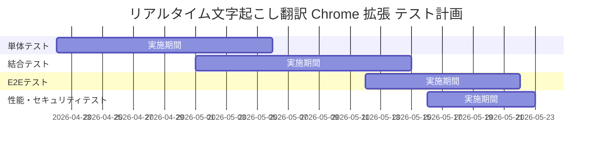

# テスト仕様書

## 1. はじめに

### 1.1 目的

本文書は、リアルタイム文字起こし翻訳 Chrome 拡張のテスト戦略、テスト環境、主要テストケースを定義する。要件定義書の受入基準を検証可能な形に落とし込み、実装・回帰・リリース判定の基準を明確化することを目的とする。

### 1.2 テスト範囲

**対象:**

- Chrome 拡張 UI (`Popup`、`Side Panel`、`Content Script Overlay`)
- `Service Worker`、`Offscreen Document`、音声前処理
- Relay API (`HTTP` / `WebSocket`)
- ソース接続、字幕、翻訳、オーバーレイ、保存、エクスポート、劣化運転
- 性能要件、セキュリティ要件、主要回帰シナリオ

**対象外:**

- 外部 STT / 翻訳 / TTS プロバイダ内部アルゴリズムの品質保証
- Chrome 本体や OS デバイスドライバの不具合再現
- Chrome 外ネイティブアプリ上での表示
- 将来拡張である TTS 再生機能の正式検証

### 1.3 対応する要件

- [要件定義書](../01-requirements/requirements-specification.md)
- [基本設計書](../02-system-design/system-design.md)
- [詳細設計書](../03-detailed-design/detailed-design.md)
- [インフラストラクチャ層設計書](../03-detailed-design/infrastructure.md)
- [API仕様書](../04-api-specification/api-specification.md)
- [セキュリティ設計書](../09-security-design/security-design.md)

## 2. テスト戦略

### 2.1 テストレベル

| テストレベル       | 目的                                                                 | 実施者      |
| ------------------ | -------------------------------------------------------------------- | ----------- |
| 単体テスト         | 状態遷移、バリデーション、マッパー、メッセージ組み立ての検証         | 開発者      |
| 結合テスト         | 拡張内部コンポーネント間、Relay API とプロバイダアダプタ間の連携検証 | 開発者      |
| E2Eテスト          | Chrome 拡張としてのユーザーシナリオ全体の検証                        | 開発者      |
| 性能テスト         | 遅延、同時処理、再接続、劣化運転時の挙動検証                         | 開発者 / QA |
| セキュリティテスト | トークン、権限、入力値、CSP、レートリミットの検証                    | 開発者 / QA |

### 2.2 テスト種別

| テスト種別         | 概要                                                               | 対応するテストレベル |
| ------------------ | ------------------------------------------------------------------ | -------------------- |
| 機能テスト         | 要件どおりにソース接続、字幕、翻訳、表示、保存が動作することを検証 | 単体 / 結合 / E2E    |
| 契約テスト         | Relay API のイベント契約、HTTP / WebSocket ペイロード整合を検証    | 結合                 |
| 性能テスト         | `p95` 遅延、3 ソース同時処理、再接続時間を検証                     | 性能テスト           |
| セキュリティテスト | 認証、権限、入力値検証、ログマスキングを検証                       | 結合 / E2E           |
| 回帰テスト         | 主要ユースケースの継続動作を検証                                   | 単体 / 結合 / E2E    |

### 2.3 テストツール

| 用途           | ツール          | 備考                                             |
| -------------- | --------------- | ------------------------------------------------ |
| 単体テスト     | Vitest          | TypeScript / React / Node 24 LTS 前提            |
| 結合テスト     | Vitest          | Chrome API スタブ、Relay / Provider モックを併用 |
| E2Eテスト      | Playwright      | unpacked extension を Chromium に読み込んで実行  |
| 性能テスト     | k6              | Relay API の HTTP / WebSocket 負荷検証           |
| カバレッジ計測 | Vitest Coverage | `v8` ベース                                      |

## 3. テスト環境

| 環境         | 用途              | 構成                                                                       |
| ------------ | ----------------- | -------------------------------------------------------------------------- |
| ローカル     | 単体 / 結合テスト | Node.js 24.x LTS、Chrome 安定版、プロバイダモック、音声フィクスチャ        |
| CI           | 自動テスト        | GitHub Actions 相当、Node.js 24.x LTS、Headless Chromium、モック Relay API |
| ステージング | E2E / 性能テスト  | 本番相当 Relay API、Chrome 安定版、Windows 11 / macOS 14 以上              |

### 3.1 音声テストデータ方針

- 英語発話、日本語発話、無音、雑音混在、短文連続発話の PCM フィクスチャを用意する
- STT / 翻訳の品質そのものではなく、イベント系列と表示結果の整合を重視する
- 外部プロバイダ依存の揺らぎを避けるため、CI では原則としてモック応答を使用する

## 4. テストケース

### 4.1 音声ソース登録・接続機能

| ID      | テスト区分 | テスト内容                                                     | 前提条件                           | 手順                                                                            | 期待結果                                         | 優先度 | 対応要件                                                            |
| ------- | ---------- | -------------------------------------------------------------- | ---------------------------------- | ------------------------------------------------------------------------------- | ------------------------------------------------ | ------ | ------------------------------------------------------------------- |
| TST-001 | 正常系     | ブラウザタブ音声またはマイク入力を追加してセッション開始できる | 拡張が有効で、対象ソースが選択可能 | 1. Popup または Side Panel を開く 2. ソース種別を選ぶ 3. 対象を選択して開始する | ソースセッションが作成され、監視 UI に追加される | 高     | [REQ-001](../01-requirements/requirements-specification.md#req-001) |

### 4.2 権限取得・状態表示機能

| ID      | テスト区分 | テスト内容                                           | 前提条件                   | 手順                                          | 期待結果                                                       | 優先度 | 対応要件                                                            |
| ------- | ---------- | ---------------------------------------------------- | -------------------------- | --------------------------------------------- | -------------------------------------------------------------- | ------ | ------------------------------------------------------------------- |
| TST-002 | 異常系     | 権限拒否時に開始を中止し、再設定導線と状態表示を行う | 権限ダイアログを拒否できる | 1. ソース追加を開始する 2. 権限要求を拒否する | セッションは開始されず、権限不足の案内とエラー状態が表示される | 高     | [REQ-002](../01-requirements/requirements-specification.md#req-002) |

### 4.3 リアルタイム文字起こし機能

| ID      | テスト区分 | テスト内容                                     | 前提条件                                                         | 手順                                                                             | 期待結果                                                       | 優先度 | 対応要件                                                            |
| ------- | ---------- | ---------------------------------------------- | ---------------------------------------------------------------- | -------------------------------------------------------------------------------- | -------------------------------------------------------------- | ------ | ------------------------------------------------------------------- |
| TST-003 | 正常系     | 音声入力から部分字幕と確定字幕が順次反映される | ソースセッションが開始済み、STT モックが部分・確定イベントを返す | 1. テスト音声を入力する 2. `transcript.partial` と `transcript.final` を受信する | 部分字幕が表示され、その後同一セグメントが確定字幕へ更新される | 高     | [REQ-003](../01-requirements/requirements-specification.md#req-003) |

### 4.4 言語設定・自動判定機能

| ID      | テスト区分 | テスト内容                                                               | 前提条件           | 手順                                                                            | 期待結果                                         | 優先度 | 対応要件                                                            |
| ------- | ---------- | ------------------------------------------------------------------------ | ------------------ | ------------------------------------------------------------------------------- | ------------------------------------------------ | ------ | ------------------------------------------------------------------- |
| TST-004 | 正常系     | ソースごとの入力言語 / 自動判定 / 翻訳先言語変更が新規字幕から反映される | セッションが動作中 | 1. ソース設定を開く 2. 入力言語または自動判定を変更する 3. 新しい発話を入力する | 変更後の設定が新規字幕・翻訳処理にのみ反映される | 高     | [REQ-004](../01-requirements/requirements-specification.md#req-004) |

### 4.5 リアルタイム翻訳機能

| ID      | テスト区分 | テスト内容                                     | 前提条件                                      | 手順                                                    | 期待結果                                                       | 優先度 | 対応要件                                                            |
| ------- | ---------- | ---------------------------------------------- | --------------------------------------------- | ------------------------------------------------------- | -------------------------------------------------------------- | ------ | ------------------------------------------------------------------- |
| TST-005 | 正常系     | 確定字幕に対応する翻訳字幕を生成して表示できる | `translationEnabled=true`、翻訳先言語設定済み | 1. 確定字幕イベントを受信する 2. 翻訳イベントを受信する | 原文と対応づく翻訳字幕がオーバーレイまたは監視 UI に表示される | 高     | [REQ-005](../01-requirements/requirements-specification.md#req-005) |

### 4.6 複数ソース同時処理機能

| ID      | テスト区分 | テスト内容                                      | 前提条件                        | 手順                                                                          | 期待結果                                                                 | 優先度 | 対応要件                                                            |
| ------- | ---------- | ----------------------------------------------- | ------------------------------- | ----------------------------------------------------------------------------- | ------------------------------------------------------------------------ | ------ | ------------------------------------------------------------------- |
| TST-006 | 正常系     | 最大 3 ソースを同時に処理しても結果が混在しない | 同時に 3 つのソースを開始できる | 1. タブ音声、マイク、共有音声を順に開始する 2. 各ソースへテストイベントを送る | ソースごとに原文・翻訳・状態が分離表示され、1 ソース停止時も他は継続する | 高     | [REQ-006](../01-requirements/requirements-specification.md#req-006) |

### 4.7 翻訳オーバーレイ表示機能

| ID      | テスト区分 | テスト内容                                                   | 前提条件                       | 手順                                                         | 期待結果                                                             | 優先度 | 対応要件                                                            |
| ------- | ---------- | ------------------------------------------------------------ | ------------------------------ | ------------------------------------------------------------ | -------------------------------------------------------------------- | ------ | ------------------------------------------------------------------- |
| TST-007 | 正常系     | オーバーレイの位置、透明度、表示行数、表示モードを変更できる | 対象タブ上にオーバーレイ表示中 | 1. Side Panel で表示設定を変更する 2. オーバーレイを確認する | 設定値が即時反映され、原文のみ / 翻訳のみ / 両方表示を切り替えられる | 高     | [REQ-007](../01-requirements/requirements-specification.md#req-007) |

### 4.8 セッション保持・エクスポート機能

| ID      | テスト区分 | テスト内容                                              | 前提条件                                  | 手順                                                                    | 期待結果                                                   | 優先度 | 対応要件                                                            |
| ------- | ---------- | ------------------------------------------------------- | ----------------------------------------- | ----------------------------------------------------------------------- | ---------------------------------------------------------- | ------ | ------------------------------------------------------------------- |
| TST-008 | 正常系     | セッション結果を保持し、TXT / JSON でエクスポートできる | 少なくとも 1 件の確定字幕と翻訳が存在する | 1. セッションを停止する 2. エクスポート形式を選択する 3. 出力を確認する | 原文のみ / 翻訳のみ / 両方併記を選択してエクスポートできる | 中     | [REQ-008](../01-requirements/requirements-specification.md#req-008) |

### 4.9 エラー復旧・劣化運転機能

| ID      | テスト区分 | テスト内容                                                   | 前提条件                                           | 手順                                           | 期待結果                                                                       | 優先度 | 対応要件                                                            |
| ------- | ---------- | ------------------------------------------------------------ | -------------------------------------------------- | ---------------------------------------------- | ------------------------------------------------------------------------------ | ------ | ------------------------------------------------------------------- |
| TST-009 | 異常系     | 翻訳障害時に文字起こしのみ継続し、再試行可能な状態へ遷移する | セッション動作中、翻訳プロバイダモックが失敗を返す | 1. 確定字幕を受信する 2. 翻訳 API を失敗させる | セッションが `degraded` へ遷移し、文字起こし表示は継続、再試行導線が表示される | 高     | [REQ-009](../01-requirements/requirements-specification.md#req-009) |

### 4.10 非機能テスト

| ID         | テスト区分   | テスト内容                                                           | 前提条件                                   | 手順                                                                            | 期待結果                                         | 優先度 | 対応要件                                                                                                                                                             |
| ---------- | ------------ | -------------------------------------------------------------------- | ------------------------------------------ | ------------------------------------------------------------------------------- | ------------------------------------------------ | ------ | -------------------------------------------------------------------------------------------------------------------------------------------------------------------- |
| TST-NF-001 | 性能         | 部分字幕表示遅延が `p95 2.0 秒以内` を満たす                         | STT モックまたはステージング環境を利用可能 | 1. 代表音声フィクスチャを連続投入する 2. 入力時刻と部分字幕表示時刻を計測する   | `REQ-NF-001` を満たす                            | 高     | [REQ-NF-001](../01-requirements/requirements-specification.md#81-性能要件)                                                                                           |
| TST-NF-002 | 性能         | 翻訳字幕表示遅延が `p95 1.5 秒以内` を満たす                         | 翻訳機能が有効                             | 1. 確定字幕発生から翻訳表示までを計測する                                       | `REQ-NF-002` を満たす                            | 高     | [REQ-NF-002](../01-requirements/requirements-specification.md#81-性能要件)                                                                                           |
| TST-NF-003 | 性能         | 3 ソース同時処理時も性能要件を維持する                               | 3 ソース起動可能                           | 1. 3 ソースへ同時にテスト音声を送る 2. 遅延とエラー率を計測する                 | `REQ-NF-004` を満たす                            | 高     | [REQ-NF-004](../01-requirements/requirements-specification.md#81-性能要件)                                                                                           |
| TST-NF-004 | セキュリティ | API キー、トークン、字幕本文が平文ログへ出力されない                 | 構造化ログを取得可能                       | 1. セッション開始、翻訳失敗、停止を実行する 2. ログを確認する                   | 機密情報がマスクされ、平文出力されない           | 高     | [REQ-NF-024](../01-requirements/requirements-specification.md#83-セキュリティ要件), [REQ-NF-050](../01-requirements/requirements-specification.md#86-運用保守性要件) |
| TST-NF-005 | セキュリティ | 権限要求前に用途説明が表示され、利用者の明示操作なしに音声取得しない | 拡張初回利用状態                           | 1. 拡張を開く 2. ソース未選択状態を確認する 3. ソース追加操作後に権限要求を行う | 明示操作前に取得開始されず、用途説明が表示される | 高     | [REQ-NF-020](../01-requirements/requirements-specification.md#83-セキュリティ要件), [REQ-002](../01-requirements/requirements-specification.md#req-002)              |

## 5. テストデータ

### 5.1 テストデータ定義

| データ名           | 用途                 | 内容                                                                        |
| ------------------ | -------------------- | --------------------------------------------------------------------------- |
| 英語短文音声       | 字幕・翻訳の基本動作 | 5〜10 秒の英語発話 PCM                                                      |
| 日本語短文音声     | 日英設定・表示確認   | 5〜10 秒の日本語発話 PCM                                                    |
| 無音音声           | VAD / 状態遷移確認   | 10 秒の無音 PCM                                                             |
| 雑音混在音声       | 劣化ケース確認       | 背景雑音を含む発話 PCM                                                      |
| 3 ソース同時音声   | 同時処理性能確認     | タブ / マイク / 共有音声を模した 3 系列                                     |
| モック字幕イベント | CI 契約テスト        | `transcript.partial` / `transcript.final` / `translation.final` の固定 JSON |

### 5.2 テストデータ準備方法

| 方法           | 用途              | 詳細                                              |
| -------------- | ----------------- | ------------------------------------------------- |
| フィクスチャ   | 単体 / 結合 / E2E | PCM、JSON、設定値を固定ファイルとして管理する     |
| ファクトリー   | 単体 / 結合       | `sessionId`、`segmentId`、設定 DTO を動的生成する |
| モックサーバー | 結合 / E2E        | Relay API、STT、翻訳 API の応答を固定化する       |

## 6. カバレッジ目標

| メトリクス                                   | 目標      |
| -------------------------------------------- | --------- |
| ステートメントカバレッジ                     | 80%以上   |
| ブランチカバレッジ                           | 70%以上   |
| 状態遷移・入力バリデーション・メッセージ契約 | 90%以上   |
| `degraded` / 再接続 / 権限拒否シナリオ       | 100% 実行 |

## 7. テスト実施スケジュール

## 変更履歴

| バージョン | 日付       | 変更者 | 変更内容 |
| ---------- | ---------- | ------ | -------- |
| 0.1.0      | 2026-04-21 | Codex  | 初版作成 |
