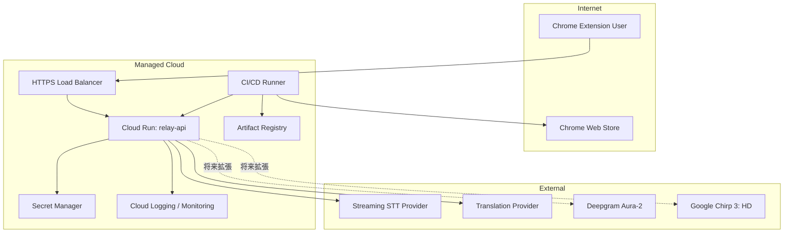
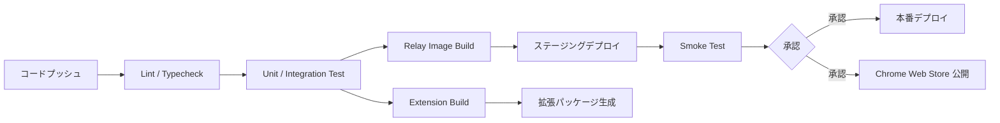

# インフラ設計書

## 1. はじめに

### 1.1 目的

本文書は、リアルタイム文字起こし翻訳 Chrome 拡張のインフラ構成を定義する。主対象は `Relay API` とそのデプロイ基盤、CI/CD、監視、Secrets 管理であり、Chrome 拡張配布もあわせて扱う。

### 1.2 対応する非機能要件

- [要件定義書 - 非機能要件](../01-requirements/requirements-specification.md#8-非機能要件)
- [運用設計書](../10-operations-design/operations-design.md)
- [セキュリティ設計書](../09-security-design/security-design.md)

## 2. インフラ構成

### 2.1 構成図

### 2.2 サーバー / サービス一覧

| ID      | サービス名                 | 種類         | スペック                 | 用途                                    |
| ------- | -------------------------- | ------------ | ------------------------ | --------------------------------------- |
| INF-001 | Chrome Extension           | クライアント | MV3 / WXT / React        | UI、音声取得、オーバーレイ表示          |
| INF-002 | HTTPS Load Balancer        | マネージド   | 自動スケール             | TLS 終端、入口制御                      |
| INF-003 | Relay API                  | Cloud Run    | Node.js 24 LTS / Fastify | セッション初期化、WebSocket / HTTP 中継 |
| INF-004 | Secret Manager             | マネージド   | バージョン管理付き       | API キー、署名鍵保管                    |
| INF-005 | Cloud Logging / Monitoring | マネージド   | 標準プラン               | ログ、メトリクス、アラート              |
| INF-006 | Artifact Registry          | マネージド   | 標準プラン               | コンテナイメージ保管                    |

### 2.3 ネットワーク設計

MVP はフルマネージドなサーバーレス構成を優先し、専用 VPC を必須としない。

| 項目                   | 設定値                                |
| ---------------------- | ------------------------------------- |
| VPC CIDR               | `N/A`（サーバーレス管理ネットワーク） |
| パブリックサブネット   | `N/A`                                 |
| プライベートサブネット | `N/A`                                 |
| データサブネット       | `N/A`                                 |
| Ingress                | HTTPS のみ                            |
| Egress                 | 外部プロバイダ宛 HTTPS / WSS のみ許可 |

## 3. 環境定義

| 項目           | 開発（dev）                   | ステージング（stg）     | 本番（prod）        |
| -------------- | ----------------------------- | ----------------------- | ------------------- |
| Relay API 台数 | min 0 / max 1                 | min 1 / max 2           | min 2 / max 10      |
| 実行基盤       | ローカル or Cloud Run         | Cloud Run               | Cloud Run           |
| ドメイン       | `localhost`                   | `stg-relay.example.com` | `relay.example.com` |
| Secrets        | ローカル env / Secret Manager | Secret Manager          | Secret Manager      |
| 監視           | ローカルログ                  | Monitoring + Alert      | Monitoring + Alert  |

## 4. CI/CD

### 4.1 パイプライン構成

### 4.2 デプロイ手順

1. `main` へのマージで CI を起動する
2. Lint、型検査、単体 / 結合テストを実行する
3. Relay API コンテナをビルドして Artifact Registry に格納する
4. ステージングへデプロイしてスモークテストを実行する
5. 承認後、本番 Cloud Run を新リビジョンへ切り替える
6. 必要な変更がある場合のみ Chrome 拡張を Chrome Web Store へ公開する

### 4.3 ロールバック手順

1. Cloud Run の直前安定リビジョンへトラフィックを戻す
2. 必要に応じて機能フラグで翻訳または特定プロバイダ呼び出しを無効化する
3. 拡張不具合時はサーバー側緩和策を優先し、拡張更新は後追いで実施する

## 5. 監視・アラート

### 5.1 監視項目

| 監視対象     | メトリクス                         | 閾値               | 監視ツール       |
| ------------ | ---------------------------------- | ------------------ | ---------------- |
| Relay API    | CPU 使用率                         | 80%以上            | Cloud Monitoring |
| Relay API    | メモリ使用率                       | 80%以上            | Cloud Monitoring |
| Relay API    | `POST /sessions` p95               | 500ms 超           | Cloud Monitoring |
| Relay API    | WebSocket 接続失敗率               | 5 分平均で閾値超過 | Cloud Monitoring |
| 翻訳処理     | `translation.final` p95            | 1500ms 超          | Cloud Monitoring |
| エラーレート | `TRANSLATION_PROVIDER_FAILED` 比率 | 5 分窓で急増       | Cloud Monitoring |

### 5.2 アラートルール

| 重大度   | 条件                                     | 通知先           | 対応方法       |
| -------- | ---------------------------------------- | ---------------- | -------------- |
| Critical | `/health` 連続失敗、全セッション開始不能 | オンコール担当   | 即時対応       |
| Warning  | p95 遅延超過、特定プロバイダ失敗率上昇   | 運用共有チャネル | 営業時間内対応 |
| Info     | 依存更新、コスト増加傾向                 | ダッシュボード   | 定期確認       |

### 5.3 ダッシュボード

- 外形監視状態
- セッション開始数
- 同時 WebSocket 数
- 部分字幕 / 翻訳字幕の `p50 / p95 / p99`
- `degraded` 状態セッション数
- プロバイダ別失敗率

## 6. バックアップ・リストア

### 6.1 バックアップ方針

MVP では中央の業務 DB を持たないため、バックアップ対象は主に設定・Secrets・デプロイ成果物・運用ログである。

| 対象                 | 方式                          | 頻度       | 保持期間                   |
| -------------------- | ----------------------------- | ---------- | -------------------------- |
| アプリケーション設定 | IaC / Git 管理                | 変更時     | Git 履歴に準拠             |
| コンテナイメージ     | Artifact Registry 保管        | デプロイ時 | リテンションポリシーに従う |
| Secrets              | Secret Manager バージョン管理 | 更新時     | 必要期間保持               |
| ログ                 | 集中ログ基盤                  | 常時       | 運用方針に従い 90 日以上   |

### 6.2 リストア手順

1. 直前安定リビジョンまたは安定イメージを特定する
2. Secrets バージョンと設定を確認する
3. Cloud Run に再デプロイする
4. `/health` とスモークテストで疎通を確認する

### 6.3 リストア訓練

| 項目     | 内容                                                   |
| -------- | ------------------------------------------------------ |
| 実施頻度 | 半年に 1 回                                            |
| 対象     | Relay API 再デプロイ、Secrets 差し替え、プロバイダ切替 |
| 確認事項 | RTO 内に最低限の字幕 / 翻訳機能が復旧できること        |

## 7. スケーリング方針

| 項目           | 方式                         | 条件                               |
| -------------- | ---------------------------- | ---------------------------------- |
| Relay API      | Cloud Run オートスケーリング | 同時接続数、CPU、レイテンシで調整  |
| WebSocket 処理 | 低並列・複数インスタンス     | 1 インスタンスあたりの接続数を抑制 |
| 外部プロバイダ | ベンダーごとのレート制御     | 契約上限超過を防ぐ                 |

## 変更履歴

| バージョン | 日付       | 変更者 | 変更内容 |
| ---------- | ---------- | ------ | -------- |
| 0.1.0      | 2026-04-21 | Codex  | 初版作成 |
