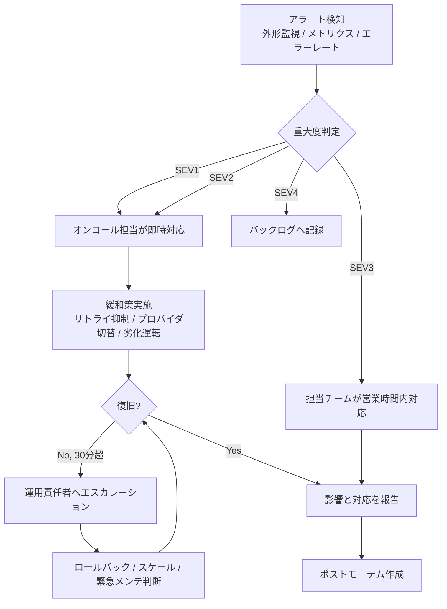

# 運用設計書

## 1. はじめに

### 1.1 目的

本文書は、リアルタイム文字起こし翻訳 Chrome 拡張の運用設計を定義する。Relay API を中心とした監視、SLA / SLO、インシデント対応、定常運用、メンテナンス、障害復旧の方針を明確化し、安定運用と継続的改善の基準を示す。

### 1.2 運用体制

| 役割               | 担当                            | 連絡先                   |
| ------------------ | ------------------------------- | ------------------------ |
| 運用責任者         | プロダクト運用責任者            | 運用共有チャネル         |
| オンコール担当     | 開発チーム持ち回り              | インシデント通知チャネル |
| エスカレーション先 | テックリード / プロダクト責任者 | 緊急連絡チャネル         |

### 1.3 対応する要件

- [要件定義書 - 可用性要件](../01-requirements/requirements-specification.md#82-可用性要件)
- [要件定義書 - 運用保守性要件](../01-requirements/requirements-specification.md#86-運用保守性要件)
- [要件定義書 - 性能要件](../01-requirements/requirements-specification.md#81-性能要件)
- [API仕様書](../04-api-specification/api-specification.md)
- [セキュリティ設計書](../09-security-design/security-design.md)

## 2. SLA定義

### 2.1 可用性目標

MVP では、利用者体験に直接影響する対象を `Relay API` とその監視可能な周辺コンポーネントに限定して可用性を定義する。外部 STT / 翻訳プロバイダ障害時は、要件どおり劣化運転を許容する。

| 項目                     | 目標                           | 計測方法                            |
| ------------------------ | ------------------------------ | ----------------------------------- |
| 月間稼働率               | 99.5%以上                      | 外形監視と `/health` チェックで計測 |
| 許容ダウンタイム（月間） | 約 3 時間 39 分以内            | 月次集計                            |
| 計画メンテナンス除外     | 事前告知済みメンテナンスは除外 | 告知記録で管理                      |

### 2.2 レスポンスタイム目標

| 対象               | p50    | p95    | p99    |
| ------------------ | ------ | ------ | ------ |
| `POST /sessions`   | 200ms  | 500ms  | 1000ms |
| WebSocket 接続確立 | 1000ms | 3000ms | 5000ms |
| 部分字幕表示遅延   | 1000ms | 2000ms | 3000ms |
| 翻訳字幕表示遅延   | 800ms  | 1500ms | 2500ms |

注記:

- `部分字幕表示遅延` と `翻訳字幕表示遅延` は、拡張・Relay API・外部プロバイダを含む E2E 指標として扱う
- 翻訳 API 単体の目標は [API仕様書](../04-api-specification/api-specification.md#26-レイテンシ優先ポリシー) に従う

### 2.3 データ保全目標

MVP では生音声をサーバー側に永続保存しないため、中央管理対象は主に運用ログ、設定、監査データである。字幕・翻訳結果のローカル保持は利用者端末依存のため、サーバー側 RPO / RTO 対象外とする。

| 項目                | 目標                           |
| ------------------- | ------------------------------ |
| RPO（目標復旧時点） | 24時間以内（運用ログ・設定類） |
| RTO（目標復旧時間） | 4時間以内（Relay API 復旧）    |

## 3. インシデント対応

### 3.1 重大度分類

| 重大度       | 定義                                                       | 初動対応時間 | エスカレーション                     |
| ------------ | ---------------------------------------------------------- | ------------ | ------------------------------------ |
| SEV1（緊急） | Relay API 全面停止、全セッション開始不能、全文字起こし停止 | 15分以内     | 即時、運用責任者とテックリードに連絡 |
| SEV2（重大） | 翻訳全面停止、接続失敗多発、p95 遅延大幅超過               | 30分以内     | 1時間以内に運用責任者へ報告          |
| SEV3（軽微） | 一部 OS / 一部ソース種別のみ障害、限定的 UI 不具合         | 4時間以内    | 当日中にチーム共有                   |
| SEV4（低）   | 軽微な表示崩れ、運用上の改善事項、単発失敗                 | 翌営業日     | 週次レビューに含める                 |

### 3.2 エスカレーションフロー

### 3.3 対応手順

1. **検知**: アラート、ダッシュボード、エラーログから影響範囲を把握する
2. **初動対応**: 被害拡大を防ぐため、劣化運転、レート制御、プロバイダ切替を実施する
3. **調査**: Relay API、外部プロバイダ、Chrome 拡張のどこに原因があるか切り分ける
4. **復旧**: ロールバック、再デプロイ、スケール調整、設定変更で復旧する
5. **報告**: 利用者影響、暫定回避策、復旧見込みを関係者へ共有する
6. **振り返り**: SEV1 / SEV2 はポストモーテムを作成し、再発防止策をチケット化する

### 3.4 緩和策の優先順位

- 翻訳障害時は `degraded` へ移行し、文字起こし単体を継続する
- 特定プロバイダ障害時はベンダー切替または対象機能の一時停止を行う
- Chrome 拡張更新が必要な不具合でも、まずは Relay API 側の設定変更や応答制御で緩和する
- Chrome Web Store 審査時間を考慮し、緊急修正はサーバー側対処を優先する

## 4. 定常運用

### 4.1 日次作業

| 作業           | 実施時間   | 担当           | 手順                                                       |
| -------------- | ---------- | -------------- | ---------------------------------------------------------- |
| 外形監視確認   | 営業開始時 | オンコール担当 | `/health` と主要メトリクスの異常有無を確認する             |
| エラーログ確認 | 営業開始時 | オンコール担当 | `STT-*`、`TRANSLATION-*`、`CAPTURE-*` の異常増加を確認する |
| レイテンシ確認 | 営業開始時 | オンコール担当 | `p95` の部分字幕 / 翻訳字幕遅延を確認する                  |

### 4.2 週次作業

| 作業                     | 実施曜日   | 担当       | 手順                                                     |
| ------------------------ | ---------- | ---------- | -------------------------------------------------------- |
| 性能レビュー             | 週次定例日 | 運用責任者 | `p50 / p95 / p99` とエラー率の推移を確認する             |
| セキュリティアラート確認 | 週次定例日 | 開発チーム | 依存脆弱性、Secrets 変更履歴、失効トークン利用を確認する |
| プロバイダ健全性確認     | 週次定例日 | 開発チーム | STT / 翻訳候補の失敗率とコストを比較する                 |

### 4.3 月次作業

| 作業                      | 実施時期 | 担当         | 手順                                             |
| ------------------------- | -------- | ------------ | ------------------------------------------------ |
| SLA / SLO レポート作成    | 月初     | 運用責任者   | 前月の可用性、遅延、障害件数を集計する           |
| キャパシティレビュー      | 月初     | テックリード | 同時セッション数、帯域、プロバイダ利用量を見直す |
| ランタイム / 依存更新計画 | 月中     | 開発チーム   | Node.js 24 LTS と依存更新の必要性を整理する      |

### 4.4 監視・アラート

| 監視対象  | 指標                               | アラート条件                    |
| --------- | ---------------------------------- | ------------------------------- |
| Relay API | `/health` 失敗率                   | 連続 3 回失敗で SEV1 判定候補   |
| WebSocket | 接続失敗率                         | 5 分平均が閾値超過で通知        |
| 字幕      | `transcript.partial` 初回応答時間  | `p95` が 2 分連続閾値超過で通知 |
| 翻訳      | `translation.final` 応答時間       | `p95` が閾値超過で通知          |
| エラー    | `TRANSLATION_PROVIDER_FAILED` 比率 | 5 分窓で急増時に通知            |
| 劣化運転  | `degraded` 状態セッション数        | 閾値超過で通知                  |

**閾値視点の定義** (IMPL-005 で確定、Phase 0 合意事項):

- 本節の `translation.final` 応答時間 `p95` は §2.2 の **翻訳字幕表示遅延 p95 1500ms** を指す (E2E 視点)
- Relay API 内の翻訳プロバイダ呼び出し単体の上限は 800ms ([`api-specification.md` §2.6](../04-api-specification/api-specification.md) / [`infrastructure.md` §10.1](../03-detailed-design/infrastructure.md))。Relay 側ではこれを超過した段階で翻訳を打ち切り `session.error` + `session.state.changed(degraded)` を返す
- 2 つの指標は別レイヤの SLO。Relay 単体が 800ms 以内でも、ネットワーク RTT や拡張側処理で E2E p95 が 1500ms を超える場合はアラートが発動する

## 5. メンテナンス

### 5.1 計画メンテナンス手順

| 項目                   | 内容                                                                                                         |
| ---------------------- | ------------------------------------------------------------------------------------------------------------ |
| 事前告知               | 3 営業日前までに関係者へ通知し、必要に応じて拡張 UI 内にも告知する                                           |
| メンテナンスウィンドウ | 原則として低利用時間帯に実施する                                                                             |
| 実施手順               | 1. 影響範囲確認 2. バックアップ / ログ保全確認 3. デプロイまたは設定変更 4. スモークテスト 5. 監視安定化確認 |
| 完了確認               | `/health`、セッション作成、WebSocket 接続、字幕 / 翻訳イベントの疎通確認                                     |

### 5.2 緊急メンテナンス手順

- SEV1 または重大なセキュリティリスク時に実施する
- 運用責任者またはテックリードの承認で即時実施可能とする
- 緊急時はまず Relay API 側で遮断、機能制限、プロバイダ切替を行う
- Chrome 拡張の更新が必要な場合は、サーバー側緩和策と並行してストア配布を進める

## 6. 障害復旧

### 6.1 災害復旧計画（DR）

MVP の Relay API はステートレス前提とし、中央永続データを最小化する。よって、DR は大規模データベース復旧よりも、`IaC と設定復元による再構築` を中心に設計する。

| 項目         | 内容                               |
| ------------ | ---------------------------------- |
| DR方式       | コールドスタンバイ相当の再構築     |
| DRサイト     | セカンダリリージョンまたは代替環境 |
| 切り替え時間 | 4時間以内                          |

### 6.2 復旧手順

1. 障害範囲がアプリ、リージョン、外部プロバイダのどこにあるかを判定する
2. 必要に応じて劣化運転または機能停止フラグを有効化する
3. Relay API を再デプロイまたは代替環境へ再構築する
4. 監視、ログ、Secrets、接続先設定を復元する
5. スモークテストでセッション開始、字幕、翻訳の最小疎通を確認する
6. 関係者へ復旧報告を行う

### 6.3 復旧訓練計画

| 項目     | 内容                                                 |
| -------- | ---------------------------------------------------- |
| 実施頻度 | 半年に 1 回                                          |
| 訓練内容 | Relay API 再構築、プロバイダ切替、劣化運転移行の訓練 |
| 参加者   | 運用責任者、オンコール担当、開発チーム               |

## 7. 変更履歴

| バージョン | 日付       | 変更者 | 変更内容 |
| ---------- | ---------- | ------ | -------- |
| 0.1.0      | 2026-04-21 | Codex  | 初版作成 |
